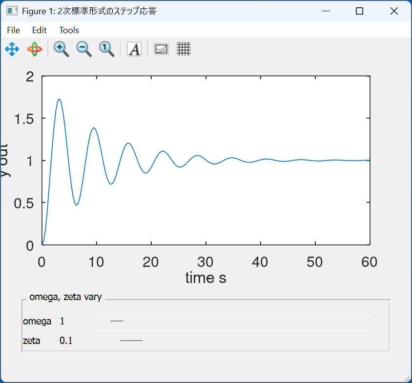
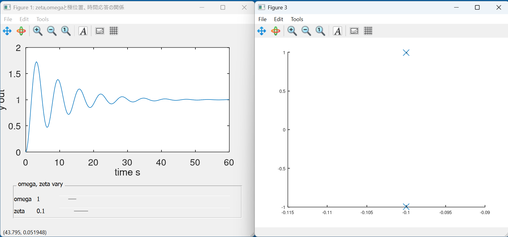
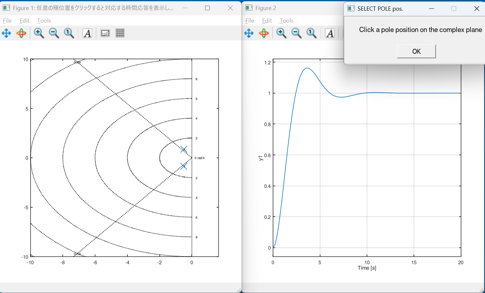
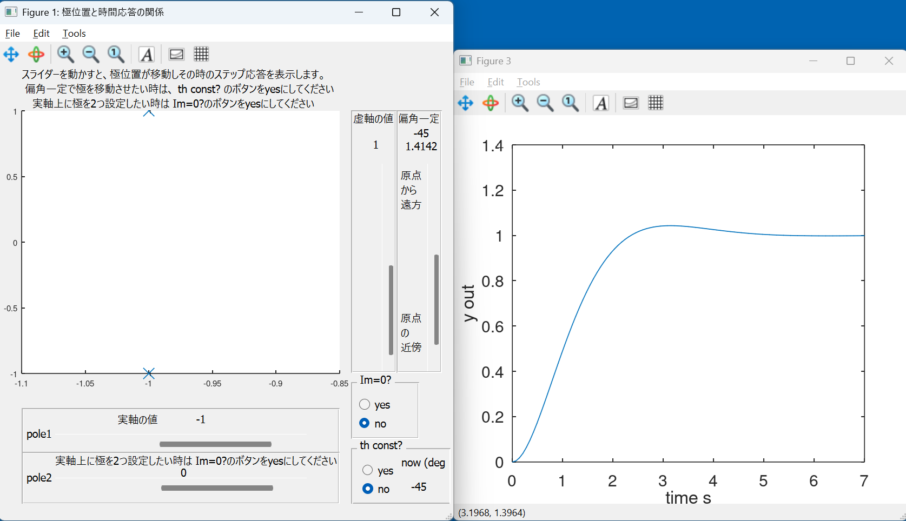
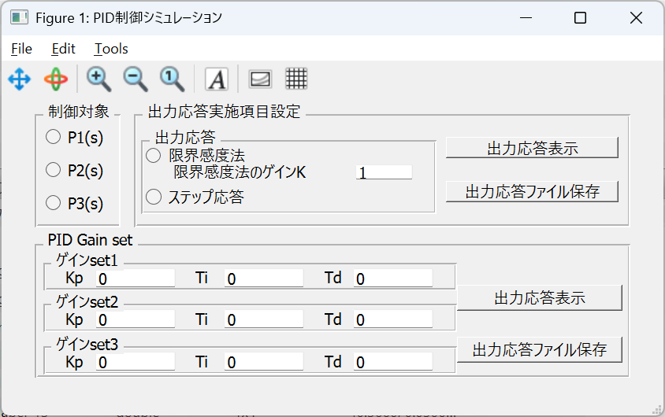

OctaveのGUIがいい感じになったので、制御を体感してもらうために、簡単なサンプルを示します。


# 二次標準形式の時間応答


伝達関数 
$$G(s)=\frac{{\omega_n}^2}{s^2+2\zeta\omega_n s +{\omega_n}^2}$$
の時間応答は 減衰係数$\zeta$と固有角周波数$\omega_n$の値で大きく変化します。

スライダーを動かすと$\zeta,\omega_n$が変化し、それに応じた時間応答を表示します。 観察してください。



ソースをDLまたはclipboardの内容を保存して、手元のPCでOctaveを起動して確認してください。


[github/sys2d_step.m](https://github.com/tarJ8253/octave/tree/main/control/sys2d_step.m)


```octave
clear all
close all
clc


pkg load control

h.fnc= @(w,z) tf([w*w],[1 2*z*w w*w]);
h.gf=figure("position",[50 50 560 420],"name","2次標準形式のステップ応答");
%defaultは[300 200 560 420].4:3


function update_plot(obj, init=false)
    hs=guidata(obj);
    replot=false;
    recalc=false;
    % getcallbackobject:
    ## gcbo holds the handle of the control
    switch (gcbo)
      case {hs.zeta_sl}
        zeta_gui=get(gcbo, "value");
        replot=true;
        recalc=true;
        omega_gui=get(hs.omega_sl,"value");
        set(hs.zeta_value,"string",num2str(zeta_gui));
      case {hs.omega_sl}
        omega_gui=get(gcbo, "value");
        replot=true;
        recalc=true;
        zeta_gui=get(hs.zeta_sl,"value");
        set(hs.omega_value,"string",num2str(omega_gui));
    end

    if(recalc==true)
        omega_n=omega_gui;
        zeta=zeta_gui;
        G=hs.fnc(omega_n,zeta);
        [y t]=step(G);
    end
    
    if(replot==true)
        hs.plot=plot(t,y);
        set(gca,"xlabel","time s","ylabel", "y out","fontsize",20);
        %guidata (obj, hs);
    end
    
end

h.p=uipanel(
    "title","\omega, \zeta vary",
    "position",[0.05 0.05 0.9 0.2]);

zeta_ini=0.1;
omega_ini=1;

h.zeta_disp=uicontrol(
    "parent",h.p,
    "style","text",
    "units", "normalized",
    "string","zeta",
    "horizontalalignment", "left",
    "position", [0 0.1 0.1 0.2]);

h.zeta_value=uicontrol(
    "parent",h.p,
    "style","text",
    "units", "normalized",
    "string",num2str(zeta_ini),
    "horizontalalignment", "left",
    "position", [0.1 0.1 0.1 0.2]);

h.zeta_sl=uicontrol(
    "parent",h.p,
    "style","slider",
    "units", "normalized",
    "string", "slider",
    "value", zeta_ini,
    "max",2,
    "min",0.001,
    "sliderstep",[0.01 0.1],
    "horizontalalignment", "left",
    "position", [0.2 0.1 0.75 0.2],
    "callback", @update_plot );

h.omega_disp=uicontrol(
    "parent",h.p,
    "style","text",
    "units", "normalized",
    "string","omega",
    "horizontalalignment", "left",
    "position", [0 0.5 0.1 0.2]);

h.omega_value=uicontrol(
    "parent",h.p,
    "style","text",
    "units", "normalized",
    "string",num2str(omega_ini),
    "horizontalalignment", "left",
    "position", [0.1 0.5 0.1 0.2]);


h.omega_sl=uicontrol(
    "parent",h.p,
    "style","slider",
    "units", "normalized",
    "string", "slider",
    "value", omega_ini,
    "max",100,
    "min",0.1,
    "sliderstep",[0.001 0.01],
    "position", [0.2 0.5 0.75 0.2],
    "callback", @update_plot );


set (h.gf, "color", get(h.gf, "defaultuicontrolbackgroundcolor"));

h.ax=axes(h.gf,"position",[0.1 0.4 0.8 0.55]);

%初期描画用伝達関数step応答
G=h.fnc(omega_ini,zeta_ini);
[y t]=step(G);
h.plot=plot(t,y);
set(gca,"xlabel","time s","ylabel", "y out","fontsize",20);

guidata(h.gf,h);% guidata(figure handle,datacontainer)
%これがなかったらerror : matrix cannot be indexed with . になる

update_plot(h.gf,true);


```


# 極位置と応答特性の関係(その1)




[github/sys2d_step_pole.m](https://github.com/tarJ8253/octave/tree/main/control/sys2d_step_pole.m)


上記伝達関数の時間応答と、極位置の関係を示します。

```octave

clear all
close all
clc

%graphics_toolkit(qt)%なくてもいい,qtがdefaultになっている

pkg load control

h.fnc= @(w,z) tf([w*w],[1 2*z*w w*w]);
%h.gf=figure("position",[50 100 700 600],"name","zeta,omegaと極位置、時間応答の関係");
h.gf=figure("position",[10 50 560 420],"name","zeta,omegaと極位置、時間応答の関係");
%defaultは[300 200 560 420].4:3

function complex_plot(pl)
global count=1;
    [r c]=size(pl);
    for i=1:r
        x(i)=real(pl(i));
        y(i)=imag(pl(i));
    end
    hold on
    plot(x,y,"x");
    text(x,y,num2str(count));
    count=count+1;
end


function update_plot(obj, init=false)
    hs=guidata(obj);
    replot=false;
    recalc=false;

    % get_call_back_object:
    ## gcbo holds the handle of the control
    switch (gcbo)
      case {hs.zeta_sl}
        zeta_gui=get(gcbo, "value");
        replot=true;
        recalc=true;
        omega_gui=get(hs.omega_sl,"value");
        set(hs.zeta_value,"string",num2str(zeta_gui));
      case {hs.omega_sl}
        omega_gui=get(gcbo, "value");
        replot=true;
        recalc=true;
        zeta_gui=get(hs.zeta_sl,"value");
        set(hs.omega_value,"string",num2str(omega_gui));
    end

    if(recalc==true)
        omega_n=omega_gui;
        zeta=zeta_gui;
        G=hs.fnc(omega_n,zeta);
        [y t]=step(G);
    end

    if(replot==true)
        figure(1)
        hs.plot=plot(t,y);
        %        figure(2)
        %plot(t,y);
        set(gca,"xlabel","time s","ylabel","y out","fontsize",20);
        %guidata (obj, hs);%なくてもいい?!

        figure(3)
        [pole,zero]=pzmap(G);
        complex_plot(pole)
    end

end

h.p=uipanel(
    "title","\omega, \zeta vary",
    "position",[0.05 0.05 0.9 0.2]);

zeta_ini=0.1;
omega_ini=1;

h.zeta_disp=uicontrol(
    "parent",h.p,
    "style","text",
    "units", "normalized",
    "string","zeta",
    "horizontalalignment", "left",
    "position", [0 0.1 0.1 0.2]);

h.zeta_value=uicontrol(
    "parent",h.p,
    "style","text",
    "units", "normalized",
    "string",num2str(zeta_ini),
    "horizontalalignment", "left",
    "position", [0.1 0.1 0.1 0.2]);

h.zeta_sl=uicontrol(
    "parent",h.p,
    "style","slider",
    "units", "normalized",
    "string", "slider",
    "value", zeta_ini,
    "max",2,
    "min",0.001,
    "sliderstep",[0.01 0.1],
    "horizontalalignment", "left",
    "position", [0.2 0.1 0.75 0.2],
    "callback", @update_plot );

h.omega_disp=uicontrol(
    "parent",h.p,
    "style","text",
    "units", "normalized",
    "string","omega",
    "horizontalalignment", "left",
    "position", [0 0.5 0.1 0.2]);

h.omega_value=uicontrol(
    "parent",h.p,
    "style","text",
    "units", "normalized",
    "string",num2str(omega_ini),
    "horizontalalignment", "left",
    "position", [0.1 0.5 0.1 0.2]);


h.omega_sl=uicontrol(
    "parent",h.p,
    "style","slider",
    "units", "normalized",
    "string", "slider",
    "value", omega_ini,
    "max",100,
    "min",0.1,
    "sliderstep",[0.001 0.01],
    "position", [0.2 0.5 0.75 0.2],
    "callback", @update_plot );


set (h.gf, "color", get(h.gf, "defaultuicontrolbackgroundcolor"));

h.ax=axes(h.gf,"position",[0.1 0.4 0.8 0.55]);

%初期描画用伝達関数step応答
G=h.fnc(omega_ini,zeta_ini);
[y t]=step(G);
h.plot=plot(t,y);
set(gca,"xlabel","time s","ylabel", "y out","fontsize",20);

%figure(3,"position",[750,100,640,480])
figure(3,"position",[570,50,560,420])
%defaultは[300 200 560 420].4:3
[pole,zero]=pzmap(G);

complex_plot(pole);

guidata(h.gf,h);
%これがなかったらerror : matrix cannot be indexed with . になる

update_plot(h.gf,true);


```

# 極位置と応答特性の関係(その2)

複素平面上の任意の点をクリックすれば、そこを極とする二次遅れ要素の時間応答 を示します。





[github/pole_clk.m](https://github.com/tarJ8253/octave/tree/main/control/pole_clk.m)


```octave
clear all
close all
clc

pkg load control

function step_cal(x,y)
fnc= @(p1,p2) zpk([],[p1,p2],p1*p2);

    p1=x+j*y;
    p2=x-j*y;
    G=fnc(p1,p2);
    figure(2)
    step(G);

end

function complex_plot(pl)
    count=1;
    [r c]=size(pl);
    for i=1:r
        x(i)=real(pl(i));
        y(i)=imag(pl(i));
    end
    hold on
    plot(x,y,"x");
    text(x,y,num2str(count));
    %    count=count+1;
end

figure(1,"position",[100,100,500,500],"name","任意の極位置をクリックすると対応する時間応答を表示します。")
axis([-10 1 -10 10])
sgrid(0.5912,[])%zeta,omega
                %daspect([1 1])

G=tf(1,[1 1 1]);
figure(2,"position",[600,100,500,500])
step(G)
[pole zero]=pzmap(G);
figure(1)
complex_plot(pole);

count=2;

H=msgbox("Click a pole position on the complex plane","SELECT POLE pos.");
%H=msgbox("極位置として複素平面上の点をクリックしてください","極位置と時間応答");
uiwait(H);

while(1)
    figure(1)
    [x y btn]=ginput(1);
    hold on
    if(btn==1)
        plot(x,y,"x")
        plot(x,-y,"x");
        text(x,y,num2str(count));
        count=count+1;
        step_cal(x,y);
    else
        break% error対策: text: invalid combination of points and text strings
    end

end

close all


```
# 極位置と応答特性の関係(その3)




スライダーを動かすと極位置が変化し、その極位置を有する 二次遅れ要素の時間応答を表示します。

`th_const?`をnoのままでは実軸/虚数軸固定、 
`th_const?`をyesとすると、偏角一定で、極位置が変化します。

[github/pole_slide.m](https://github.com/tarJ8253/octave/tree/main/control/pole_slide.m)

```octave
% 極位置指定からstep応答をみる

clear all
close all
clc

pkg load control

h.fnc= @(p1,p2) zpk([],[p1,p2],p1*p2);
h.gf=figure("position",[10 100 560 540],"name","極位置と時間応答の関係");
%defaultは[300 200 560 420].4:3

function complex_plot(pl)
global     count=1;

[r c]=size(pl);
    for i=1:r
        x(i)=real(pl(i));
        y(i)=imag(pl(i));
    end
    figure(1)
    hold on
    plot(x,y,"x");
    text(x,y,num2str(count));
    count=count+1;
    %    sgrid(zeta_com,[])
end


function update_plot(obj, init=false)
    hs=guidata(obj);
    replot=false;
    recalc=false;

    IMG_ZERO=get(hs.rb1,"value");
    TH_CNST=get(hs.gp2_rb1,"value");

    real_part_gui=get(hs.real_part_sl,"value");
    imag_part_gui=get(hs.imag_part_sl,"value");
    real_part2_gui=get(hs.real_part2_sl,"value");

    th_cnst_gui=get(hs.th_cnst_sl,"value");
    dist=sqrt(real_part_gui*real_part_gui+imag_part_gui*imag_part_gui);

    if(IMG_ZERO==false)
        th_angle=atan(imag_part_gui/real_part_gui)*180/pi;
    end

    % get_call_back_object:
    ## gcbo holds the handle of the control
    switch (gcbo)
      case {hs.real_part_sl}
        real_part_gui=get(gcbo, "value");
        set(hs.real_part_value,"string",num2str(real_part_gui));
        replot=true;
        recalc=true;
      case {hs.imag_part_sl}
        imag_part_gui=get(gcbo, "value");
        set(hs.imag_part_value,"string",num2str(imag_part_gui));
        replot=true;
        recalc=true;
      case {hs.real_part2_sl}
        real_part2_gui=get(gcbo, "value");
        set(hs.real_part2_value,"string",num2str(real_part2_gui));
        replot=true;
        recalc=true;

      case {hs.rb1} % buttongroupは両方イベント起こるので場合分け必要
        if ( (get(hs.rb1, "value")==true) && (get(hs.rb2, "value")==false) )
            IMG_ZERO=true;
        else
            IMG_ZERO=false;
        end
        replot=true;
        recalc=true;
      case {hs.rb2}
        if ( (get(hs.rb2, "value")==true) && (get(hs.rb1, "value")==false) )
            IMG_ZERO=false;
        else
            IMG_ZERO=true;
        end
        replot=true;
        recalc=true;

      case {hs.th_cnst_sl}
        th_cnst_gui=get(gcbo, "value");
        set(hs.th_cnst_value,"string",num2str(th_cnst_gui));

        replot=true;
        recalc=true;
      case {hs.gp2_rb1} % buttongroupは両方イベント起こるので場合分け必要
        if ( (get(hs.gp2_rb1, "value")==true) && (get(hs.gp2_rb2, "value")==false) )
            TH_CNST=true;
        else
            TH_CNST=false;
        end
        replot=true;
        recalc=true;
      case {hs.gp2_rb2}
        if ( (get(hs.gp2_rb2, "value")==true) && (get(hs.gp2_rb1, "value")==false) )
            TH_CNST=false;
        else
            TH_CNST=true;
        end
        replot=true;
        recalc=true;
end

    if(recalc==true)
        if(IMG_ZERO==true)
            p1=real_part_gui;
            p2=real_part2_gui;
        else
            if(TH_CNST==true)
                %座標計算時のみ、原点から計算する
                real_part_gui=dist*th_cnst_gui*cos(pi-th_angle*pi/180);
                imag_part_gui=dist*th_cnst_gui*sin(pi-th_angle*pi/180);
                set(hs.real_part_value,"string",num2str(real_part_gui));
                set(hs.imag_part_value,"string",num2str(imag_part_gui));
                set(hs.th_cnst_value2,"string",num2str(th_angle));
                set(hs.th_cnst_value_disp,"string",num2str(th_angle));
            end

            p1=real_part_gui+imag_part_gui*j;
            p2=real_part_gui-imag_part_gui*j;

        end
        G=hs.fnc(p1,p2);
        [y t]=step(G);
    end

    if(replot==true)
        figure(3)
        hs.plot=plot(t,y);
        set(gca,"xlabel","time s","ylabel","y out","fontsize",20);

        figure(1)
        [pole,zero]=pzmap(G);
        complex_plot(pole)
    end

end

h.p_real=uipanel(
    "position",[0.05 0.1 0.7 0.12]);

h.p2_real=uipanel(
    "position",[0.05 0.0 0.7 0.12]);

h.p_imag=uipanel(
    "position",[0.775 0.3 0.1 0.6]);

h.th_cnst=uipanel(
    "position",[0.875 0.3 0.1 0.6]);

real_part_ini=-1;
imag_part_ini=1;
real_part2_ini=0;
dist_ini=sqrt((real_part_ini*real_part_ini)+(imag_part_ini*imag_part_ini));
th_ini=atan(imag_part_ini/real_part_ini)*180/pi;


p1_ini=real_part_ini+imag_part_ini*j;
p2_ini=real_part_ini-imag_part_ini*j;

h.real_part1_disp=uicontrol(
    "parent",h.p_real,
    "style","text",
    "units", "normalized",
    "string","pole1",
    "horizontalalignment", "left",
    "position", [0.01 0.3 0.1 0.4]);

h.real_part_disp=uicontrol(
    "parent",h.p_real,
    "style","text",
    "units", "normalized",
    %    "string","real_part",
    "string","実軸の値",
    "horizontalalignment", "left",
    "position", [0.3 0.6 0.2 0.4]);

h.real_part_value=uicontrol(
    "parent",h.p_real,
    "style","text",
    "units", "normalized",
    "string",num2str(real_part_ini),
    "horizontalalignment", "left",
    "position", [0.55 0.6 0.1 0.4]);

h.real_part_sl=uicontrol(
    "parent",h.p_real,
    "style","slider",
    "units", "normalized",
    "string", "slider",
    "value", real_part_ini,
    "max",10,
    "min",-50,
    "sliderstep",[0.1 1.0],
    "horizontalalignment", "left",
    "position", [0.1 0.1 0.8 0.4],
    "callback", @update_plot );

h.real_part2_disp=uicontrol(
    "parent",h.p2_real,
    "style","text",
    "units", "normalized",
    "string","pole2",
    "horizontalalignment", "left",
    "position", [0.01 0.3 0.1 0.4]);

h.real_part2_disp=uicontrol(
    "parent",h.p2_real,
    "style","text",
    "units", "normalized",
    %    "string","when p2 use, set yes at Im=0? button",
    "string","実軸上に極を2つ設定したい時は Im=0?のボタンをyesにしてください",
    "horizontalalignment", "left",
    "position", [0.1 0.7 0.9 0.3]);

h.real_part2_value=uicontrol(
    "parent",h.p2_real,
    "style","text",
    "units", "normalized",
    "string",num2str(real_part2_ini),
    "horizontalalignment", "left",
    "position", [0.5 0.45 0.2 0.3]);

h.real_part2_sl=uicontrol(
    "parent",h.p2_real,
    "style","slider",
    "units", "normalized",
    "string", "slider",
    "value", real_part2_ini,
    "max",10,
    "min",-50,
    "sliderstep",[0.1 1.0],
    "horizontalalignment", "left",
    "position", [0.1 0.1 0.8 0.4],
    "callback", @update_plot );


h.imag_part_disp=uicontrol(
    "parent",h.p_imag,
    "style","text",
    "units", "normalized",
    %    "string","imag_part",
    "string","虚軸の値",
    "position", [0.01 0.95 0.95 0.05]);

h.imag_part_value=uicontrol(
    "parent",h.p_imag,
    "style","text",
    "units", "normalized",
    "string",num2str(imag_part_ini),
    "position", [0.1 0.85 0.9 0.05]);

h.imag_part_sl=uicontrol(
    "parent",h.p_imag,
    "style","slider",
    "units", "normalized",
    "string", "slider",
    "value", imag_part_ini,
    "max",50,
    "min",0,
    "sliderstep",[0.1 1.0],
    "position", [0.7 0 0.4 0.8],
    "callback", @update_plot );

h.th_cnst_disp=uicontrol(
    "parent",h.th_cnst,
    "style","text",
    "units", "normalized",
    %    "string","th_cnst",
    "string","偏角一定",
    "position", [0.01 0.95 0.95 0.05]);

h.th_cnst_value=uicontrol(
    "parent",h.th_cnst,
    "style","text",
    "units", "normalized",
    "string",num2str(dist_ini),
    "position", [0.1 0.85 0.9 0.035]);

h.th_cnst_value2=uicontrol(
    "parent",h.th_cnst,
    "style","text",
    "units", "normalized",
    "string",num2str(th_ini),
    "position", [0.1 0.9 0.9 0.035]);

h.th_cnst_sl=uicontrol(
    "parent",h.th_cnst,
    "style","slider",
    "units", "normalized",
    "string", "slider",
    "value", dist_ini,
    "max",10,
    "min",0.01,
    "sliderstep",[-0.1 -1.0],
    "position", [0.7 0 0.4 0.8],
    "callback", @update_plot );

h.th_cnst_disp_far=uicontrol(
    "parent",h.th_cnst,
    "style","text",
    "units", "normalized",
    "string","原点\nから\n遠方",
    "horizontalalignment", "left",
    "position", [0.05 0.6 0.5 0.2]);
h.th_cnst_disp_origin=uicontrol(
    "parent",h.th_cnst,
    "style","text",
    "units", "normalized",
    "string","原点\nの\n近傍",
    "horizontalalignment", "left",
    "position", [0.05 0.05 0.5 0.2]);


gp = uibuttongroup ("title","Im=0?",
                    "Position", [ 0.775 0.15 0.15 0.15]);
gp2 = uibuttongroup ("title","th const?",
                    "Position", [ 0.775 0 0.22 0.15]);

h.rb1=uicontrol(
    "parent",gp,
    "style","radiobutton",
    "units", "normalized",
    "string", "yes",
    "value", false,
    "position", [0.1 0.4 0.7 0.4],
    "callback", @update_plot );
h.rb2=uicontrol(
    "parent",gp,
    "style","radiobutton",
    "units", "normalized",
    "string", "no",
    "value", true,
    "position", [0.1 0.05 0.7 0.4],
    "callback", @update_plot );

h.gp2_rb1=uicontrol(
    "parent",gp2,
    "style","radiobutton",
    "units", "normalized",
    "string", "yes",
    "value", false,
    "position", [0.1 0.4 0.7 0.4],
    "callback", @update_plot );
h.gp2_rb2=uicontrol(
    "parent",gp2,
    "style","radiobutton",
    "units", "normalized",
    "string", "no",
    "value", true,
    "position", [0.1 0.05 0.7 0.4],
    "callback", @update_plot );

h.th_cnst_label_disp=uicontrol(
    "parent",gp2,
    "style","text",
    "units", "normalized",
    "string","now (deg)",
    "horizontalalignment", "left",
    "position", [0.5 0.55 0.45 0.4]);

h.th_cnst_value_disp=uicontrol(
    "parent",gp2,
    "style","text",
    "units", "normalized",
    "string", num2str(th_ini),
    "horizontalalignment", "left",
    "position", [0.6 0.1 0.3 0.4]);

h.menu_label=uicontrol(
    "parent",h.gf,
    "style","text",
    "units", "normalized",
    "string", "スライダーを動かすと、極位置が移動しその時のステップ応答を表示します。\n 偏角一定で極を移動させたい時は、 th const? のボタンをyesにしてください\n　実軸上に極を2つ設定したい時は Im=0?のボタンをyesにしてください",
    "horizontalalignment", "left",
    "position", [0.05 0.9 1 0.1]);

set (h.gf, "color", get(h.gf, "defaultuicontrolbackgroundcolor"));

%h.ax=axes(h.gf,"position",[0.05 0.27 0.7 0.65]);
h.ax=axes(h.gf,"position",[0.05 0.3 0.7 0.6]);

%初期描画用伝達関数step応答
G=h.fnc(p1_ini,p2_ini);
[y t]=step(G);
guidata(h.gf,h);% guidata(figure handle, datacontainer)
%これがなかったらerror : matrix cannot be indexed with . になる

%figure(3,"position",[800,100,700,600])
figure(3,"position",[570,100,560,480])
%defaultは[300 200 560 420].4:3
h.plot=plot(t,y);
set(gca,"xlabel","time s","ylabel", "y out","fontsize",20);

figure(1);%,"position",[900,100,700,600])
[pole,zero]=pzmap(G);
%sgrid(zeta_com,[]);%zeta,omega

complex_plot(pole);

%guidata(h.gf,h);% guidata(figure handle, datacontainer)
%これがなかったらerror : matrix cannot be indexed with . になる:fig(3)の前に移動

update_plot(h.gf,true);

%H=msgbox("Slide the mover to select a pole position");
%H=msgbox("スライダーを動かすと、極位置が移動し、\n その時のステップ応答を表示します。\n 偏角一定で極を移動させたい時は、\n th const? のボタンをyesにしてください","使い方");

```


# PID制御シミュレーション




制御対象の伝達関数は以下のとおりです。

$$P1(s)=\dfrac{1}{s(2s+1)(0.5s+1)}$$

$$P2(s)=\dfrac{1}{s(s+2)}$$

$$P3(s)=\dfrac{1}{(s+1)(s+5)}$$

ボタンで選択します。

限界感度法やステップ応答を表示できます。

PIDゲインを設定すると閉ループシミュレーションを実行できます。


[github/pid_sim.m](https://github.com/tarJ8253/octave/tree/main/control/pid_sim.m)


```octave
%Octave ソース : PID制御系設計
clear all
close all
clc

pkg load control
h.gf=figure("position",[10 300 560 250],"name","PID制御シミュレーション");
h.wind=[570 100 560 420];%defaultは[300 200 560 420].4:3
                         %640-480

h.P1=@() zpk([],[0 -0.5 -2],1);%(z,p,k),1/s(2s+1)(0.5s+1),Q1-P1
h.P2=@() tf(1,[1 2 0]);%,1/s(s+2),Q1-P2
h.P3=@() zpk([],[-1 -5],1);%(z,p,k),1/(s+1)(s+5)*1,Q2-応答データ取得に使用


function prt_fig(fn,fnum)
    ext='.png';
    fname=["fig_" num2str(fnum) "_" fn ext];
    %    print(["fig_" fn "_" num2str(fnum) ".svg"],"-dsvg");
    print(fnum, fname,'-dpng','-S640,480');
end

function [P t_end lab fnum]=set_model(obj,P1_select,P2_select,P3_select)
    hs=guidata(obj);
    if (P1_select== true)
        P=hs.P1();
        t_end=[20 40];%開ループ,閉ループsim時間
        lab="P1";
        fnum=[2 21];%開ループ,閉ループ,図番
    elseif (P2_select== true)
        P=hs.P2();
        t_end=[10 10];
        lab="P2";
        fnum=[3 31];
    elseif (P3_select== true)
        P=hs.P3();
        t_end=[5 5];
        lab="P3";
        fnum=[4 41];
    else
%        H=errordlg("制御対象を選択してください");
        H=errordlg("Select Control Object Trans.");
        uiwait(H);
        %exit;終了してしまう?
    end
end


function [C]=set_pid_cont(KP,TI,TD)
    if(TI!=0)
        if(TD!=0)
            tau=0.1*TD;%Uのグラフを描くためこの形式を使用
            C=KP*(1+tf(1,[TI 0])+tf([TD 0],[tau 1]));
        else
            C=KP*(1+tf(1,[TI 0]));
        end
    else

        if(TD!=0)
            tau=0.1*TD;%Uのグラフを描くためこの形式を使用
            C=KP*(1+tf([TD 0],[tau 1]));
        else
            C=KP;
        end
    end
end

function [GC UC]=set_close_tf(C,P)
    L=C*P;
    GC=minreal(L/(1+L));
    UC=minreal(C/(1+L));%入力表示
end
function Time_sim(GCL,UCL, leg,ti,fnum,wind)

    cl={[0 0 1],[0 0.51 0],[1 0 0],[0.3  0.74 0.93],[0.49 0.18 0.55],[0.93 0.69 0.12],[0 0.44 0.74],[0.46  0.67 0.18],[0.85  0.32 0.09]};
    %bgrcm(紫)ybg(薄緑)r(茶)

    %linewidthはpt, 1.5pt=2px,1.125pt=1.5px
    lw=1.125;

    [c lnum ]=size(leg);%legendの数(入力で),1*lnum
    for i=1:lnum
        y(:,i)=step(GCL{i},ti);
        uin(:,i)=step(UCL{i},ti);
    end
    figure(fnum,"position",wind)
    set(fnum,"position",wind);
    clf
    figure(fnum);%,"position",wind)

    for i=1:lnum
        plot(ti,y(:,i),'color',cl{i+3},'linewidth',lw);%rを避けるため+3
        hold on
    end
    set(gca,'xlabel','time s','ylabel','y');

    if(lnum==2)
        legend(leg{1},leg{2},'location','southeast');
    elseif(lnum==3)
        legend(leg{1},leg{2},leg{3},'location','southeast');
    elseif(lnum==4)
        legend(leg{1},leg{2},leg{3},leg{4},'location','southeast');
    end

    fnum=fnum+1;
    figure(fnum,"position",wind)
    set(fnum,"position",wind);
    clf
    figure(fnum);%,"position",wind)

    for i=1:lnum
        plot(ti,uin(:,i),'color',cl{i+3},'linewidth',lw);%rを避けるため+3
        hold on
    end
    set(gca,'xlabel','time s','ylabel','u in');


    if(lnum==2)
        legend(leg{1},leg{2},'location','southeast');
    elseif(lnum==3)
        legend(leg{1},leg{2},leg{3},'location','southeast');
    elseif(lnum==4)
        legend(leg{1},leg{2},leg{3},leg{4},'location','southeast');
    end
end


function [r st bl]=get_from_edit(edit_value)

    bl=1;
    if(size(edit_value)==0)%空白の場合を見つける
        bl=false;
    end

    [r st]=str2num(edit_value);%status:数値以外は0,ただし空白でもtrue

    if ((st==false)|| (bl==false))%数値以外は0で戻る
        r=0;
    end
end

function update_plot(obj, init=false)
    hs=guidata(obj);

    P1_select=get(hs.rbP1,"value");
    P2_select=get(hs.rbP2,"value");
    P3_select=get(hs.rbP3,"value");

    lmt_sense=get(hs.rb_lmt,"value");
    step_method=get(hs.rb_open,"value");

    STEP_res_draw=false;
    STEP_res_file=false;
    Q1_STEP_res_draw=false;
    Q1_STEP_res_file=false;


    tag=1;
    [lmt_gain_gui st(tag) bl(tag)]=get_from_edit(get(hs.rb_lmt_gain_edit,"string"));  tag=tag+1;

    [Lmt_K_val_gui  st(tag) bl(tag)]=get_from_edit(get(hs.Lmt_K_edit,"string")); tag=tag+1;
    [Lmt_Ti_val_gui st(tag) bl(tag)]=get_from_edit(get(hs.Lmt_Ti_edit,"string")); tag=tag+1;
    [Lmt_Td_val_gui st(tag) bl(tag)]=get_from_edit(get(hs.Lmt_Td_edit,"string")); tag=tag+1;

    [Step_K_val_gui st(tag) bl(tag)]=get_from_edit(get(hs.Step_K_edit,"string")); tag=tag+1;
    [Step_Ti_val_gui st(tag) bl(tag)]=get_from_edit(get(hs.Step_Ti_edit,"string")); tag=tag+1;
    [Step_Td_val_gui st(tag) bl(tag)]=get_from_edit(get(hs.Step_Td_edit,"string")); tag=tag+1;

    [Tune_K_val_gui st(tag) bl(tag)]=get_from_edit(get(hs.Tune_K_edit,"string")); tag=tag+1;
    [Tune_Ti_val_gui st(tag) bl(tag)]=get_from_edit(get(hs.Tune_Ti_edit,"string")); tag=tag+1;
    [Tune_Td_val_gui st(tag) bl(tag)]=get_from_edit(get(hs.Tune_Td_edit,"string")); tag=tag+1;

    % get_call_back_object:
    ## gcbo holds the handle of the control
    switch (gcbo)
      case {hs.rbP1} % buttongroupは全イベント起こるので場合分け必要
        if ( (get(hs.rbP1, "value")==true) && (get(hs.rbP2, "value")==false) &&  (get(hs.rbP3, "value")==false) )
            P1_select=true;
            P2_select=false;
            P3_select=false;
        else
            P1_select=false;
            P2_select=false;
            P3_select=false;
        end
      case {hs.rbP2}
        if ( (get(hs.rbP1, "value")==false) && (get(hs.rbP2, "value")==true) &&  (get(hs.rbP3, "value")==false) )
            P2_select=true;
            P1_select=false;
            P3_select=false;
        else
            P1_select=false;
            P2_select=false;
            P3_select=false;
        end
      case {hs.rbP3}
        if ( (get(hs.rbP1, "value")==false) && (get(hs.rbP2, "value")==false) &&  (get(hs.rbP3, "value")==true) )
            P3_select=true;
            P1_select=false;
            P2_select=false;
        else
            P1_select=false;
            P2_select=false;
            P3_select=false;
        end


      case {hs.rb_lmt}
        if ( (get(hs.rb_lmt, "value")==true) && (get(hs.rb_open, "value")==false))
            lmt_sense=true;
            step_method=false;
        else
            lmt_sense=false;
            step_method=false;
        end
      case {hs.rb_open}
        if ( (get(hs.rb_open, "value")==true) && (get(hs.rb_lmt, "value")==false))
            step_method=true;
            lmt_sense=false;
        else
            lmt_sense=false;
            step_method=false;
        end
      case {hs.rb_lmt_gain_edit}
        tag=1;
        [lmt_gain_gui st(tag) bl(tag)]=get_from_edit(get(gcbo,"string"));
        STEP_res_draw=true;
      case {hs.STEP_res_button}
        STEP_res_draw=true;
      case {hs.STEP_res_file_button}
        STEP_res_file=true;
      case {hs.STEP_res_button_1}
        Q1_STEP_res_draw=true;
      case {hs.STEP_res_file_button_1}
        Q1_STEP_res_file=true;
      case {hs.Step_K_edit}
        tag=5;
        [Step_K_val_gui st(tag) bl(tag)]=get_from_edit(get(gcbo, "string"));
      case {hs.Step_Ti_edit}
        tag=6;
        [Step_Ti_val_gui st(tag) bl(tag)]=get_from_edit(get(gcbo, "string"));
      case {hs.Step_Td_edit}
        tag=7;
        [Step_Td_val_gui st(tag) bl(tag)]=get_from_edit(get(gcbo, "string"));

      case {hs.Tune_K_edit}
        tag=8;
        [Tune_K_val_gui st(tag) bl(tag)]=get_from_edit(get(gcbo, "string"));
      case {hs.Tune_Ti_edit}
        tag=9;
        [Tune_Ti_val_gui st(tag) bl(tag)]=get_from_edit(get(gcbo, "string"));
      case {hs.Tune_Td_edit}
        tag=10;
        [Tune_Td_val_gui st(tag) bl(tag)]=get_from_edit(get(gcbo, "string"));

    end %end of case

    if (min(bl)==0)
        %        msgbox("PIDパラメータに空白の設定を発見しましたので0としました","注意")
        msgbox("FOUND blank term in PID pars.,  treated as zero.","caution");
    end
    if (min(st)==0)
        %        msgbox("PIDパラメータに数値以外の設定を発見しましたので0としました","注意")
        msgbox("FOUND non number on PID pars., treated as zero","caution");
    end

    if((STEP_res_draw==true) || (STEP_res_file==true))

        if((step_method==false) && (lmt_sense==false))
            %            H=errordlg("出力応答方法を選択してください");
            H=errordlg("Set OUTPUT method","caution");
            uiwait(H);
            return
        end


        [P tnum lab fnum]=set_model(obj,P1_select,P2_select,P3_select);
        %tnum=[開ループsim時間 閉ループsim時間]
        dt=0.01;
        ti=[0:dt:tnum(1)];

        if(lmt_sense==true)
            L=lmt_gain_gui*P;
            G=L/(1+L);
            fn=fnum(1);%lmd/stpで図番変える
                       %msgbox(["制御対象" lab "の限界感度法実施"],"出力応答実施");
            msgbox(["Exec limit sens. method using " lab ],"OUTPUT");
        elseif(step_method==true)
            G=P;
            fn=fnum(1)*10;
            %            msgbox(["制御対象" lab "のステップ応答実施"],"出力応答実施");
            msgbox(["STEP resp. using " lab ],"OUTPUT");
        else
            return
        end
        %PID設計用の出力応答を見る時はfnumはPによって変える@set_model
        fh=figure(fn);%,"position",hs.wind);
        set(fh,"position",hs.wind);
        figure(fn)
        step(G,ti);
        legend("off");

        if(STEP_res_file==true)
            prt_fig(["OUT_res_" lab ],fn);%lab:P1,P2,P3
            %            msgbox(["fig\\_" num2str(fn) "\\_OUT\\_res.pngで保存しました"],"案内");
            msgbox(["Saved as fig\\_" num2str(fn) "\\_OUT\\_res\\_" lab ".png"],"Announce");
            %uiwaitなしでmsgboxを連続すると、別windowが開くが、スルーする
        end

    end % end of 出力応答

    %pid制御器設計
    c_lmt=set_pid_cont(Lmt_K_val_gui,Lmt_Ti_val_gui,Lmt_Td_val_gui);
    c_step=set_pid_cont(Step_K_val_gui,Step_Ti_val_gui,Step_Td_val_gui);
    c_tune=set_pid_cont(Tune_K_val_gui,Tune_Ti_val_gui,Tune_Td_val_gui);
    if((Q1_STEP_res_draw==true) || (Q1_STEP_res_file==true))
        [P tnum lab fnum]=set_model(obj,P1_select,P2_select,P3_select);
%        msgbox(["制御対象は" lab "(s)です"]);
        msgbox([lab "(s) is Control object"]);
        %tnum=[開ループsim時間 閉ループsim時間]
        dt=0.01;
        ti=[0:dt:tnum(2)];
        [GC{1} UC{1}]=set_close_tf(c_lmt,P);
        [GC{2} UC{2}]=set_close_tf(c_step,P);
        [GC{3} UC{3}]=set_close_tf(c_tune,P);

        leg={"set1","set2","set3"};%1*3

        Time_sim(GC, UC, leg,ti,fnum(2),hs.wind);

        if(Q1_STEP_res_file==true)
            prt_fig(["Q1_" lab],fnum(2));%lab:P1,or,P2
            prt_fig(["Q1_" lab],fnum(2)+1);%制御入力
            fnbody=["\\_Q1\\_" lab ".png"];
            %            msgbox(["fig\\_" num2str(fnum(2)) fnbody "と\n fig\\_" num2str(fnum(2)+1) fnbody "で保存しました"]);
            msgbox(["Saved as fig\\_" num2str(fnum(2)) fnbody "and\n fig\\_" num2str(fnum(2)+1) fnbody ],"Success");

        end

    end
end


gp = uibuttongroup ("title","制御対象","Position", [ 0.05 0.56 0.13 0.43]);

%## Create a buttons in the group
h.rbP1 = uicontrol (
		    "parent", gp,
		    "style", "radiobutton",
		    "units", "normalized",
		    "string", "P1(s)",
		    "value", false,
		    "horizontalalignment", "left",
		    "Position", [ 0.1 0.7 0.8 0.2 ],
		    "callback",@update_plot);
h.rbP2 = uicontrol (
		    "parent", gp,
		    "style", "radiobutton",
		    "units", "normalized",
		    "string", "P2(s)",
		    "value", false,
		    "horizontalalignment", "left",
		    "Position", [ 0.1 0.4 0.8 0.2 ],
		    "callback",@update_plot);
h.rbP3 = uicontrol (
		    "parent",gp,
		    "style", "radiobutton",
		    "units", "normalized",
		    "string", "P3(s)",
		    "value", false,
		    "horizontalalignment", "left",
		    "Position", [ 0.1 0.1 0.8 0.2 ],
		    "callback",@update_plot);
% b1/b2/b3いずれかだけ


h.Menu=uipanel("title","出力応答実施項目設定","position",[0.2 0.56 0.75 0.43]);

gp2 = uibuttongroup (h.Menu, "title","出力応答","Position", [ 0.01 0.1 0.6 0.8]);

%## Create a buttons in the group
h.rb_lmt = uicontrol (
		    "parent", gp2,
		    "style", "radiobutton",
		    "units", "normalized",
		    "string", "限界感度法",
		    "value", false,
%		    "callback",@update_plot,
		    "horizontalalignment", "left",
		    "Position", [ 0.01 0.7 0.7 0.22 ]);

h.rb_open = uicontrol (
		    "parent", gp2,
		    "style", "radiobutton",
		    "units", "normalized",
		    "string", "ステップ応答",
		    "value", false,
%		    "callback",@update_plot,
		    "horizontalalignment", "left",
		    "Position", [ 0.01 0.1 0.7 0.22 ]);

h.rb_lmt_label = uicontrol (
		    "parent", gp2,
		    "style", "text",
		    "units", "normalized",
		    "string", "限界感度法のゲインK",
		    "value", false,
%		    "callback",@update_plot,
		    "horizontalalignment", "left",
		    "Position", [ 0.1 0.45 0.62 0.22 ]);

h.rb_lmt_gain_edit = uicontrol (
		    "parent", gp2,
		    "style", "edit",
		    "units", "normalized",
		    "string", "1",
%		    "value", "",
		    "horizontalalignment", "left",
		    "Position", [ 0.73 0.45 0.2 0.22 ],
		    "callback",@update_plot);

h.STEP_res_button=uicontrol(
    "parent",h.Menu,
    "style","pushbutton",
    "units", "normalized",
    "string","出力応答表示",
    "callback", @update_plot,
    "horizontalalignment", "left",
    "position", [0.63 0.6 0.35 0.2]);

h.STEP_res_file_button=uicontrol(
    "parent",h.Menu,
    "style","pushbutton",
    "units", "normalized",
    "string","出力応答ファイル保存",
    "callback", @update_plot,
    "horizontalalignment", "left",
    "position", [0.63 0.2 0.35 0.2]);


h.Q1=uipanel("title","PID Gain set","position",[0.05 0.05 0.9 0.5]);

p_x_pos=0.01;
p_y_pos=0.65;
p_width=0.7;
p_l_width=p_width/10 ;%label_width
p_e_width=p_l_width*2.8;%editbox_width
p_height=0.32;


h.Lmt=uipanel("parent",h.Q1,
	      "title","ゲインset1","position",[p_x_pos p_y_pos p_width p_height]);
h.Step=uipanel("parent",h.Q1,
	       "title","ゲインset2","position",[p_x_pos p_y_pos-p_height p_width p_height]);
h.Tune=uipanel("parent",h.Q1,
	       "title","ゲインset3","position",[p_x_pos p_y_pos-p_height*2 p_width p_height]);


h.STEP_res_button_1=uicontrol(
    "parent",h.Q1,
    "style","pushbutton",
    "units", "normalized",
    "string","出力応答表示",
    "callback", @update_plot,
    "horizontalalignment", "left",
    "position", [0.71 0.5 0.28 0.2]);
h.STEP_res_file_button_1=uicontrol(
    "parent",h.Q1,
    "style","pushbutton",
    "units", "normalized",
    "string","出力応答ファイル保存",
    "callback", @update_plot,
    "horizontalalignment", "left",
    "position", [0.71 0.1 0.28 0.2]);

%label_mn:m行n列
label_11=[0.05 0.05 p_l_width 0.8];
label_12=[0.05+p_l_width 0.05 p_e_width 0.8];
label_13=[0.1+p_l_width+p_e_width*1 0.05 p_l_width 0.8];
label_14=[0.1+p_l_width*2+p_e_width*1 0.05 p_e_width 0.8];
label_15=[0.15+p_l_width*2+p_e_width*2 0.05 p_l_width 0.8];
label_16=[0.15+p_l_width*3+p_e_width*2 0.05 p_e_width 0.8];
label_btn=[0.75 0.1 0.2 0.2];

h.Lmt_K_label=uicontrol(
    "parent",h.Lmt,
    "style","text",
    "units", "normalized",
    "string","Kp",
%    "callback", @update_plot,
    "horizontalalignment", "left",
    "position", label_11);
h.Lmt_K_edit=uicontrol(
    "parent",h.Lmt,
    "style","edit",
    "units", "normalized",
    "string","0",
    "callback", @update_plot,
    "horizontalalignment", "left",
    "position", label_12);

h.Lmt_Ti_label=uicontrol(
    "parent",h.Lmt,
    "style","text",
    "units", "normalized",
    "string","Ti",
%    "callback", @update_plot,
    "horizontalalignment", "left",
    "position", label_13);
h.Lmt_Ti_edit=uicontrol(
    "parent",h.Lmt,
    "style","edit",
    "units", "normalized",
    "string","0",
    "callback", @update_plot,
    "horizontalalignment", "left",
    "position", label_14);
h.Lmt_Td_label=uicontrol(
    "parent",h.Lmt,
    "style","text",
    "units", "normalized",
    "string","Td",
%    "callback", @update_plot,
    "horizontalalignment", "left",
    "position", label_15);
h.Lmt_Td_edit=uicontrol(
    "parent",h.Lmt,
    "style","edit",
    "units", "normalized",
    "string","0",
    "callback", @update_plot,
    "horizontalalignment", "left",
    "position", label_16);

h.Step_K_label=uicontrol(
    "parent",h.Step,
    "style","text",
    "units", "normalized",
    "string","Kp",
%    "callback", @update_plot,
    "horizontalalignment", "left",
    "position", label_11);
h.Step_K_edit=uicontrol(
    "parent",h.Step,
    "style","edit",
    "units", "normalized",
    "string","0",
    "callback", @update_plot,
    "horizontalalignment", "left",
    "position", label_12);

h.Step_Ti_label=uicontrol(
    "parent",h.Step,
    "style","text",
    "units", "normalized",
    "string","Ti",
%    "callback", @update_plot,
    "horizontalalignment", "left",
    "position", label_13);
h.Step_Ti_edit=uicontrol(
    "parent",h.Step,
    "style","edit",
    "units", "normalized",
    "string","0",
    "callback", @update_plot,
    "horizontalalignment", "left",
    "position", label_14);

h.Step_Td_label=uicontrol(
    "parent",h.Step,
    "style","text",
    "units", "normalized",
    "string","Td",
%    "callback", @update_plot,
    "horizontalalignment", "left",
    "position", label_15);
h.Step_Td_edit=uicontrol(
    "parent",h.Step,
    "style","edit",
    "units", "normalized",
    "string","0",
    "callback", @update_plot,
    "horizontalalignment", "left",
    "position", label_16);


h.Tune_K_label=uicontrol(
    "parent",h.Tune,
    "style","text",
    "units", "normalized",
    "string","Kp",
%    "callback", @update_plot,
    "horizontalalignment", "left",
    "position", label_11);
h.Tune_K_edit=uicontrol(
    "parent",h.Tune,
    "style","edit",
    "units", "normalized",
    "string","0",
    "callback", @update_plot,
    "horizontalalignment", "left",
    "position", label_12);

h.Tune_Ti_label=uicontrol(
    "parent",h.Tune,
    "style","text",
    "units", "normalized",
    "string","Ti",
%    "callback", @update_plot,
    "horizontalalignment", "left",
    "position", label_13);
h.Tune_Ti_edit=uicontrol(
    "parent",h.Tune,
    "style","edit",
    "units", "normalized",
    "string","0",
    "callback", @update_plot,
    "horizontalalignment", "left",
    "position", label_14);
h.Tune_Td_label=uicontrol(
    "parent",h.Tune,
    "style","text",
    "units", "normalized",
    "string","Td",
%    "callback", @update_plot,
    "horizontalalignment", "left",
    "position", label_15);
h.Tune_Td_edit=uicontrol(
    "parent",h.Tune,
    "style","edit",
    "units", "normalized",
    "string","0",
    "callback", @update_plot,
    "horizontalalignment", "left",
    "position", label_16);

set(h.gf, "color", get(h.gf, "defaultuicontrolbackgroundcolor"));
guidata(h.gf,h);
update_plot(h.gf,true);


```
