# Octaveを用いた周波数領域の制御工学


## 主な命令は以下のとおりです。

```
s=tf('s');
G=1/(s^2+s+1);%伝達関数の設定その1
G=tf([分子の係数],[分母の係数]);%伝達関数の設定2
G=zpk([零点の値],[極の値],ゲイン);伝達関数の設定3
[Mag Phi]=bode(G);戻り値を取得すると描画しません
pzmap(G);%極と零点を描画
rlocus(G);%根軌跡
nyquist(G);%ナイキスト線図
impulse(G);%インパルス応答
step(G);%ステップ応答
lsim(G,u,t);%任意の入力uに対する応答
```


## 細かい使い方の例を以下に示します。

サンプルソースと結果を示します。

|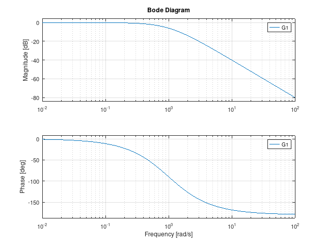|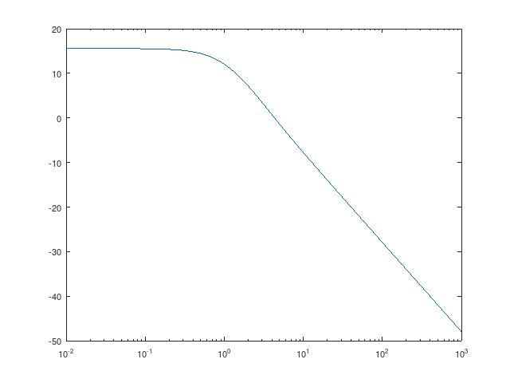|
|--|--|
|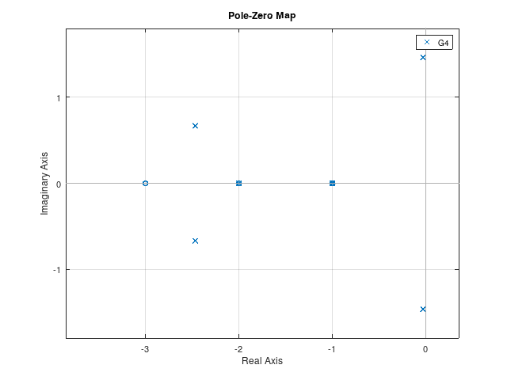|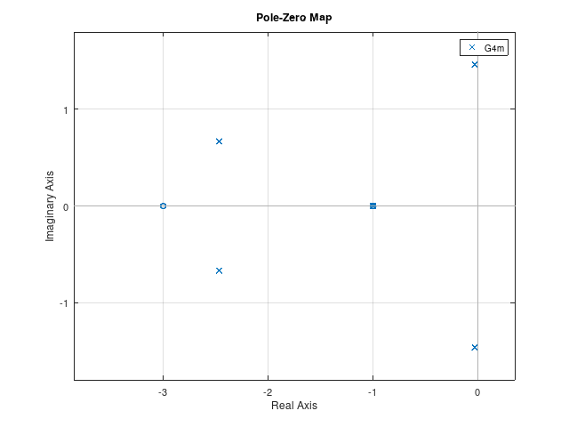|
|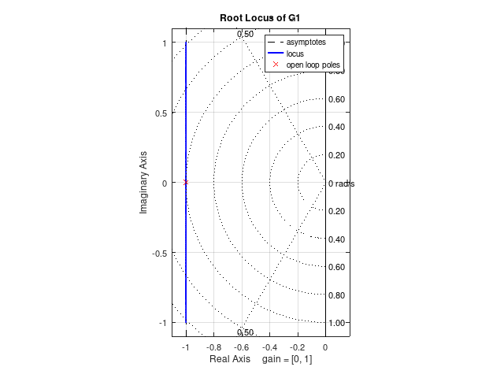|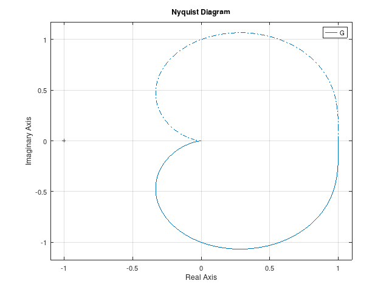|
|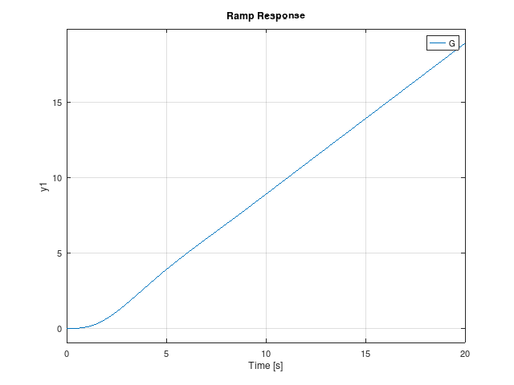|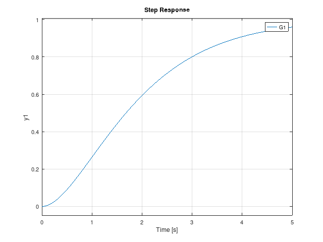|
|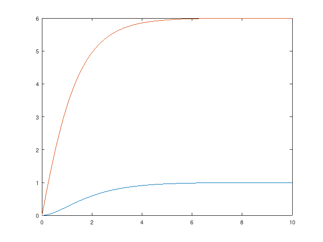|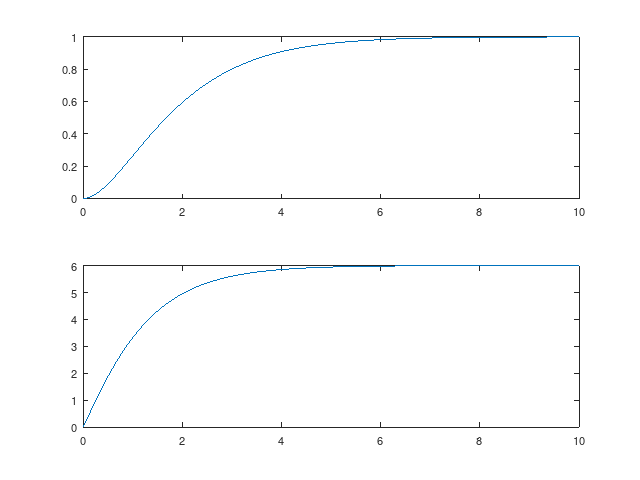|
|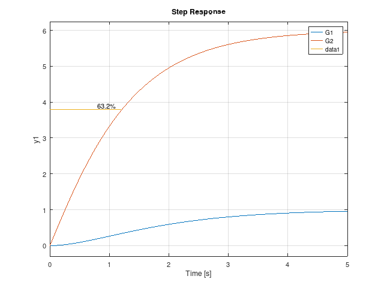|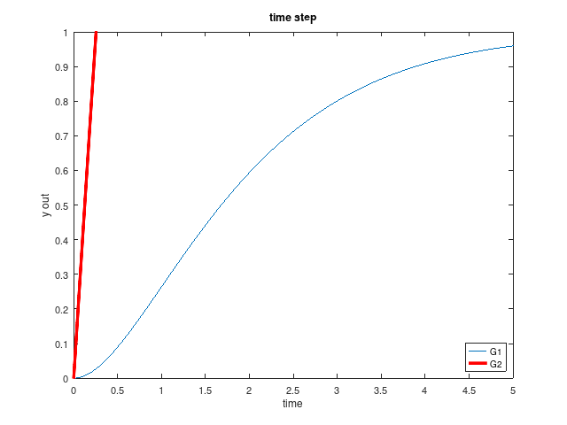|


[github/b2_control_step1.m](https://github.com/tarJ8253/octave/tree/main/control/b2_control_step1.m)


```octave
clear all%変数クリア
close all%図のwindowをすべて閉じる
clc%コマンドウィンドゥをクリア

pkg load control%tfなど制御関係の命令を使うためにcontrol packageを読み込む。

%伝達関数の設定その1
s=tf('s');
G=1/(s^2+s+1);
%伝達関数の設定その2
G1=tf(1,[1 2 1]);%係数だけ設定1/s^2+2s+1
%伝達関数の設定その3
%零点、極、システムゲインを設定。符号に注意
G2=zpk([-3],[-1 -2],4);%(s+3)/[(s+1)(s+2)] * 4
G3=zpk([],[-1 -2],4);%零点がないとき:1/(s+1)(s+2) * 4

%分母分子の係数取り出し
[num den]=tfdata(G1);
[z p k]=zpkdata(G2);

n=den{1,1};%極を手動で計算する時,sの高次式の係数を取りだす
roots(n);%高次式の解を求める


%%以下の描画において、関数の結果を引数で戻した場合、描画されないので
%%目的用途に応じて使い分けすること。

%bode線図
[Mag Phi]=bode(G1);%描画または数値を取得(自分で描きたいとき)
w=0.6;%指定周波数(rad/s)
[Ma Ph]=bode(G1,w);%指定した周波数wの周波数伝達関数の大きさと位相角を取得
%いずれの場合もMagは大きさなので、dBにするときは20log10(Mag)とすること
bode(G1)%bode線図自動描画

%自分で周波数範囲を指定するとき
w2=logspace(-2,3,100);%(start,end,個数),(10^start)から(10^end)まで 個数分のw
[Mag2 phi2]=bode(G2,w2);

[gm pm wg wp]=margin(G1);%ゲイン交差周波数と位相余有、位相交差周波数とゲイン余有

figure
%自分でボード線図を描くとき(片対数グラフの書き方)
semilogx(w2,20*log10(Mag2))


%%極と零点
%分母分子を整理(約分):高次-->低次にする。
G4=G1*G2/(1+G1*G2);
G4m=minreal(G4);

pole(G4);%極位置を取得
zero(G4);%零点だけ求まる。
[p z]=pzmap(G4);%極と零点を取得
figure(10)%fig window番号指定
pzmap(G4)%極と零点を描画
figure(11)
pzmap(G4m)%minrealの前後を比較

%根軌跡
[RLDATA K]=rlocus(G);%数値だけ取得
%Kは実軸と交差するときの値???要確認
figure%fig window番号を指定しないと前の続きになる
rlocus(G1);%図を描画
sgrid on
%または
zeta=0.5;
sgrid(zeta,[])

daspect([1 1])%図の縦横比を1:1にするとき

%ナイキスト線図
[Re Im W]=nyquist(G);%数値だけ取得
figure
nyquist(G);%自動描画


%%時間応答
dt=0.01;%離散間隔(刻み時間)
ti=0:dt:10;%時間指定

%impules応答
[y t x]=impulse(G);
%step応答
[y t x]=step(G,ti);%時間tiを指定
[y]=step(G);%だけでもok
%ramp応答
figure
ramp(G);%傾き(du/dt)1

%任意の傾きのランプ入力を作る場合
du=0.1;%du/dt
u=zeros(1,length(ti));
for i=2:length(ti);
    u(1,i)=u(1,i-1)+du;
end                 %

%任意の入力uの応答
[y t x]=lsim(G,u,ti);%時間刻みtを指定


%%図を描く
figure%新しいfigure windowを開ける
step(G1)%図は自動で描かれる

%自分で描きたいときは、数値を取得する。
[y1 t1]=step(G1,ti);%刻み時間指定:不安定になることもあるので注意

figure(20)%番号を指定して、新しいfigure windowを開ける
plot(ti,y1);
[y2 t2]=step(G2,ti);%刻み時間指定:不安定になることもあるので注意
hold on%図を重ね描きするおまじない
lh=plot(ti,y2);%オプション指定時は、ハンドル(lh)を取得して設定すると複数設定時は省力でき便利。
set(lh,'linewidth',2,'linestyle','-','color','r','linewidth',4);
%線のスタイルの設定,plot(t,y,'r-','linewidth',4)と同じ,入力がラクな方を選んでください
set(gca,'xlim',[0 5],'ylim',[0 1]);%x,y軸の最小最大値の設定
set(gca,'xtick',0:0.5:10,'ytick',0:0.1:1);%x,y軸の目盛り間隔を指定するとき
%set(gca,'xticklabel',0:1:10,'yticklabel',0:0.2:1);%x,y軸の目盛り数値表示を指定するとき
set(gca,'xlabel','time','ylabel','y out');%x,y軸の名前の設定, xlabel('time')でもok

%set(gca,...)は一行にまとめても可
legend('G1','G2','location','southeast');%注釈を図中に記すとき。詳細はhelp legend参照
title('time step')%タイトルをつけたいとき:レポートでは図の下に個別に明記することが望ましいので非オススメ

%%1つのwindowに複数の図を描く
%重ね描きするときはhold onが必要
figure%番号を指定しないと、以前のfig windowの続き番号になる
plot(t1,y1);
hold on%図を重ね書きするときのおまじない
plot(t2,y2);
%任意の2点(x0,y0)(x1,y1)を結びたいときは
%plot([x0 x1],[y0 y1]);

%画面を分割するときは、subplotで分ける
figure
subplot(2,1,1)%2行1列に分割し、1番目の場所に描く
plot(t1,y1);
subplot(2,1,2)%2行1列に分割し、2番目の場所に描く
plot(t2,y2);

figure
step(G1,G2);%自動で重ね描きするとき。線オプションの手動加工はできない。
hold on
plot([0 1.2],[3.79 3.79])
text(0.8,3.9,'63.2%')%図中に文字を置く,text(x座標,y座標,'文字')

%%図をファイルに保存する
fname='fig_';%図のファイル名の共通部.
ext1='.svg';%scalable vector graph:拡大/縮小しても図はきれいで品質良い.wordでは張り込めないかも
%svgはinkscapeやtext editorで編集できる,xml(HTML5)形式で書かれている

ext2='.png';%portable network graphics. bitmap形式。 pbm,jpgもあり
for i=[1:11 20]%保存する図番を指定:そのためfigure(n)として描画したほうがわかりやすいかも
    print(i,[fname,num2str(i),ext2],'-dpng','-S640,480')
    %print(i,[fname,num2str(i),ext1],'-dsvg','-S640,480')
end

%保存した図が小さい場合やファイルが生成できないなどの不具合がある場合は、
%PC環境によるものなので、手動で図を保存すること。
%拡大表示して、FILE->SAVE_AS> file type :pngを選択して名前をつけて保存

```
