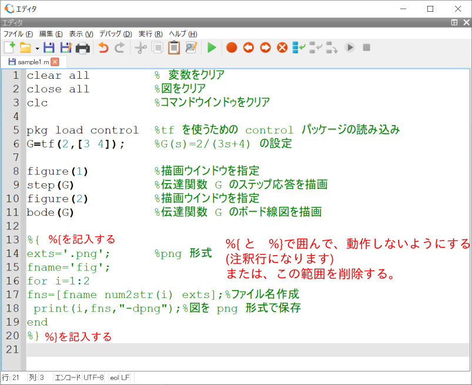
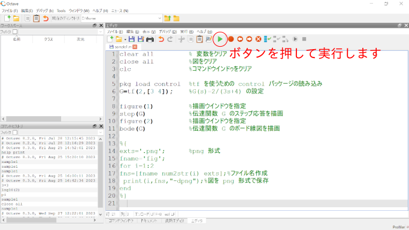
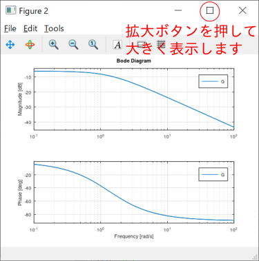
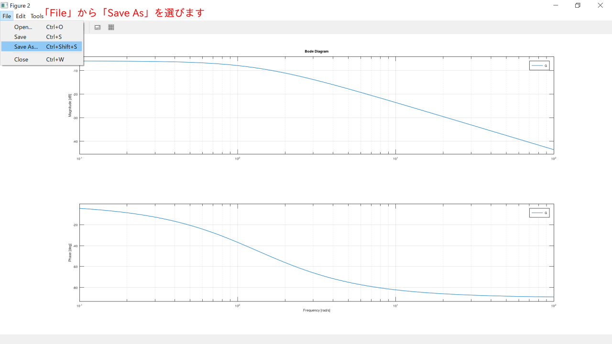
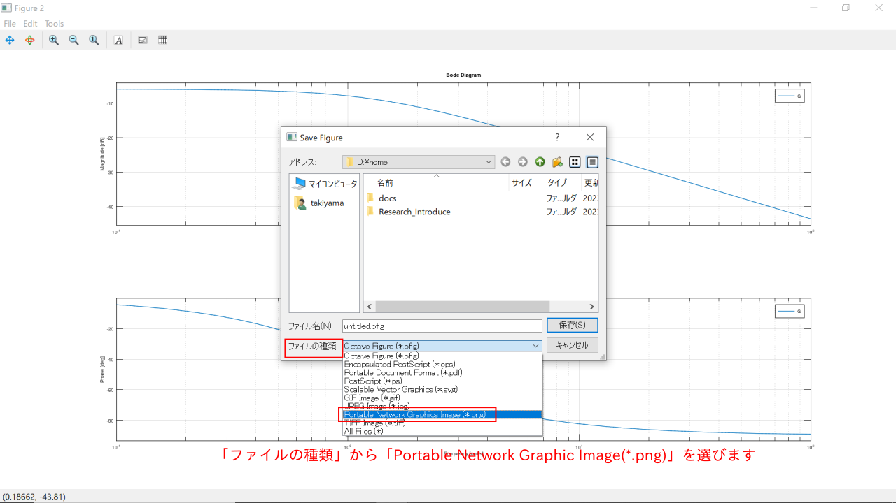
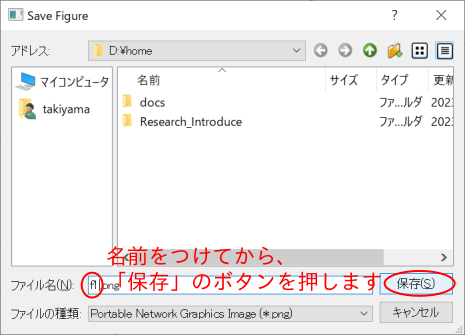
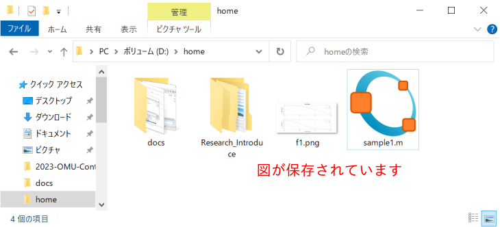

<!--## OctaveのFigureの保存方法-->


## OctaveのFigure出力を保存する方法は以下のとおりです。

1.  print 命令を使用 以下にソースコードを示します。

``` matlab:p.m
        fig_n=1;%保存したいFigureの番号
        figur(fig_n);
        fn='fig_';%保存するファイル名
        print([fn num2str(fig_n) '.png'],'-dpng','-S640,480');
```

ファイル名、fig_番号.png、として、 png形式で保存されます。\
    ビットマップ形式なので、拡大縮小すると図の品質が悪化します。\
    pngで記された箇所をsvgとすると、ベクトル形式となり品質向上しますが、\
    windowsでは扱いにくい場合があるので、注意してください。\
    \
    ただし、これを実行して、
    図が小さい,図を表示したあと止まってしまう、などの問題が発生する場合があります。\
    この問題は、Octaveのprint命令で使うグラフィックエンジ
    ンが、PCの環境により、仕様通り動作できないためだと思われます。\
    最後の\'-S640,480\'は出力画像のサイズです。
    小さいサイズで出力されたら、書いてください。\
    これでも解決しないときは以下の方法を実行してください。
    

2.  GUIから手動で保存
    1.  print命令関連のコマンドを無効(コメント)に(または削除)します。\
        
		
    2.  Octaveのソースファイルを実行して図を出力します。\
        
        
    3.  実行して表示された図を拡大ボタンを押して、大きく表示します。\
        

	4.  大きく表示した図のwindow中にあるメニューバーの「File」を押して、
        「Save As ..」(名前をつけて保存)を選びます。
        
		
    5.  Save Figureダイアログが立ち上がります。\
        注意　この時<font color='red'>「ファイルの種類」を必ず選択して、png形式にします。</font>\
        <font color='red'>初期設定はofig形式で、Octaveでしか理解できないので、必ずpng形
        式を選んでください。</font>\
		お好みでsvgやepsも可能です。\
        
		
    6.  ファイル名も入力します。お好みの名前(なるべく英数字)でok。\
        ここではf1.pngとしました。\
        
		
    7.  fi.pngが保存されていることがわかります。\
        これをクリックして開くと大きいサイズになっていると思います。\
        
        

    おわり
