<!--## Octaveのグラフィック:データをプロットする-->


## 計算結果をきれいにグラフ表示しよう

OctaveがGUIで使え、グラフィックがきれいに描けます。\
最近のバージョンではQtのエンジン使っているそうです。(昔はgnuplot)

<!--more-->


| グラフを書く命令|
| -- | -- | --| -- |
|  plot     |  線形プロット  | |             |
|  semilogx |  x片対数プロット|   semilogy|   y片対数プロット|
|  loglog   |  両対数プロット |   plotyy  |   左右両軸プロット|


help plotなどとして、内容を調べてください。

## 二次元グラフィックス

基本

``` octave
    plot(y)
    H=plot(x,y)
    H=plot(x,y,''option'')
```

      
- 引数が1つのplot(y)は、配列データyを順番にプロットしていきます。

- plot(x,y)では、配列xを横軸値、配列yを縦軸値として
(x,y)の組の順番にプロットしていきます。

したがってx,yのデータ数(長さ)が同じでないと描けません。
よくエラーになるので注意。

- オプション''option''は色、マーカー、線種などを設定できます。

例えば、
plot(x,y,'r:+')とすると
赤色(r)、点線(:)、十字マーカー(+)を用いた二次元グラフが描画されます。


help plot,doc plot
でオプションを調べてみましょう。


| linestyle |
|--|----|--|----|
|\'-\'|Use solid lines (default).|\'\--\'|Use dashed lines.|
|\':\'|Use dotted lines.|\'-.\'|Use dash-dotted lines.|

|  marker  |
|--|------|--|------|--|------|
| \'+\'|  crosshair  |  \'o\' |   circle | \'\*\'|  star |   \'.\' |   point|
| \'x\'| cross       |  \'s\' |   square  | \'d\' |  diamond | \'\^\'|   upward-facing triangle|
| \'v\'| downward-facing triangle | \'\>\' | right-facing triangle | \'\<\'| left-facing triangle | \'p\'|  pentagram|
| \'h\'|   hexagram  |


|  color |
|--|-----|--|----|--|----|--|----|
| \'k\' | blacK  |  \'r\'   |    Red     |  \'g\'|   Green |  \'b\'|   Blue|
  \'y\' | Yellow |  \'m\'   |    Magenta |  \'c\'|   Cyan |   \'w\'|   White|
|  \[r g b\] |0\<r,g,b\< 1 のr,g,bの値を指定  |

- 線の太さなどを少しいろいろ細かく設定したい場合は、plotのハンドルを取得してハンドルプロパティを設定します。

	-   plotの戻り値 Hはハンドル番号(ID番号のようなもの)です。
	-   get(H)で、得られたプロパティ(属性:線の色、太さなど)が表示されます。
    そのハンドル番号に対してset命令を用いてさまざまな設定を行います。

``` bash
    get(H)
    ans=
      scalar structure containing the fields:
    (中略)
        color =
           1   0   0
    (中略)
        linestyle = :
        linewidth =  0.50000
        marker = +
    (中略)
        markersize =  6
    (後略)
    >>H=plot(x,y)
    >>set(H,'linewidth',1,'linestyle',':', 'color', 'c' ,'marker','x');
```

linewidth(線の太さ)の単位はpt(ポイント)のようです。\
描画命令(plot)と、オプション命令(set)を分けて描くと、
プログラム中で色や線種を自動指定しやすくなります(オススメ)。

- 軸の設定は axis(\[xmin xmax ymin ymax\])や xlim(\[xmin xmax\]),ylim(\[ymin ymax\]),で設定もできるが、明示的にいろいろ設定したい場合は、
軸プロパティを指定すれば良い。

```bash
    gca:get a handle current axes object

    get(gca);%プロパティが表示されます。
    set(gca,'xlabel','X','ylabel','Y','title','HOGE','xlim',[xmin xmax],'ylim',[ymin ymax],'FontSize',10,'FontName','Times')
    legend('h1','name2',...,表示場所);%help legendして調べてください。
```

## その他2次元データのプロット

|||
|-|-----|
|bar()|棒グラフ, データの列行を転置で入れ替え可\bar(\[1 2 3 1\]),bar(t\')|
|barh()|barの横向き\optionでSTYLE,PROPERTY設定あり|
|hist()|ヒストグラム。hist(\[1 1 2 3 3 3\])\区間を10分割して各度数(頻度)を計算して図示する。|
|pie()|円グラフ, 百分率で表示|
|polar()|放射状グラフ|
|その他、area, rose, compassなどあり|


``` octave
    N=6;
    x=linspace(1,N,N)';
    bar(x,4*[cos(x)+1.5 sin(x)+1.5 rand(N,3)+1.0])%'grouped'がdefault
    figure
    barh(x,4*[cos(x)+1.5 sin(x)+1.5 rand(N,3)+1.0], 'stacked')
    figure
    hist(randn(100,1));%正規分布乱数100個を10区分に分けて度数を示す。
```

| bar (grouped)       | barh stacked         | hist           |
|---------------|--------------------|-------------------|
 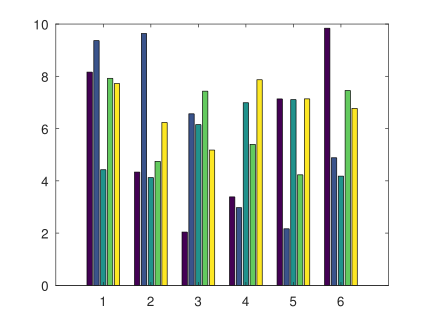  | 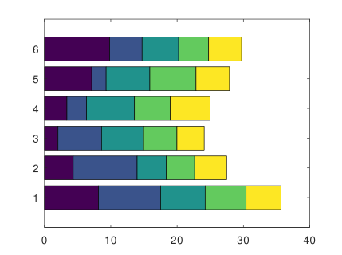       | 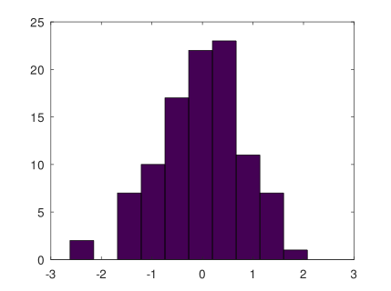       |


<table><tr><td><pre>
Sold=[20 15 8 7 3]; 
Fruits={'Apple','Orange','Banana','Peach','Cherry'}; 
Explor=[0 0 0 0.1 0]; 
figure 
pie(Sold,Explor,Fruits)
</pre>
</td>
<td>pie<br>
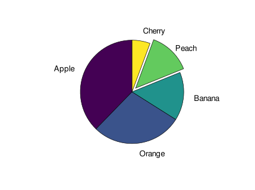
</td>
</tr>
</table>


<table><tr><td><pre>
th=linspace(0, 2*pi, 201);
figure
H=polar(th,sqrt(2)*cos(5*th));
set(H,'linewidth',4);
</pre>
</td>
<td>
polar<br>
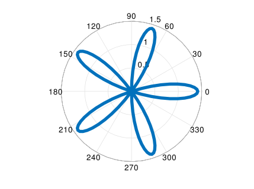
</td>
</tr>
</table>


[MATLABのプロットタイプを紹介します。](https://jp.mathworks.com/help/matlab/creating_plots/types-of-matlab-plots.html)\
ここに近いことがOctaveでもできると思います。\
レーダーチャートはユーザー投稿programからどうぞ


## グラフをたくさん描きたい

1.  \[方法1.\] figure(ウィンドウ番号)で描画画面を複数開き、
    グラフィックウィンドウを指定して描画する。\
    ウィンドウ番号の指定なければ1が指定されて開く。\
    plotは上書きが基本なので、重ね描きするときは、 hold onを記述する。\
    \
    例\
    plot(x,sin(x))と plot(x,cos(x))を重ね描きします。\
    figureの番号を指定しないときは、1から始まり、figure命令毎に増えます。


<table><tr><td><pre>
clear all 
close all 
clc 
x=linspace(0,2*pi,50);
figure
plot(x,sin(x),'+');%データ点を+で表示
hold on
plot(x,cos(x),'r--');%データ点を赤色破線で結んで表示 
</pre></td>
<td>
<br>

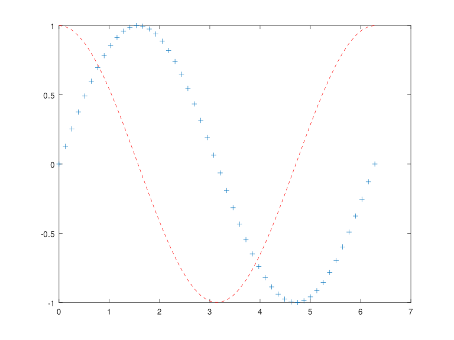
</td>
</tr>
</table>
	
	
	
	
	
2.  \[方法2.\] 一つの画面を分割する。\
    subplot(行数,列数,描画する画面)

例
	

<table><tr><td><pre>
figure 
ezplot('sin(x)') 
subplot(2,1,2) 
ezplot('log10(x)')
</pre></td>
<td>
<br>
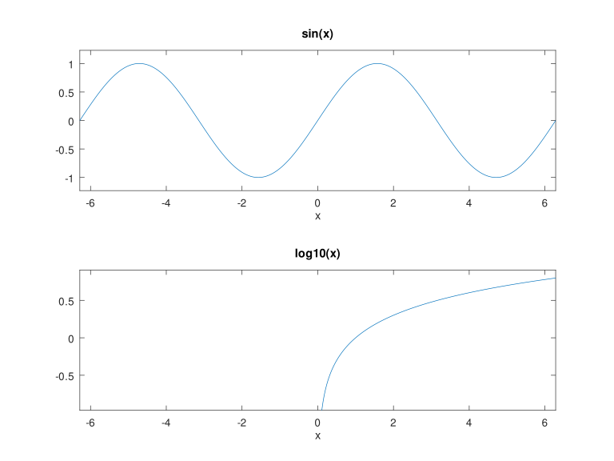
</td>
</tr>
</table>

	
ウインドウを上下二段(2行,1列)に分割して、
    上(最後の1で指定)の部分にsin(x)を描画。
    下(最後の2で指定)の部分にlog10(x)を描画します。\
    \
    ezplotは いくつかの関数について、横軸xの数値がなくても、
    ezplot(関数名)とするだけで、グラフが表示されます。


## 三次元データのグラフィックス

三次元データの図示例として 以下を示します。


<table><tr><td><pre>
z = [0:0.01:3];
figure 
plot3 (cos (2*pi*z), sin (2*pi*z), z,'o-');
hold on 
plot3 (z, exp (2i*pi*z)); 
</pre></td>
<td>
plot3<br>
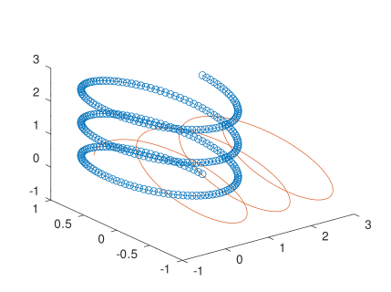
</td>
</tr>
</table>


<table><tr><td><pre>
     theta = 0:0.2:6;
     figure
     stem3 (cos (theta), sin (theta), theta);
</pre></td>
<td>
stem3<br>
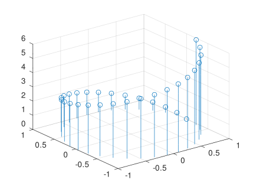
</td>
</tr>
</table>


<table><tr><td><pre>
[x y z]=peaks(36);
figure
contour3(x,y,z)
figure
mesh(x,y,z)
figure
meshc(x,y,z)
figure
ribbon(y,z)
figure
surf(x,y,z)
figure
surfc(x,y,z)

%**cでcontour(等高線)併記
</pre></td>
<td>
<table>
<tr><td>
contour3<br>
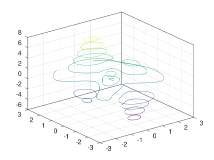
</td>
<td>
mesh
<br>
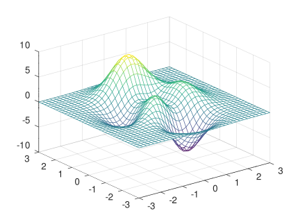
</td>
<td>
meshc
<br>
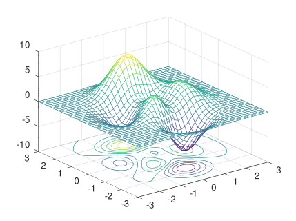
</td>
</tr>
<tr><td>
ribbon
<br>
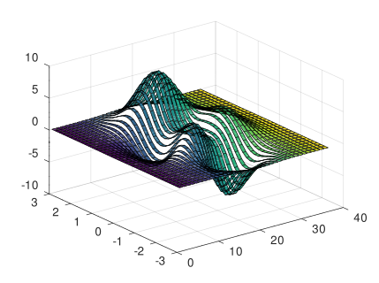
</td>
<td>
surf
<br>
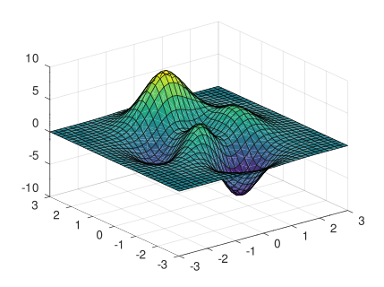
</td>
<td>
surfc<br>
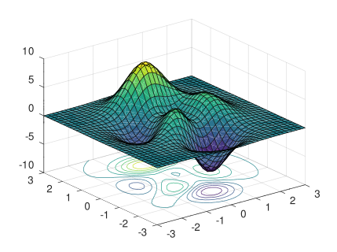
</td></tr></table>

</td></tr></table>


</table>


<table><tr><td><pre>
[x y z]=peaks(37);
figure
surface(x,y,z)
colorbar
</pre></td>
<td>
surface<br>
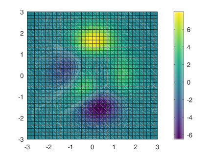
</td>
</tr>
</table>


<table><tr><td><pre>
[x, y, z]=peaks(80);
figure
contourf(x, y, z) ;
colorbar;
figure
contour(x, y, z) ;
</pre></td>
<td>
contourf<br>
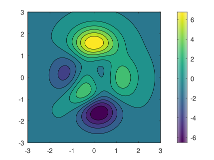
</td>
<td>
contour<br>
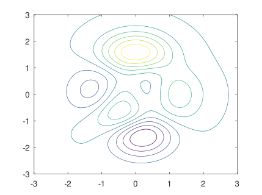
</td>
</tr>
</table>


<table><tr><td><pre>
f= @(x,y) sin(sqrt(x.^2+y.^2))./sqrt(x.^2+y.^2);
range = linspace (-8, 8, 41);
[X, Y] = meshgrid (range, range);
Z = f (X, Y);
figure
surf (X, Y, Z);
</pre></td>
<td>
surf<br>
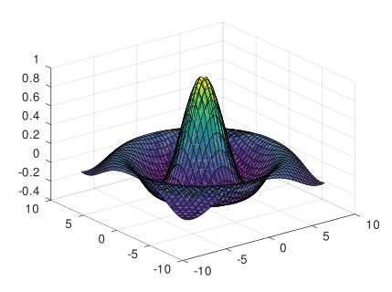
</td>
</tr>
</table>


\
meshgrid(X,Y)とはX,Yがそれぞれベクトルとして、
交点(X,Y)の値を求める命令です。\
上記ではX,Yともに-8から8まで41個の値(range)なので
(X,Y)=(-8.0,-8.0),(-7.6, -8.0),(-7.2,
-8.0),\...,(7.6,8.0),(8.0,8.0)の41x41組の(X,Y)値が得られる。\
\
簡単できれいにグラフィックスができることがOctave/Matlabの特長です。\
既定値以外の線の色や種類に変更したいときは、svg形式で出力したファイルをInkscape(ソフトウェア名)を用いて編集すれば簡単にできます。\
svgファイルをEditorで読み込んでテキスト編集してもできます。


## その他オプションの紹介

-   軸の縦横比を揃えたい。\
    軸の縦横比を揃えて「円」を円らしく表記したいときなどは、縦横比を指定します。初期
    値は auto のようです。

```octave
        daspect([1 1])
        daspect([1 1 1])
```

二次元でも三次元でも ok です。

-   grid 根軌跡の場合はsgrid on

```octave
   zeta=0.691;
   sgrid(zeta,[]);
```

とすると、指定したzetaの補助線が表示されます。


## 図をファイルとして保存する

レポートに添付するために、図をファイルとして保存します。\
図には、ベクトル形式とビットマップ形式があります。\
ベクトル形式は 拡大縮小などしても劣化が少なくきれいな形式です。
拡張子はeps,svg,pdfなどがあります。\
ベクトル形式は LibreOfficeでは問題なく貼り込めますが、
wordでは貼り込めない場合があるので、
そのような場合はビットマップ形式で保存します。\
図のメニューから印刷できますし、 コマンドとしては
print(H,FILANAME,OPTIONS) とします。\
\
Hは図のハンドル番号で、 保存するfigureのウィンドウ番号を指定します。

-   FILENAMEは保存するファイル名
-   OPTIONSにはいろいろ指定できますが、  保存形式\'-dDEVICE\'を指定します。
-   DEVICEには、ベクトル形式なら,eps,svg,pdf、ビットマップ形式ならばpng,pbm,jpgとします。
- svgで保存しているのは、Inkscapeで見栄え良く編集するためです。
-   epsに色付きで直接保存するときは、\'-color\'のオプション指定が必要な場合があるようです。
	-depscとする手もあるかもしれません。

以下のようなmファイルを実行すれば、fig1からfig10までを連続して
fig\_\*.svgとして出力保存されます。(\*はfig番号)

``` octave
    fn='fig_';
    ext='.svg';

    for i=1:10
      fname=[fn num2str(i) ext];
      print(i, fname, '-dsvg','-S640,480');
    end
```

最後の\'-S640,480\'は出力画像のサイズです。
小さいサイズで出力されたら、書いてください。
