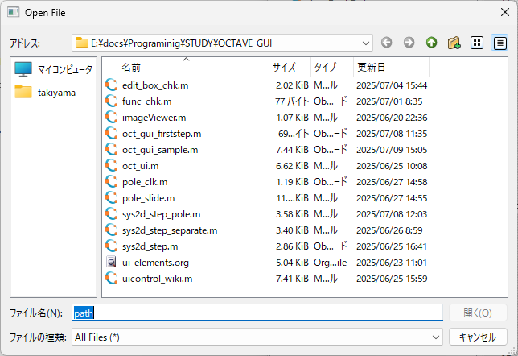
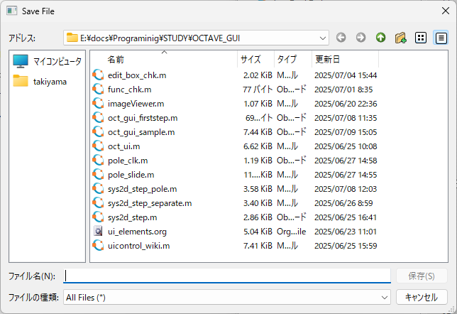
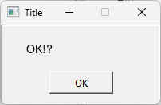
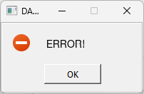
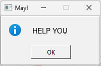
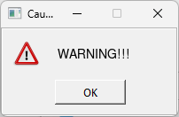
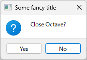
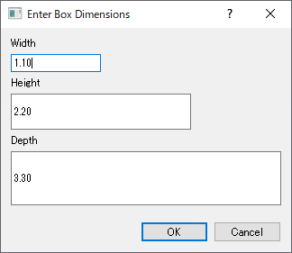
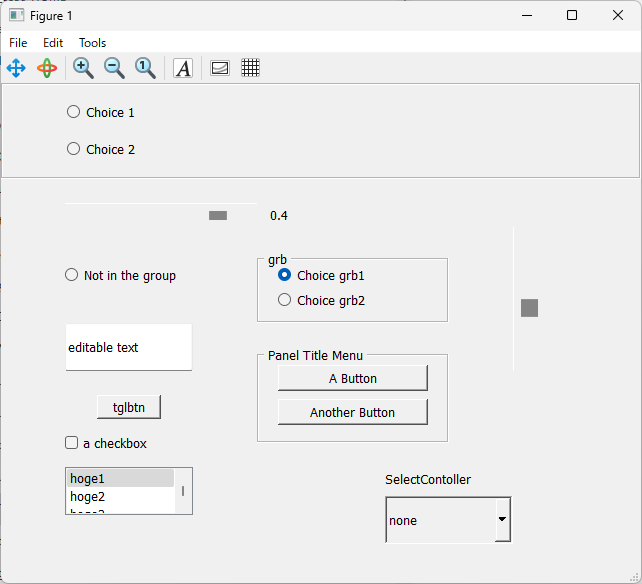

Octave7.3(Deb12)/9.6(w11)で検証

* GUIを用いた読み込みと書き込みファイルの指定

<!--more-->
** ファイルを選ぶ
ファイル名が決まっていない場合や任意のファイルを選びたい場合などでは、
OctaveではGUIを用いて選んだファイルのファイル名を取得できます。

- ファイルを開く

#+begin_src octave
[fname fpath fltindex]=uigetfile();
#+end_src

Octaveを実行したフォルダを開きます。

別のフォルダを指定する場合は、右辺()内に"folderpath"を記します。

  [fname fpath fltindex]=uigetfile("c:\\data\\*.ext")とすれば、
  (i)フォルダc:dataにある、 (ii)拡張子extをもつファイル、
  を表示します。
  \は円記号です。

- ファイルを保存する

#+begin_src  octave
     [fname fpath fltindex]=uiputfile(); 
#+end_src

- 戻り値fname,fpathは、それぞれファイル名とパス(フォルダ名)です。

読み書きするためのパスまで含んだ全ファイル名は次のようにすれば設定できます。

#+begin_src  octave
FILENAME=[fpath fname] 
#+end_src

- uigetdirもあります

* ダイアログBOXを使う

簡単なGUI使用例を紹介します。

windowsのOctaveではmsgboxに日本語(2バイト文字)は表示できないようです。(Linuxでは表示可)

1. メッセージ表示

 |     ||||

左から順に以下のとおりです。

   #+begin_src  octave
   H=msgbox("OK!?","TITLE");
   uiwait(H)
   #+end_src
   
   #+begin_src  octave
   H=errordlg("ERROR!","DANGER!");
   uiwait(H)
   #+end_src

   #+begin_src  octave
   H=helpdlg("HELP YOU","MayI");
   uiwait(H)
   #+end_src

   #+begin_src  octave
   H=warndlg("WARNING!!!","Caution");
   uiwait(H)
   #+end_src

   uiwait(H)がないと、OKボタンを押さなくてもプログラム実行は次に進んでいきます。

2. Yes/No入力

   #+begin_src  octave
   btn = questdlg ("Close Octave?", "Some title", "Yes", "No", "No");

   if (strcmp (btn, "Yes"))
     exit ();
   else
     H=msgbox("Octave continue");
     uiwait(H)
   endif
   #+end_src

   

   詳細を見たいときはhelp questdlgまたは、doc questdlgしてください。

   - 基本は quetdlg("メッセージ","タイトル")
     で、Yes,No,Cancelボタンが現れます。

   - Yes/Noの表示を変えたいときは、以下のようにしてください。

     #+begin_src  octave
     quetdlg("メッセージ","タイトル","ボタン1の表示名","ボタン2の表示名","defaultのボタン")
     #+end_src

     defaultのボタン指定はなくても構いません。

     また、指定できるボタンは2つまでのようです。

   - 押されたボタンを検出するための文字列の比較はstrcmpで行います。

3. 入力ボックス

   サンプルソースを紹介します。 実行して、内容を理解してください。

   

    

   #+begin_src  octave
   prompt = {"Width", "Height", "Depth"};
   defaults = {"1.10", "2.20", "3.30"};
   rowscols = [1,10; 2,20; 3,30];
   dims = inputdlg (prompt, "Enter Box Dimensions", ...
           rowscols, defaults);
   #+end_src

   

   - 実行したらcell配列dimsの中に入力値が保存されています。

    セル配列の扱いを参考に、取り扱ってください。

* マウスクリック座標を取得する

octaveのfigure画面上をマウスクリックしたときの座標を取得できます。

#+begin_example
[x y buttons]=ginput(n)
#+end_example

nはイベント回数,n=1とすれば1回発生時の座標取得、nの定義がなければ、ret
が押されて終了するまでの座標をすべて記憶しています。

* もっとGUI

UI Elementには、
uifigure(), uipanel(), uibuttongroup(), uicontrol(),
uitable(), uimenu(), uicontextmenu(), uitoolbar(),
uipushtool(), uitoggletool()
などなどあるようですが、uicontrol()だけでもそれなりになるようです。

** uicontrol()

以下のguiがあります。

"checkbox"
"edit"
"listbox"
"popupmenu"
"pushbutton"
"radiobutton"
"slider"
"text"
"togglebutton"

- figure画面にguiのパーツを置く
- イベントはcallbackで指定した関数に飛ばして処理する
- guidata(H,DATA);%GUIdataをfigure handle Hにstoreする
  
GUIとサンプルソースを示します。参考にしてください。

[[https://github.com/tarJ8253/octave/blob/main/oct_gui/oct_gui_sample.m][github/oct_gui_sample.m]]

#+begin_src octave
clear all
close all
clc

function mylist_callback(hs,evt, arg1)
    msgbox(get(hs,"string"){get(hs,"value")},"ListboxSelection");
end

function mybutton_grb(hs,evt, arg1)
    msgbox(["called from grb " num2str(arg1)],"group button");
end

function update_menu(obj, init=false)

    hs=guidata(obj);
    %gcbo holds the habdle of the control
    switch(gcbo)
      case {hs.gb1}
        if((get(hs.gb1,"value")==true) && (get(hs.gb2,"value")==false))
           msgbox("Choice1","Selected");
        end
      case {hs.gb2}
        if((get(hs.gb2,"value")==true) && (get(hs.gb1,"value")==false))
           msgbox("Choice2","Selected");
        end
      case {hs.tglbtn1}% 0/1変化
        num=get(gcbo, "value");
        disp(num)
      case {hs.ed1}
        ed_gui=get(gcbo,"string");
        disp(ed_gui);
      case {hs.cb1}
        cb1_gui=get(gcbo,"value");
        disp(cb1_gui);
      case {hs.slb1}
        slb1_num_gui=get(gcbo,"value");
        set(hs.slb1_num,"string",num2str(slb1_num_gui));
    end
end

%## Create figure and panel on it
h.f=figure("position",[100 100 640 480]);

h.p = uipanel ("title", "Panel Title Menu",
               "units", "normalized",
               "position", [.4 .25 .3 .2]);

%## add two buttons to the panel
h.b1 = uicontrol ("parent", h.p,
                  "string", "A Button", 
                  "units", "normalized",
                  "horizontalalignment", "left",
                  "position", [.1 .6 .8 .3],
                  "callback", @update_menu);

h.b2 = uicontrol ("parent", h.p,
                  "string", "Another Button", 
                  "units", "normalized",
                  "horizontalalignment", "left",
                  "position",[.1 .2 .8 .3],
                  "callback", @update_menu);

%## Create a button group
h.gp = uibuttongroup ("parent",h.f,
                      "units", "normalized",
                      "Position", [0 0.8 1 0.2]);
%## Create a buttons in the group
h.gb1 = uicontrol ("parent", h.gp,
                   "style", "radiobutton", 
                   "string", "Choice 1",
                   "value",false,
                   "units", "normalized",
                   "horizontalalignment", "left",
                   "position", [ .1 .6 .2 .2 ],
                   "callback", @update_menu);
h.gb2 = uicontrol ("parent", h.gp,
                   "style", "radiobutton",
                   "string", "Choice 2", 
                   "value",false,
                   "units", "normalized",
                   "horizontalalignment", "left",
                   "position", [ .1 .2 .2 .2 ],
                   "callback",@update_menu);

h.gp2 = uibuttongroup ("parent", h.f,
                       "title","grb",
                       "units", "normalized",
                       "Position", [ 0.4 0.5 0.3 0.15] );

h.grb1 = uicontrol ("parent",h.gp2,
                    "style", "radiobutton",
                    "string", "Choice grb1",
                    "units", "normalized",
                    "position", [ .1 .6 .7 .3 ],
                    "callback",{@mybutton_grb,1});

h.grb2 = uicontrol ("parent", h.gp2,
                    "style", "radiobutton",
                    "string", "Choice grb2",
                    "units", "normalized",
                    "horizontalalignment", "left",
                    "position", [ .1 .2 .7 .3 ],
                    "callback",{@mybutton_grb,2});

%## Create a button not in the group
h.rb0 = uicontrol ("parent",h.f,
                   "style", "radiobutton",
                   "string", "Not in the group", 
                   "units", "normalized",
                   "horizontalalignment", "left",
                   "position", [ .1 .5 .2 .2 ],
                   "callback", @update_menu);

%## Create an edit control
h.ed1 = uicontrol ("parent", h.f,
                  "style", "edit",
                  "string", "editable text", 
                  "units", "normalized",
                  "horizontalalignment", "left",
		  "position", [.1 .4 .2 .1],
                  "callback", @update_menu );

%## Create a checkbox
h.cb1 = uicontrol ("parent", h.f,
                  "style", "checkbox",
                  "string", "a checkbox", 
                  "units", "normalized",
                  "horizontalalignment", "left",
		  "position", [.1 .2 .15 .1],
                  "callback", @update_menu);

mylist={"hoge1","hoge2","hoge3","hoge4","hoge5"};
h.lb1 = uicontrol ("parent", h.f,
                   "style", "listbox",
                   "string", mylist,
                   "units", "normalized",
                   "horizontalalignment", "left",
                   "position", [.1 0.1 .2 .1],
                   "callback", {@mylist_callback, mylist});

h.cont_list = uicontrol ("parent", h.f,
%                         "title","select controller",
                         "style", "popupmenu",
                         "units", "normalized",
                         "string", {"none",
                                    "PID",
                                    "PoleSet",
                                    "LQ",
                                    "Fuzzy",
                                    "STR",
                                    "SlidingMode",
                                    "BackStepping",
                                    "SimpleAdaptiveCont.",
                                    "ModelPredictCont."},
                         "horizontalalignment", "left",
                         "position", [0.6 0.04 0.2 0.1],
                         "callback", @update_menu);

h.l_label = uicontrol ("parent",h.f,
                       "style", "text",
                       "units", "normalized",
                       "string", "SelectContoller",
                       "horizontalalignment", "left",
                       "position", [0.6 0.15 0.15 0.05]);

%two states,0/1
h.tglbtn1 = uicontrol ("parent",h.f,
                       "style", "togglebutton",
                       "units", "normalized",
                       "string", "tglbtn",
                       "horizontalalignment", "left",
                       "position", [0.15 0.3 0.1 0.05],
                       "callback", @update_menu);

slb_ini=0.4;
h.slb1 = uicontrol ("parent",h.f,
                    "style", "slider",
                    "units", "normalized",
                    "value", slb_ini, % 初期値の指定,max/min指定なければ変化幅は0/1
                    "max",10,
                    "min",-100,
                    "sliderstep",[0.001 0.01],
                    "horizontalalignment", "left",
                    "Position", [ 0.1 0.7 0.3 0.05],
                    "callback",@update_menu);

h.slb1_num=uicontrol("parent",h.f,
                     "style","text",
                    "units", "normalized",
                     "string",num2str(slb_ini),
                     "horizontalalignment", "left",
                     "position", [ 0.42 0.7 0.2 0.05]);

h.sl_ver = uicontrol ("parent",h.f,
                      "style", "slider",
                      "units", "normalized",
                      "string", "volume",
                      "value", 0.4, % 初期値の指定,出力は0/1
                      "horizontalalignment", "left",
                      "Position", [ 0.8 0.4 0.05 0.3],%幅/高さ比で自動的に向きが変わる!
                      "callback",@update_menu);

set (h.f, "color", get(0, "defaultuicontrolbackgroundcolor"));
guidata(h.f, h);
update_menu(h.f, true);

#+end_src

参考サイト

- wiki: https://wiki.octave.org/Uicontrols
- UI Elements:https://docs.octave.org/interpreter/UI-Elements.html
- 日本語訳:https://runebook.dev/ja/docs/octave/ui-elements
- uicontrol():https://docs.octave.org/latest/Uicontrol-Properties.html
- 利用例:https://shuzo-kino.hateblo.jp/entry/2020/11/25/235944

