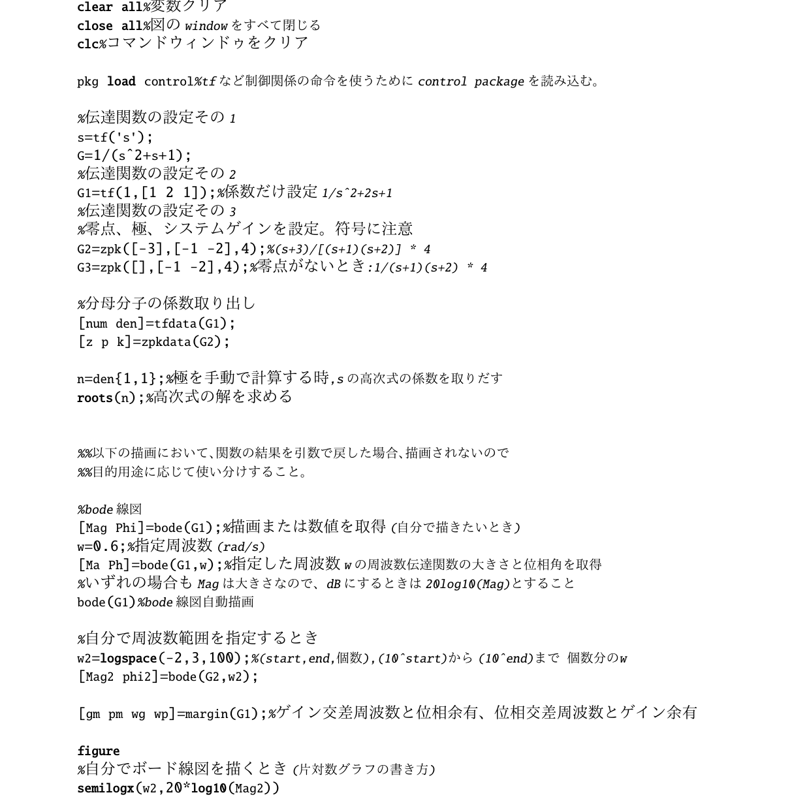
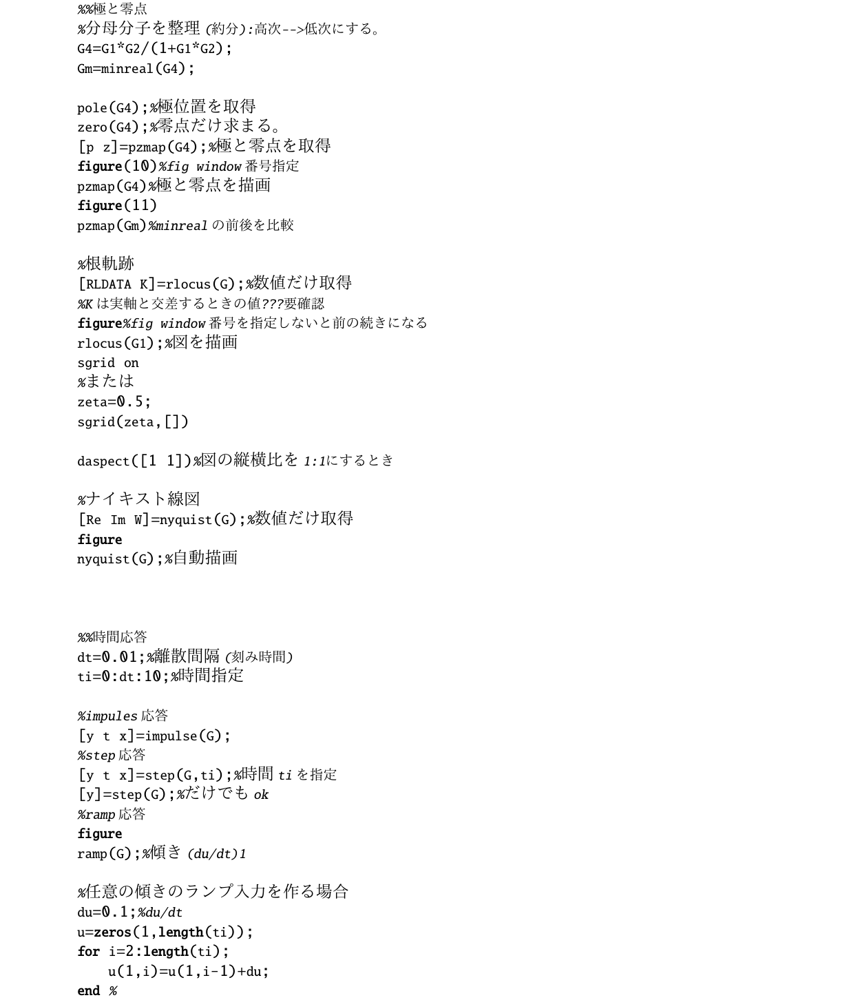
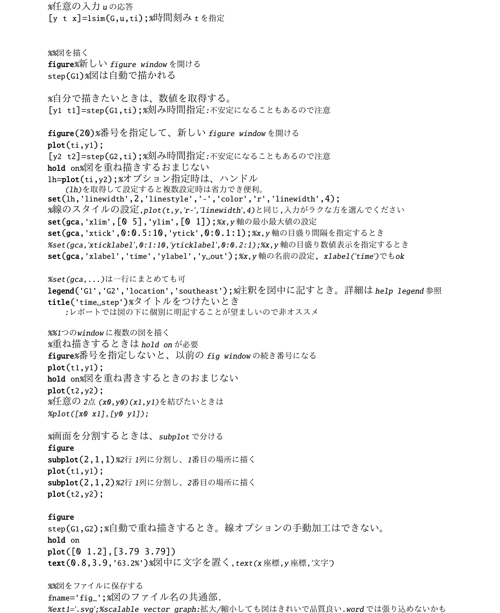
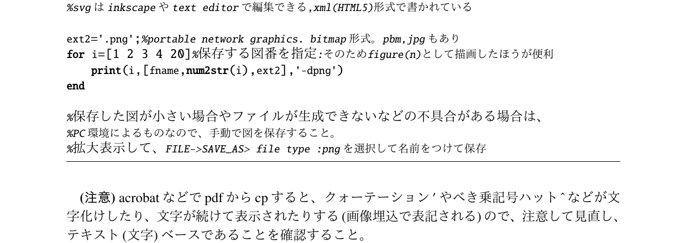

<!--# GNU Octaveで制御系設計-->


MATLABと互換性が高いフリーソフトのGNU
Octave(以降octaveと略)を使って制御系を設計しましょう。

<!--more-->

## 1. ファイル実行のすすめ

octaveはインタプリタなので、一行毎に実行しますが、修正や再試行するのが非
常に煩わしいです。\
そこで、octaveの命令を順番に記述したファイルを作成し、
拡張子(ファイルの最後の文字)を .m として保存します。\
そうすれば、octaveのコンソールからファイル名(.mは省く)を入力することで、
ファイル内のoctaveの命令が順に実行されます。\
このファイルはmファイルと呼ばれることもあります。\
この文書はすべて、<font color='blue'>mファイルを作成してから実行</font>することをススメます。\
ただし<font color='red'>ファイル名には以下の制限があります。</font>

-   ファイル名使用文字は半角英数。ただし先頭は半角英文字。
-   先頭文字に数字を用いてはいけません。
-   ファイル名中に演算子を用いてはいけません。とくにハイフン(-)に注意。
    アンダーバーを使いましょう。

これはOctave/Matlabが演算命令と間違えるためです。\
**また、octave実行時はmファイルのあるディレクトリにcdしてから、
octaveしましょう。 その方が平和です。**

## Octaveサンプルプログラム

<!--
	\
	{style="align:left"}\
	{style="align:left"}\
	{style="align:left"}\
	{style="align:left"}
-->

``` octave
%% b2_control_step1.m 2023.10.31版
clear all%変数クリア
close all%図のwindowをすべて閉じる
clc%コマンドウィンドゥをクリア

pkg load control%tfなど制御関係の命令を使うためにcontrol packageを読み込む。

%伝達関数の設定その1
s=tf('s');
G=1/(s^2+s+1);
%伝達関数の設定その2
G1=tf(1,[1 2 1]);%係数だけ設定1/s^2+2s+1
%伝達関数の設定その3
%零点、極、システムゲインを設定。符号に注意
G2=zpk([-3],[-1 -2],4);%(s+3)/[(s+1)(s+2)] * 4
G3=zpk([],[-1 -2],4);%零点がないとき:1/(s+1)(s+2) * 4

%分母分子の係数取り出し
[num den]=tfdata(G1);
[z p k]=zpkdata(G2);

n=den{1,1};%極を手動で計算する時,sの高次式の係数を取りだす
roots(n);%高次式の解を求める


%%以下の描画において、関数の結果を引数で戻した場合、描画されないので
%%目的用途に応じて使い分けすること。

%bode線図
[Mag Phi]=bode(G1);%描画または数値を取得(自分で描きたいとき)
w=0.6;%指定周波数(rad/s)
[Ma Ph]=bode(G1,w);%指定した周波数wの周波数伝達関数の大きさと位相角を取得
%いずれの場合もMagは大きさなので、dBにするときは20log10(Mag)とすること
bode(G1)%bode線図自動描画

%自分で周波数範囲を指定するとき
w2=logspace(-2,3,100);%(start,end,個数),(10^start)から(10^end)まで 個数分のw
[Mag2 phi2]=bode(G2,w2);

[gm pm wg wp]=margin(G1);%ゲイン交差周波数と位相余有、位相交差周波数とゲイン余有

figure
%自分でボード線図を描くとき(片対数グラフの書き方)
semilogx(w2,20*log10(Mag2))


%%極と零点
%分母分子を整理(約分):高次-->低次にする。
G4=G1*G2/(1+G1*G2);
G4m=minreal(G4);

pole(G4);%極位置を取得
zero(G4);%零点だけ求まる。
[p z]=pzmap(G4);%極と零点を取得
figure(10)%fig window番号指定
pzmap(G4)%極と零点を描画
figure(11)
pzmap(G4m)%minrealの前後を比較

%根軌跡
[RLDATA K]=rlocus(G);%数値だけ取得
%Kは実軸と交差するときの値???要確認
figure%fig window番号を指定しないと前の続きになる
rlocus(G1);%図を描画
sgrid on
%または
zeta=0.5;
sgrid(zeta,[])

daspect([1 1])%図の縦横比を1:1にするとき

%ナイキスト線図
[Re Im W]=nyquist(G);%数値だけ取得
figure
nyquist(G);%自動描画


%%時間応答
dt=0.01;%離散間隔(刻み時間)
ti=0:dt:10;%時間指定

%impules応答
[y t x]=impulse(G);
%step応答
[y t x]=step(G,ti);%時間tiを指定
[y]=step(G);%だけでもok
%ramp応答
figure
ramp(G);%傾き(du/dt)1

%任意の傾きのランプ入力を作る場合
du=0.1;%du/dt
u=zeros(1,length(ti));
for i=2:length(ti);
    u(1,i)=u(1,i-1)+du;
end                 %

%任意の入力uの応答
[y t x]=lsim(G,u,ti);%時間刻みtを指定


%%図を描く
figure%新しいfigure windowを開ける
step(G1)%図は自動で描かれる

%自分で描きたいときは、数値を取得する。
[y1 t1]=step(G1,ti);%刻み時間指定:不安定になることもあるので注意

figure(20)%番号を指定して、新しいfigure windowを開ける
plot(ti,y1);
[y2 t2]=step(G2,ti);%刻み時間指定:不安定になることもあるので注意
hold on%図を重ね描きするおまじない
lh=plot(ti,y2);%オプション指定時は、ハンドル(lh)を取得して設定すると複数設定時は省力でき便利。
set(lh,'linewidth',2,'linestyle','-','color','r','linewidth',4);
%線のスタイルの設定,plot(t,y,'r-','linewidth',4)と同じ,入力がラクな方を選んでください
set(gca,'xlim',[0 5],'ylim',[0 1]);%x,y軸の最小最大値の設定
set(gca,'xtick',0:0.5:10,'ytick',0:0.1:1);%x,y軸の目盛り間隔を指定するとき
%set(gca,'xticklabel',0:1:10,'yticklabel',0:0.2:1);%x,y軸の目盛り数値表示を指定するとき
set(gca,'xlabel','time','ylabel','y out');%x,y軸の名前の設定, xlabel('time')でもok

%set(gca,...)は一行にまとめても可
legend('G1','G2','location','southeast');%注釈を図中に記すとき。詳細はhelp legend参照
title('time step')%タイトルをつけたいとき:レポートでは図の下に個別に明記することが望ましいので非オススメ

%%1つのwindowに複数の図を描く
%重ね描きするときはhold onが必要
figure%番号を指定しないと、以前のfig windowの続き番号になる
plot(t1,y1);
hold on%図を重ね書きするときのおまじない
plot(t2,y2);
%任意の2点(x0,y0)(x1,y1)を結びたいときは
%plot([x0 x1],[y0 y1]);

%画面を分割するときは、subplotで分ける
figure
subplot(2,1,1)%2行1列に分割し、1番目の場所に描く
plot(t1,y1);
subplot(2,1,2)%2行1列に分割し、2番目の場所に描く
plot(t2,y2);

figure
step(G1,G2);%自動で重ね描きするとき。線オプションの手動加工はできない。
hold on
plot([0 1.2],[3.79 3.79])
text(0.8,3.9,'63.2%')%図中に文字を置く,text(x座標,y座標,'文字')

%%図をファイルに保存する
fname='fig_';%図のファイル名の共通部.
ext1='.svg';%scalable vector graph:拡大/縮小しても図はきれいで品質良い.wordでは張り込めないかも
%svgはinkscapeやtext editorで編集できる,xml(HTML5)形式で書かれている

ext2='.png';%portable network graphics. bitmap形式。 pbm,jpgもあり
for i=[1:11 20]%保存する図番を指定:そのためfigure(n)として描画したほうがわかりやすいかも
    print(i,[fname,num2str(i),ext2],'-dpng','-S640,480')
    %print(i,[fname,num2str(i),ext1],'-dsvg','-S640,480')
end

%保存した図が小さい場合やファイルが生成できないなどの不具合がある場合は、
%PC環境によるものなので、手動で図を保存すること。
%拡大表示して、FILE->SAVE_AS> file type :pngを選択して名前をつけて保存


```

## 2.control toolbox(package)を用いる

octaveは数式演算ソフトなので、様々な数式を解くことができます。\
したがって、
プログラミングすれば制御で用いられるボード線図やステップ応答などを求める
ことはできますが、 非常に煩わしいものです。\
しかし、control toolboxを使えば、
関数として簡単に各種の作業を行うことができ、
制御系設計を容易に行うことができます。

```octave
    pkg load control
```

というおまじないが必要です。\
\
よく使う関数を以下に示します。
なお、行末にセミコロン;をつけると、結果出力が抑制されます。
お好みで使い分けしてください。


1.  伝達関数

-   伝達関数の設定
```octave
	G=tf(\[分子の係数\],\[分母の係数\]);
```
G=tf(\[1\],\[1 2 1\]);など

-   極と零点で指定
```octave
	zpk(\[z1, z2 \...\],\[p1, p2	\...\],K)
```
を使います(2022.6.8,New)\
	零点や極がないときは、\[ \]だけ必要です。

```octave
	G=zpk([],[-1, -2],3);%3/(s+1)(s+2)=3/(s^2+3s+2)
```

   極や零点の<font color='red'>符号</font>に注意しましょう。
        

-   s式で指定する方法。

```octave
	s=tf('s');
	G=1/(s+p1)(s+p2);
```

が使えるようです。ただし、p1,p2が虚数の場合は使えないようです。
        

-   伝達関数の分母(pole)と分子(zeros)を取り出す。

```octave
	[p z]=tfdata(G)
```

   p,zはセル配列なので、数値として取り出すときは
   
```octave
	pp=p{1,1}
```

などとします。
   
```octave
	roots(pp)
```

   とすれば、極位置(特性方程式の根)が求まります。\
   尤も、後述の[p z]=pzmap(G)とするほうが簡単ですが.. 

-   伝達関数の分母と分子を整理。

```octave
	Gm=minreal(G)
```

後述のpzmapでは必須です。
いわゆる約分です。\
minrealしないと、約分前の高次式の全ての極と零点が用いられます。


-   伝達関数の足し算:
```octave
	G=sysadd(A,B);
```

AとBが並列時に使います。G=A+Bと同意ですのでほとんど使わないと思います。

-   伝達関数の掛け算:
```octave
	G=sysmult(G1,G2);
```
G1,G2が直列時に使います。
G=A\*Bと同意ですのでほとんど使わないと思います。

-   係数どうしの掛け算

```octave
	conv([a b c],[d e f]);
```

$(ax^2+bx+c)*(dx^2+ex+f)$の係数が求まります。
      sysmultの代用にする場合もあります。

-   フィードバック結合

いずれかを使います。(ただしこれも使用例をほとんど見受けられません)

```octave
	GG=feedback(G,GF);
	GG=buildssic([1 -2;2 1],[],1,1,G,GF);
```

Gは前向き伝達関数、GFはFB伝達関数、を負のFB結合した
結果がGGです。 通常はGF=tf(\[1\],\[1\]);としておきます。
        
buildssicの引数について調べたい時は、ヘルプかソースを除いてください。
   
```octave
	buildssic(CLIST,ULIST,OLIST,ILIST,G1,..,G8)
```
http://www.ecs.shimane-u.ac.jp/~hamaguchi/class/octave/octave_9.htm

    
2.  時間応答\
    \
	計算と描画を行います。 左辺の\[\*,\*\]=の部分は、戻り値を示します。
    単純に描画する時は不要です。戻り値を書くと、描画されません。
-   インパルス応答 \[Y,T\]=impulse(伝達関数)

-   ステップ応答 \[Y,T\]=step(伝達関数)

-   任意の応答 \[Y,X\]=lsim(伝達関数,入力(列ベクトル),時間)\
        Xは内部状態変数の挙動なので、plotするときは
        plot(Y,時間)としましょう\
        また、入力は列ベクトルにする必要があるので、転置して書くことが多いです。\
        たとえば、ランプ入力を作成する時は以下のようにします。\
        (<font color='red'>%から後ろはコメント</font>です)
        書き方修正しました。2023.9.1,迷惑かけた人ごめんなさい

``` octave
	end_time=10;%終了時間
	div_time=1000;%分割数
	dt=end_time/div_time;
	du=dt;
	t=0:dt:end_time;
	u=zeros(1,length(t));
	for i=2:length(t);
	u(1,i)=u(1,i-1)+du;
	end
```
		
``` octave
	[y x]=lsim(G,u,t);
	plot(t,y)
```

これで ランプ応答の結果が図示されます。

Octave bug??? 時間応答を求める時に注意!!!
	
1.  step(G)として時間応答を図示
		
2.  時間を指定して時間応答を図示

``` octave
            t=0:0.01:10
            y=step(G,t)
            plot(t,G)
```
   (1)では時間tはOctave内部で適切に処理されるようですが、\
   (2)の場合、tの刻みが適切でないと、時間応答がおかしくなることがあります。\
   定常値にならない、発散する、変な値に収束するなどなど\
   多分微分方程式がうまく解けていないのだと思います。\
   <font color='red'> シミュレーション結果がおかしい場合、
   step(G)で正しく描画できることを確認して、時間tの刻みを変えてみてください。</font>
    
	
3.  各種図
-   ボード線図 \[大きさ　位相　周波数\]=bode(伝達関数); \
	\[M P W\]=bode(G)\
        重ね書きする時は、戻り値を用いて、片対数で重ね書きします。
		
-   semilogx(周波数,20\*log10(大きさ),option);\
   semilogx(W,20\*log10(M),\"r\");\
   semilogx(周波数,位相,option);\
   semilogx(W,P,\"r\");
        

-   ナイキスト線図 nyquist(伝達関数)

-   根軌跡 rlocus(伝達関数)\
	根軌跡の場合にスケールonするのは

```octave
    sgrid on
```
指定したzetaの補助線だけを示すときは
```octave
	zeta=0.691;
	sgrid(zeta,[]);
```
とします。
図の縦横比を同じにするには
```octave
	daspect([1 1])
```
を加えます。
        

-   極位置描画 pzmap(伝達関数)

```octave
	[p z]=pzmap(G)
```
とすると、極と零点の値が求まります。plotしたいときは

```octave
	p_r=real(p(1))
	p_i=imag(p(1))
	plot(p_r,p_i,'m*')
```

などとします。 p(1)は戻り値に応じて適切なindexにしてください。\
control	packageが3.2未満の場合、バグが現れることがあります。(零点の影響)

```bash
	#apt install liboctave-dev
```
して、octaveのコマンドウィンドゥから
```octave
	>>pkg update
```
してください。\
\~/octave/の下に新しいパッケージが入ります。\
control-3.2.0とio-2.6.3が入りました。(2021.6.9)

	
表示の縦横比を揃えたいときは

```octave
	daspect([1 1])
```
	
とします。
三次元の場合は

```octave
	daspect([1 1 1])
```
とします。


## 3.グラフィックスの技

複数の伝達関数の応答を重ねて比較するなど、重ね描きはぜひしたいもの。\
しかし、上記の命令を単純に並べると、うまく描画できない場合があります。\
そんな時は、計算結果だけを取得して、自分で描きましょう。\
plot(\[x座標データ\],\[y座標データ\])が基本ですが、
重ね描きにはおまじないが必要です。

-   1画面上に重ねる hold on

```octave
        plot(x,y);
        hold on
```

plotの引数にはいろいろあります。help plotしてみてください。 \
hold onがないと、最後に命令したplotだけが残ります。\
また、plotの後にhold onを指定しないと有効にならないようです。

-   画面の分割 subplot(行数、列数、描く場所)

```octave
	subplot(2,1,1)
	plot(G)
	subplot(2,1,2)
	plot(H)
```

とすると、上下に描きます。

その他

-   表示をズームする。限定したい。 x(y)lim(\[min max\])

```octave
	xlim([表示するxの最小値 表示するxの最大値])
	ylim([表示するyの最小値 表示するyの最大値])
	axis([表示するxの最小値 表示するxの最大値 表示するyの最小値 表示するyの最大値])
```

となります。

-   軸の名前をつける。 x(y)label(\"label\")

-   目盛の表示 grid on\
    細かい目盛の表示は grid(\"minor\",\"on\") とします。

-   semilogx(X,Y);x軸が対数座標のグラフ:重ね描き時などbode線図を手動で書くときに使います。

-   図中に注記(key)をつける。 legend(\"1つめの説明\",\"2つめの説明\")

octaveのグラフィックスはgnuplotを使っているので、同じ感覚で使えると思い
ます。\
わかりにくければ、

``` octave
    help 命令
```

としてください。

## 4. 図をファイルに出力する

print((fig番号),ファイル名、形式) とすれば、ファイルに落ちます。

``` octave
    print("h.svg","-dsvg")
```

これで、svg形式でh.svgというファイル名で保存されました。\
たくさんの図を一気に保存するときはloopを回しましょう

``` octave
    ext=".svg";
    fb="hoge";
    for i=1:n
    fn=[fb num2str(i) ext];
    print(i,fn,'-dsvg','-S640,480');
    end
```
で任意ファイル名(hoge1.svg,hoge2.svg)を生成できます。


最後の'-S640,480'は出力画像のサイズです。
小さいサイズで出力されたら、書いてください。

## 5.その他プログラミングなこと

-   変数初期化　clear\
    clear allすると、全部初期化します。 function
    の後に書くときは、clearだけにしましょう。

-   表示図を閉じる。close all

-   配列の設定

```octave
        tau=[0.01 0.1 0.5 ];%0.01と0.1と0.5を設定します。
        tau=0:0.1:5;%0か5まで0.1刻みで設定します。
```

-   forループ

```octave
        for i=1:2
        ***
        end
```

-   高次方程式の解を求める roots

```octave
	    plot(roots([1 1 1]),"x")
```
   $x^2+x+1=0$の解の位置を描画します。

-   logspace(初期値のべき数、最終値のべき数、個数)

-   コメント　% (octaveは#も可)\
    ブロックコメント%{ 〜 %}

```octave
        %{
        この間すべてコメントになります。
        %}
```


   ただし、<font color='red'>\\%{や\\%}の後ろはすぐ改行すること。</font>\
   コメント文を続けてはいけません。
   ブロックコメントをコメントにしてしまえば簡単に戻ります。

-   関数

```octave
        function r=fname(hoge)
         ......
        endfunction

        a=fname(fuga)
```

戻り値が複数ある時は配列にします。\
また、octaveがインタプリタだからなのか、pathを設定しないと、怒られること
があります。

```octave
	    path (path, '/hoge/fuga/octave_source_dir');
```

    をファイル行頭につけましょう。

## 6.octaveのくせ(エラー頻発の原因)

たとえばG(1),G(2),G(3)のステップ応答を重ね描きしようとして

```octave
for i=1:3
 step(G(i))
 hold on
end
```

とすると
```octave
    error: A(I):Index exceeds matrix dimension.
```

がよく起こります。\
**セル配列を用いましょう!!**\
G{1},G{2},G{3}として伝達関数を定義すると

```octave
for i=1:3
step(G{i})
hold on
end
```

おわり
