<!--# GNU Octaveはじめましょう-->


GNU Octave(以降octaveと略)がGUIで使えるようになって、とても使いやすくなりました。
<!--こちらのほうが面倒くさくないかもしれません。 scilab版の演習を移植しました。-->

<!--more-->

## 1.octaveのインストール

1.  [gnu.org/software/octave/download.html](https://www.gnu.org/software/octave/download.html)からインストールします。\
    OS毎のインストールパッケージが示されています。\
    多分多くの人の場合ですと、 少し下のMicrosoft
    Windwowsの項目のところの
    octave-(version)-w64-installer.exeが良いと思い ます。\
    OSが32bitの場合はそちらを選んでください。\
    \
    あとは、「Next」ボタンと「Install」ボタンを押せば完了です。

## 2. octave　の使い方

octaveのメニューにGUI版とCLI(Command line)版があります。
GUI版のアイコンをクリックしましょう。
octaveのウィンドウが立ち上がります。\
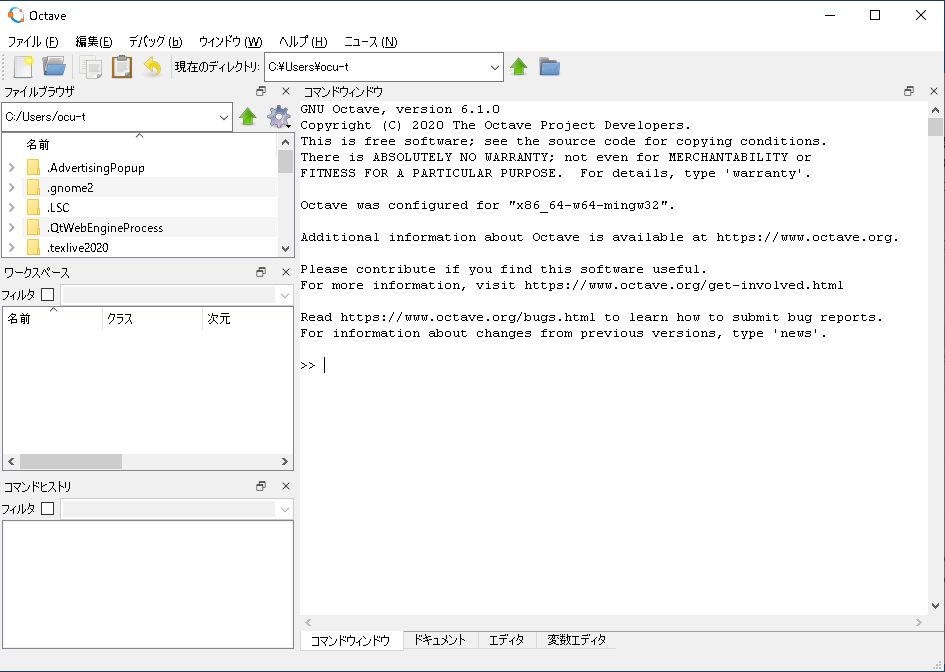\
\
コンソール画面の中に <font color='red'>\>\></font> で示される、
フロンプトが表示されているので、直接そこに命令を入力することもできますが、
入力\--実行\--編集の効率をあげるために、命令を記述したファイルを作成します。\
\
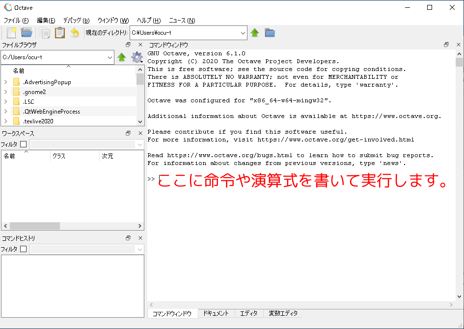


1.  下の方にタブとして「コマンドウィンドウ」「ドキュメント」「エディタ」「実
    数エディタ」が表示されています。\
    これにより、さまざまな機能を切り替えます。\
    「エディタ」のタブを押します。\
    または、アイコン群の左端にある、新規スクリプト、をクリックします。\
    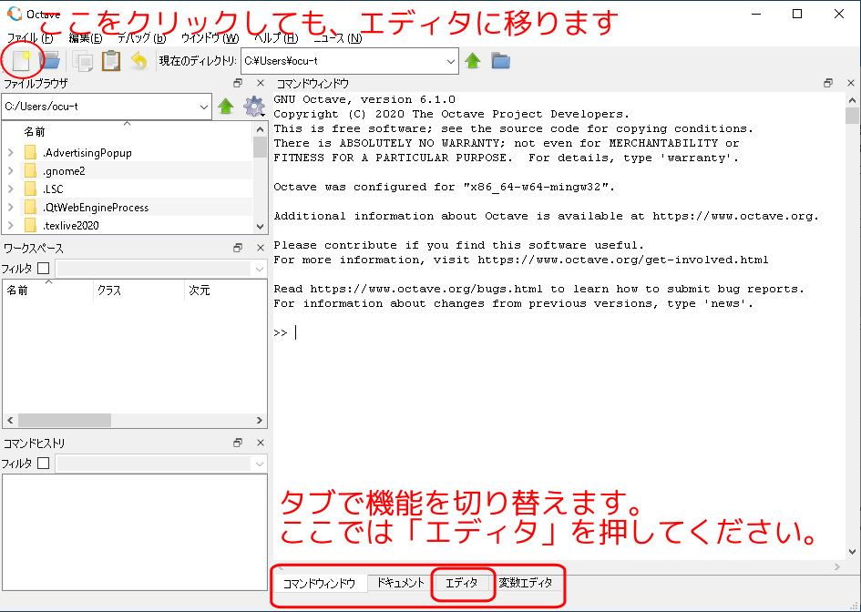


2.  エディタ(編集ソフト)が起動し、
    unnamed、のウインドゥが開くので、この中に命令を書いていきます。\
    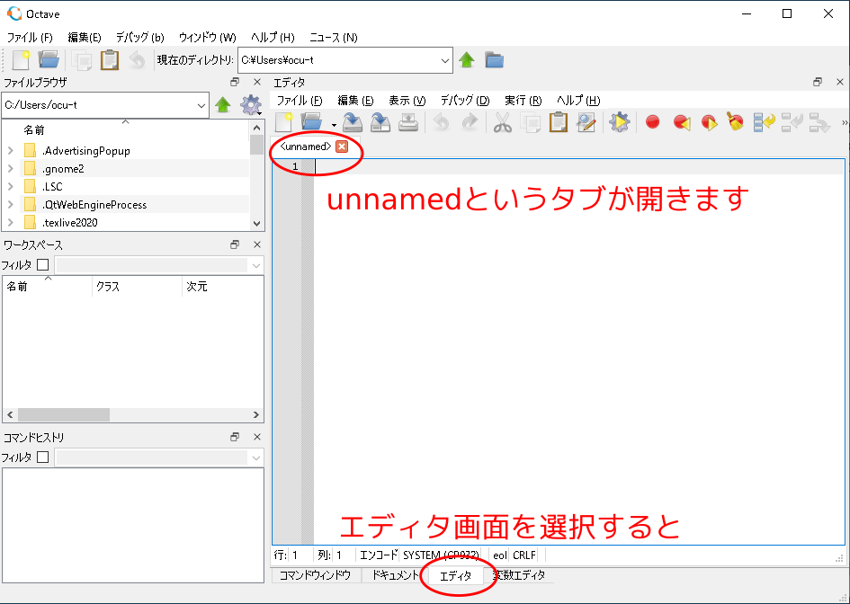


    今回は以下の内容を記入してください。%から右側は入力する必要はありません。
    %はこの右側は注釈、という意味です。ここでは各行の説明をしています。

```matlab:sample.m
        clear all         % 変数をクリア
        close all         %図をクリア
        clc               %コマンドウインドゥをクリア

        pkg load control  %tf を使うためのcontrolパッケージの読み込み
        G=tf(2,[3 4]);    %G(s)=2/(3s+4)の設定

        figure(1)         %描画ウインドウを指定
        step(G)           %伝達関数Gのステップ応答を描画
        figure(2)         %描画ウインドウを指定
        bode(G)           %伝達関数Gのボード線図を描画

        exts='.svg';      %svg形式
        fname='fig';
        for i=1:2
        fns=[fname num2str(i) exts];%ファイル名作成  
         print(i,fns,'-dsvg','-S640,480');%図をsvg形式で保存
        end
```

num2strは数値を文字列に変換するおまじないです。\
fns=\[\]は、文字列を結合する手っ取り早いおまじないです。\
図をeps形式にしたいときは 拡張子をeps、
 printオプションを-depsc2とします。

wordなどMSに貼り付ける場合は、png,-dpngにすると平和だと思います。

最後の'-S640,480'は出力画像のサイズです。
小さいサイズで出力されたら、書いてください。


ステップ応答、ボード線図についてはこれからの講義で履修していきます。


このような画面になっていると思います。\
    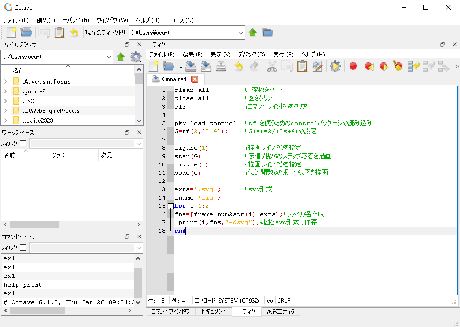


3.  メニュー中の右側三角印のアイコンを押します。
    ファイルを保存して実行、します。\
    \
    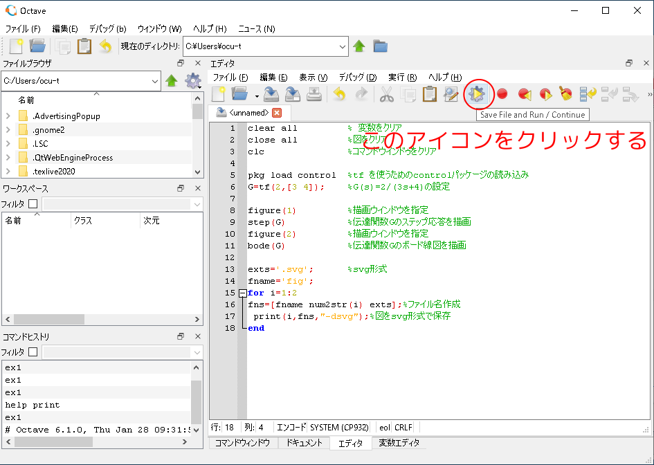


4.  「ファイルを保存して実行」なので、
    「名前をつけて保存」する保存先を選ぶダイアログが現れます。(\\は¥記号のことでフォルダの区切りを示します。)\
    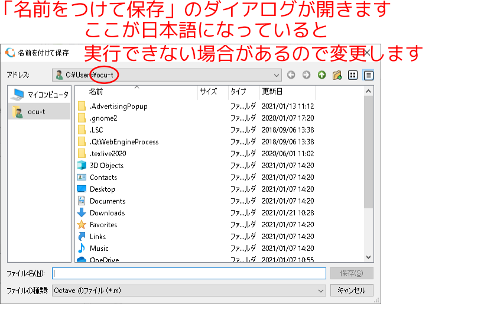


    <font color='red'>ここで注意してください。</font>
    このままでは、C:\\Users\\ocu-tの下に保存されます。\
    ocu-tの部分に
    <font color='red'>日本語の漢字かな空白などの2バイト文字が使われていると、
    実行できない場合がある</font>ので、\
    <font color='blue'>**新しいフォルダを作成して、そこに保存しましょう。**</font>\
    これはパソコンを最初に立ち上げたときの使用者登録の画面で、
    漢字を使ったための、MSの仕様です。あまり好きではありません。\
    私の環境では、最初から英文字(1バイト文字)を用いています。


5.  「マイコンピュータ」のアイコンを押すと、PC内のすべての親フォルダが見えます。\
    ここではCドライブにしますが、
    Cドライブ以外のパーティション(D,Eなど)があるならば、
    windowsに煩わされないので、そちらをおすすめします。\
    また、<font color='red'>C:\\Usersの下には作れない</font>ようなので、親ディ
    レクトリ(C:)の下に作成します。\
    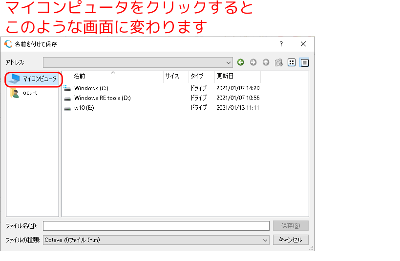
    


    「Windows(C:)」の表示を押すと以下のような表示になります。\
    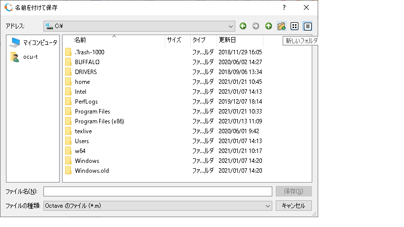


    Create New folderのアイコンを押します。\
    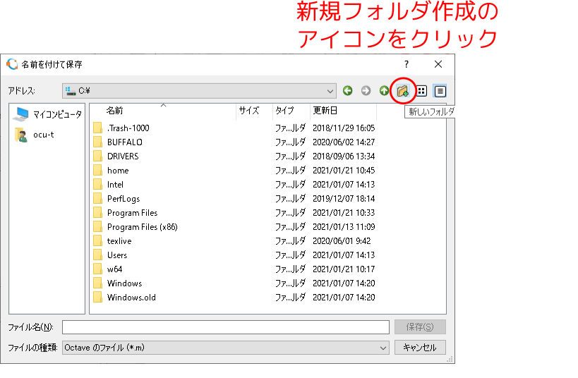


    「新しいフォルダ」が現れましたので、<font color='red' size='+1'>英文字</font>の適当な名前をつけます。\
    <font color='green'>ここでは、C:/home/Octave</font>に
    保存します。(名前は好きな英語名で構いません)\
    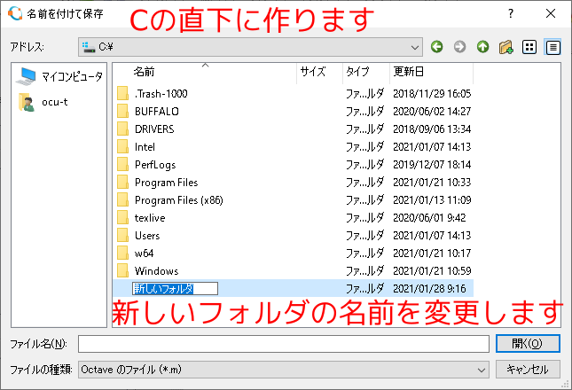


    まず、homeとします。\
    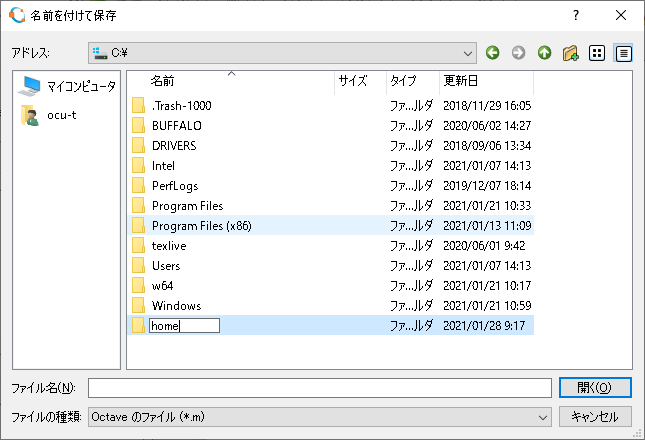


    homeのフォルダをクリックしました。\
    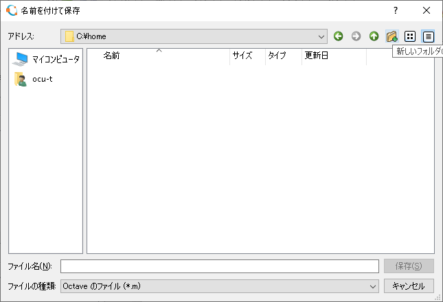\
    もう一度、新規フォルダ作成をクリックしてOctaveという名前のフォルダを作成しま
    す。\
    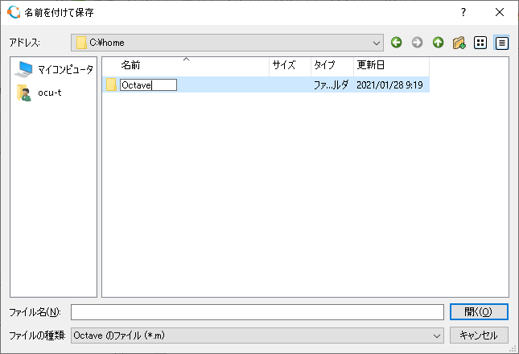


    home/octaveができました。ここをクリックします。\
    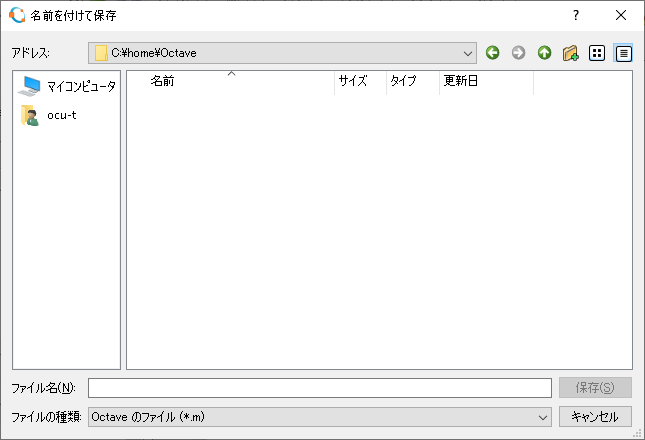


    フォルダが開いたので、ファイル名を付けて保存します。\
    この例では、ex1としました。
    ファイルタイプ(拡張子)は自動でmになります。\
   <font color='red'> ここでも注意です。</font>
    -   <font color='red' size='+1'>ファイル名は必ず英数文字にする。</font>
    - <font color='red'>  ファイル名の1文字目は必ず英文字にする(数字は使わない)</font>

    Octaveは1文字目に数字があると、「その文字列は数式もしくは数値」と判断するようです。\
    ファイル名を入力して「保存(S)」のボタンを押します。\
    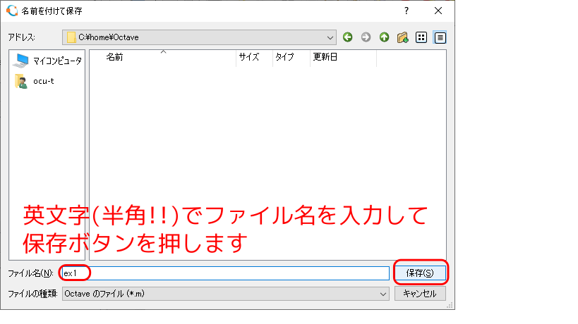


    
    するとこんなダイアログが立ち上がります。\
    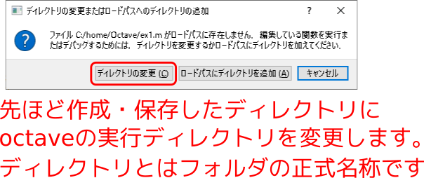\
    一番左の「ディレクトリの変更」のボタンを押します。


    実行されると同時に、Octaveの画面が少し変わります。\
    「現在のディレクトリ」(フォルダ)が先ほど指定の場所になり、
    実行ファイルと 結果のファイルができています。(後で説明します)\
    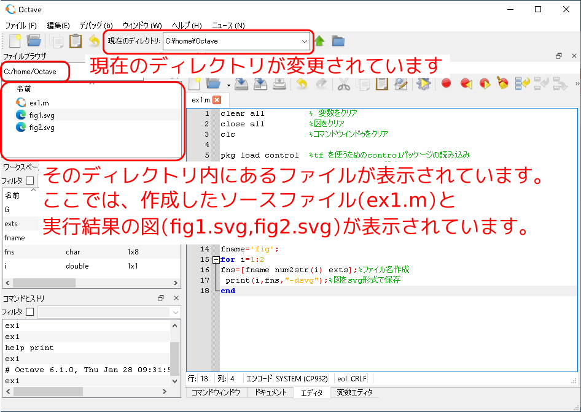


6.  間違いなく命令を入力できていれば、このような2枚のグラフが現れます。\
    同じ位置で重なって現れますので、注意してください、

      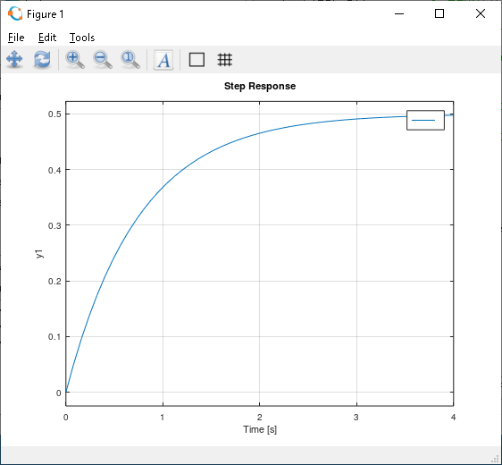   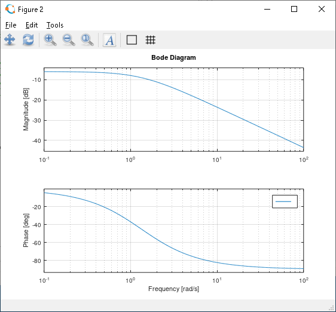


<font color='red'>    2022.4.21トラブル:
    図が表示されない場合は、PCハードウェアの関係でグラフィックライブラリの依存関係が解決できないことが考えられます。\
    graphics_toolkit qt/gnuplot\
    その場合はひとつ古いバージョンのOctaveを使うと解決できるかもしれません。
    (現在調査中)</font>


コマンドウィンドウから、先ほど保存したファイル名を入力しても、実行できます。\
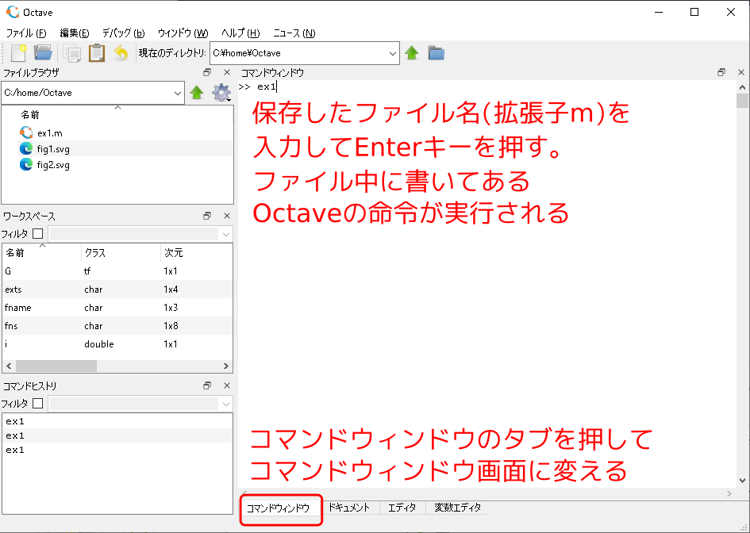

7.  octaveはヘルプも充実しています。 コンソールからhelp
    (知りたい命令)とすれば、説明が現れます。\
    printにはいろいろオプションがあるので、調べてみましょう。\
    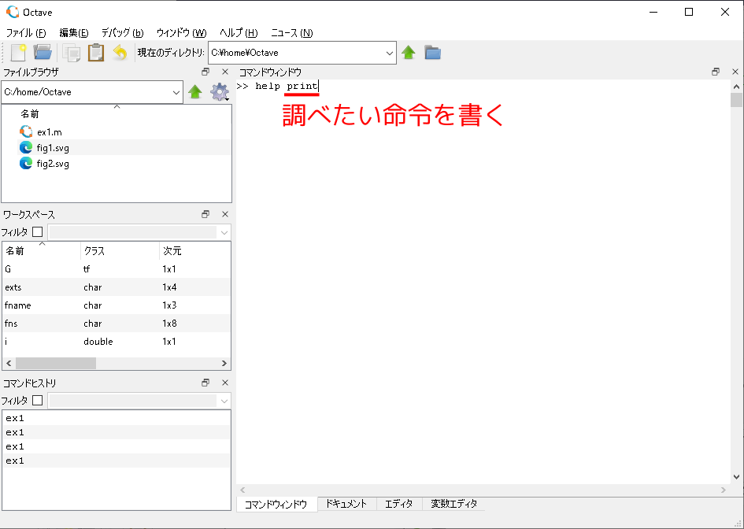


    いろいろ現れました。\
    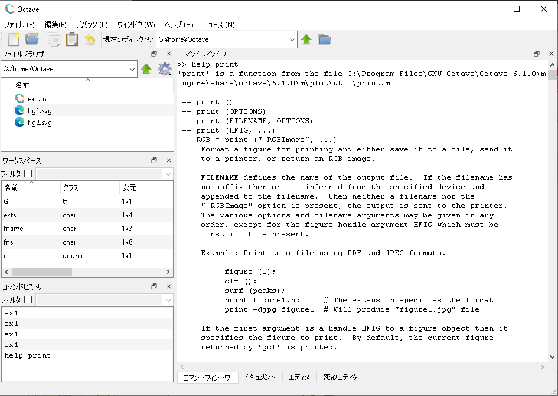


## 3.図を保存する。

1.  figureのウィンドウから保存できます。 「File」のボタンを押します。\
    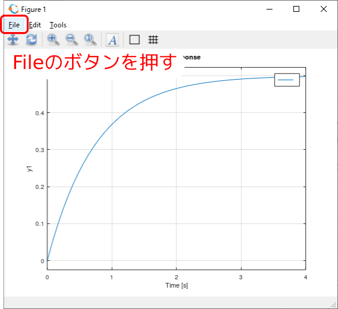

2.  Saveを選びます。\
    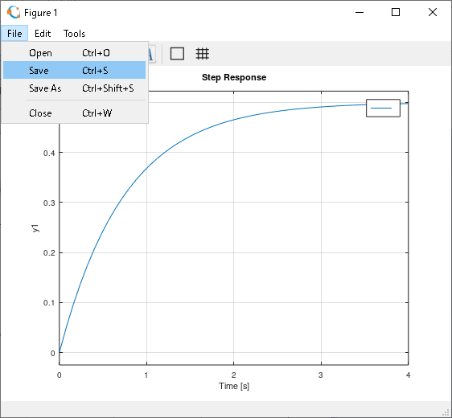

3.  ダイアログが開きます。 デフォルトでuntitled.ofigになっています。\
    これはOctaveでしか理解できないファイルタイプなので、ベクトル形式
    (\*.pdf,\*.svg)または、ビットマップ形式(\*.jpg,\*.png)のいずれかを選びましょ
    う。\
    まずVectorImageFormats(ベクトル形式)を選び、 pdf(portable document
    format)形式にするために、
    拡張子をpdfとする名前(untitled.pdf)を付けて保存します。\
    \
    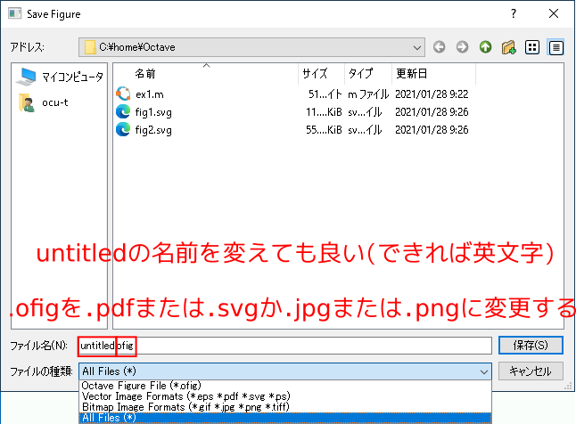

4.  保存されていることがわかります。\
    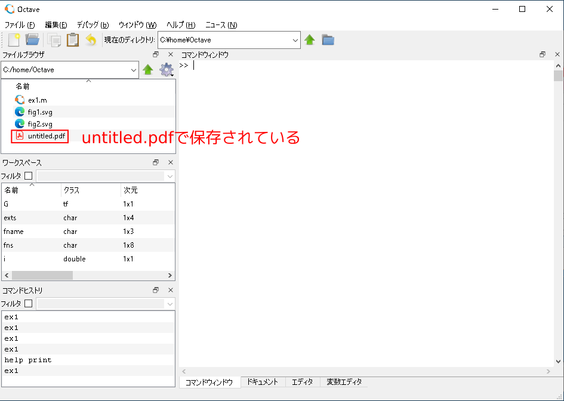


    このまま開いてacrobatなどで見ると、周囲の空白が広すぎる!ことがわかりますので、
    他の形式を選択するか、
    先ほどのプログラム中のprint命令を使い他の形式で保存しましょう。

5.  毎回ダイアログを開いて保存作業をするのは面倒、なので
    今回はprint命令で実行と同時に図を保存しています。\
    print命令により、実行ファイルと同じフォルダ中に図が保存されていま
    す。\
    \
    printのオプションについて
	
    1.  help printから 保存したい希望の画像形式を探します。
        -   印刷品質がよいのは、ベクトル形式の図です。\
            Inkscape(フリーソフトです)で加工する時はsvgを選びます。\
            最近のLibreOffic(5.3以降)やOffice365では問題ないようです。\
            epsも問題ありませんが、軸名とかつけて綺麗に加工するなら、svgを使いましょう。\
            もちろんコマンドで軸名をつける方法もあります。
        -  Wordなどにそのまま貼り付ける時は、png,jpg,(jpeg)などを選びます。
            ただし図を拡大縮小すると品質はあまりよくありません。
        -   編集しない場合は、pdfが印刷品質がよいと思います。
            ただし空白はとても広いので、見栄えが良くないと思います。

        


## 4.LibreOfficeを起動して貼り付けてみましょう。 

挿入から、画像を選びます。\
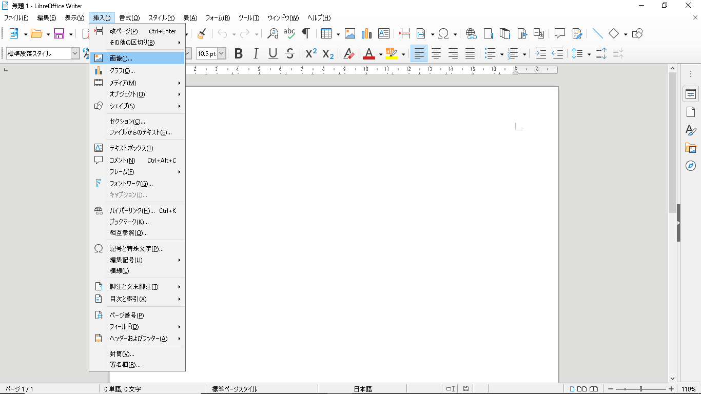


画像を保存したフォルダを選択後、ファイル名をクリックします。\
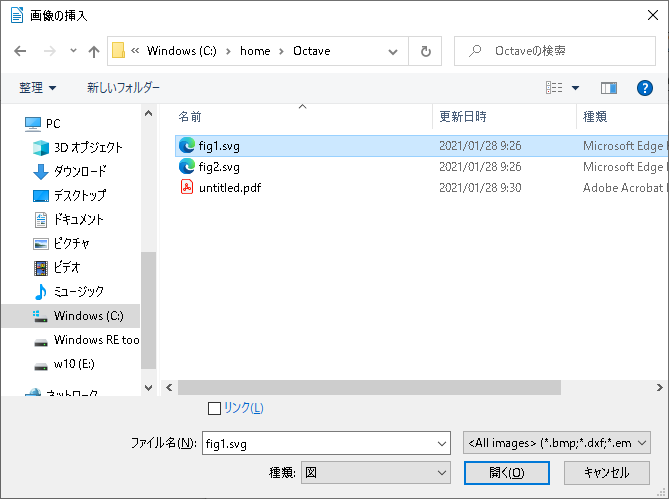


fig1.svgを選択しました。 周りの空白は適当のようです。\
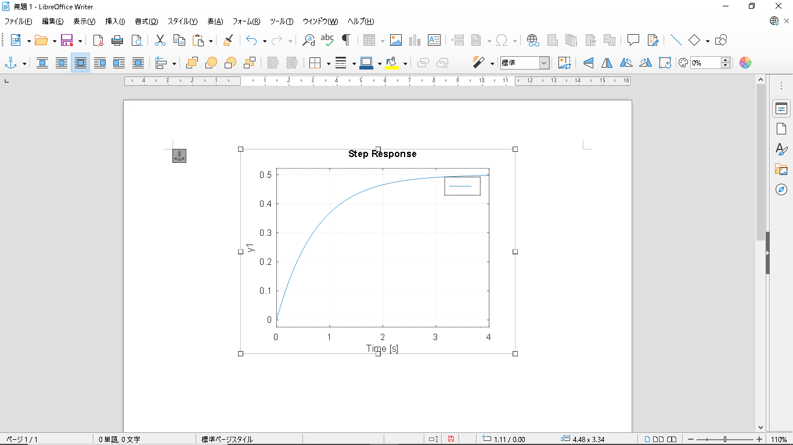


untitled.pdfを選択して、貼りこみました。\
少し周りの空白が広いようです。\
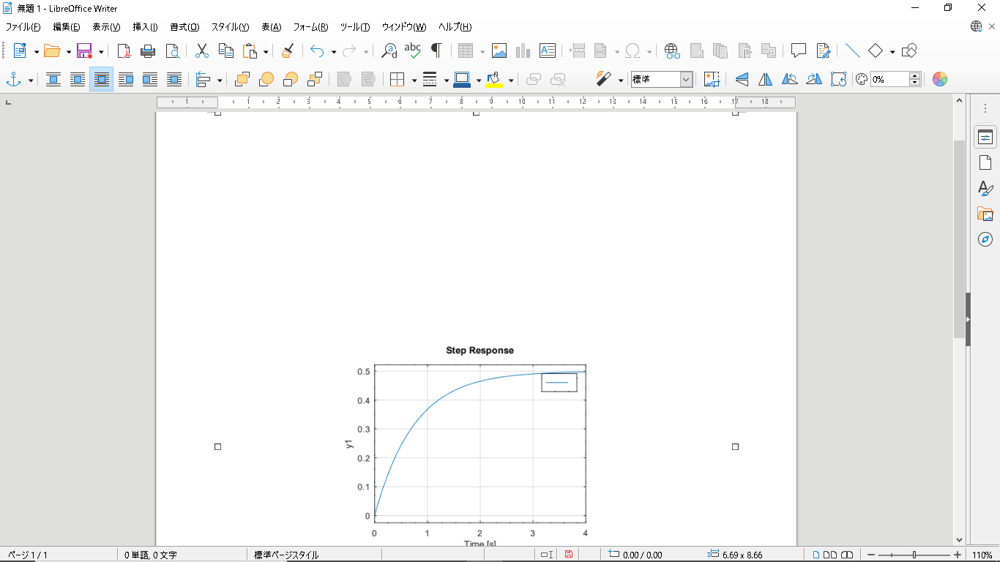


複数の図を貼りこむときは、同じ位置に取り込まれるようなので、取り込み後、
マウスでつかんで位置を調整してください。

------------------------------------------------------------------------

これでレポート作成にも添付できるでしょう。\
\
おわり
