---
#content/post/に置くファイルの雛形!
#---はyamlの書式.+++はtoml
title: "Inkscapeでsvgを編集" # Title of the blog post.
date: 2025-04-18T10:50:10+09:00 # Date of post creation.
description: "Inkscape svg edit" # Description used for search engine.
featured: true # sidebarのおすすめの投稿, sets if post is a featured post, making appear on the home page side bar.
draft: false #true # Sets whether to render this page. Draft of true will not be rendered.
toc: false # Controls if a table of contents should be generated for first-level links automatically.
# menu: main # when uncomment, display on manu bar
#usePageBundles: false # Set to true to group assets like images in the same folder as this post.
usePageBundles: true # Set to true to group assets like images in the same folder as this post.
#featureImage: "/images/path/file.jpg" # Sets featured image on blog post.
#featureImageAlt: 'Description of image' # Alternative text for featured image.
#featureImageCap: 'This is the featured image.' # Caption (optional).
#thumbnailはstatic/images/*.pngを
#thumbnail: "/images/path/thumbnail.png" # Sets thumbnail image appearing inside card on homepage.
#shareImage: "/images/path/share.png" # Designate a separate image for social media sharing.
codeMaxLines: 10 # Override global value for how many lines within a code block before auto-collapsing.
codeLineNumbers: false # Override global value for showing of line numbers within code block.
figurePositionShow: true # Override global value for showing the figure label.
# hugo.tomlのtaxonomiesで分類あり
categories:
  - tool
tags:
  - inkscape
#  - Tag_name2
#series :
#  - tool
#aliases : 
#  - migrate-from-jekyl
# Create redirects from old URLs to new URLs with aliases:
# comment: false # Disable comment if false.
#+LANGUAGE: ja
#+options: toc:nil author:nil  timestamp:nil ^:{} 
#  inkscapeで図を編集
---

** Octaveで出力した図をInkscapeで編集する方法です。

具体的には、以下の手順です。

1. Octaveからsvg形式で図を出力
2. Inkscapeで図を開く。
3. 図中にあるオブジェクトのグループを解除。個別のオブジェクトにします。@@html: @@  
   グループ解除しない場合は、編集したいオブジェクトをクリックし続けると、個別選択できます。
4. 個別のオブジェクトを加工修正。
5. TeXに取り込む場合は、eps(platex)またはpdf(lualatex)に別名で保存。@@html: @@
   Bitmap形式にしたい場合は、exportして保存

順に紹介します。

<!--more-->

** Octaveで図を出力します。

ソース例です。svg形式で図を保存します。

#+begin_src octave
clear all
close all
clc
pkg load control
G=tf(1,[1 1 1]);
step(G)
print(1,"s1.svg","-dsvg");
#+end_src

Octaveの出力結果です。コマンドでsvg形式の図に保存されています。

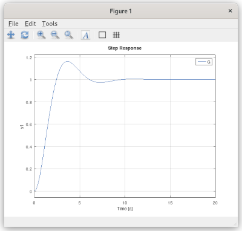

** Inkscapeで図を開いたところです。数字キーの「4」を押して、全体を中央に表示しています。

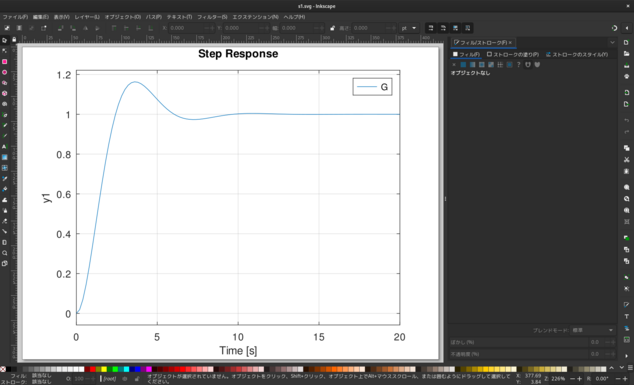

** 図中の任意の箇所を左クリックすると、このようにオブジェクトの範囲が示されます。

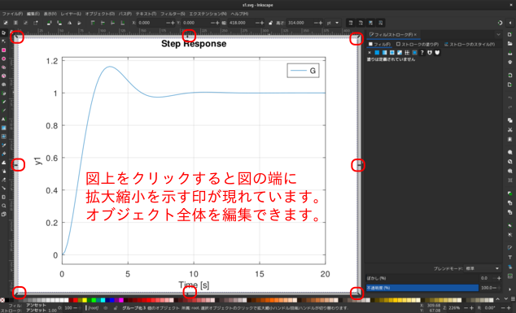

** 図上で右クリックを押してコンテキストメニューを表示し、「グループ解除」を選択します。

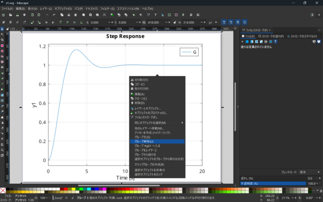

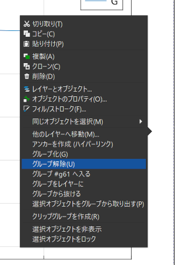

** グループ解除すると、いくつかのオブジェクトとして、現れます。

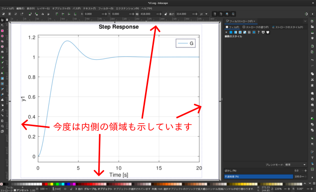

** 再度、「グループ解除」を実行します。

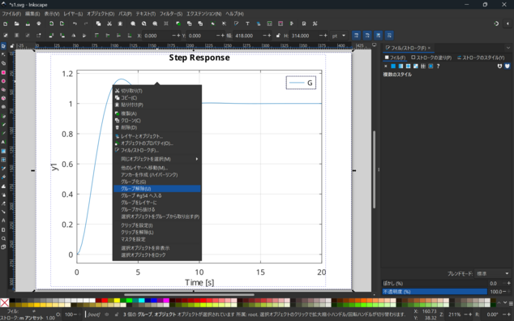zつ

** 再度「グループ解除」を選択した後、このように個別のオブジェクトが示されます。

全てのグループが解除されました。

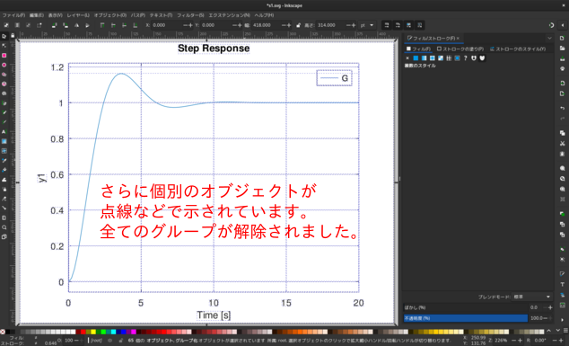

** オブジェクトが示されている範囲外をクリックして、一旦抜け出します。

白い背景以外の箇所:灰色の箇所:をクリックしてグループ解除から抜け出します。

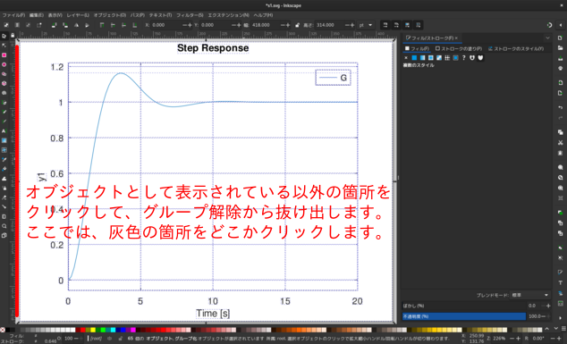

** 時間応答を示す曲線を左クリックすると、曲線が描かれている範囲が示されています。

グループ解除したくない場合は、この曲線(オブジェクト)を何回か続けてクリックすると、個別のオブジェクトとして選択できます。

**オブジェクト個別の編集ができます。**

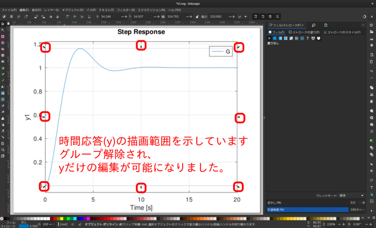

** 右側のメニューの「ストローク(線)の塗り」を選択すると、線色を示しています。

「ストローク(線)の塗り」タブをクリックし、
color wheelを動かすと、色を編集できます。画面下のパレットで選択しても構いません。

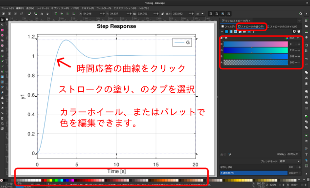

** color wheelを動かして、色を編集しました。

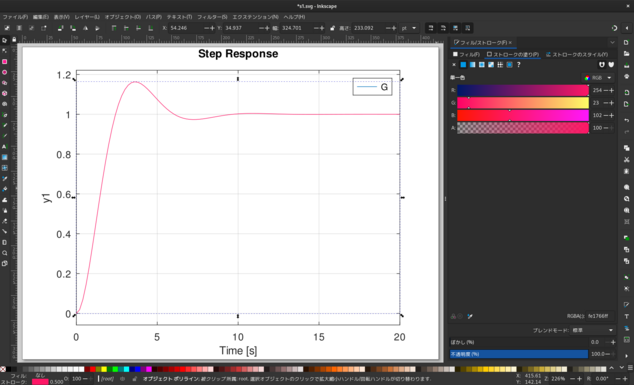

** 「ストロークのスタイル」を選択すると、「線の幅(太さ)」や「スタイル」を編集できます。

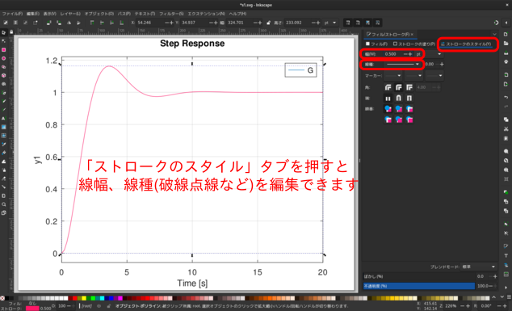

** 5ptの点線にしました。

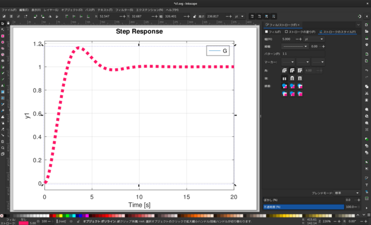

** svgで保存後、「ファイル」「別名で保存」でepsまたはpdf,エクスポートでpngなどに保存します。

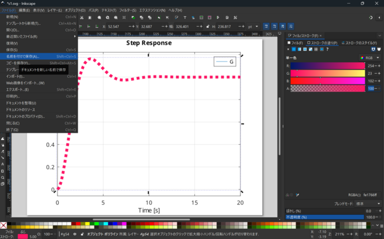

*** 名前をつけて保存

Octaveで出力したファイル名とは別名で保存すると平和かもしれません。

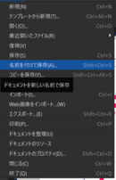

svg形式で保存します。Inkscapeで編集するためには、svg形式で保存するのが平和です。

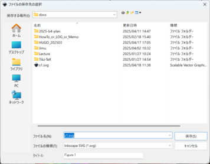

その後は、利用したい形式のepsやpdf形式として、保存します。

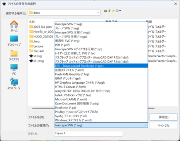

BITMAP形式で使用したい場合は、エクスポートを選びます。

右下に、出力メニューがありますので、ここを選択します。
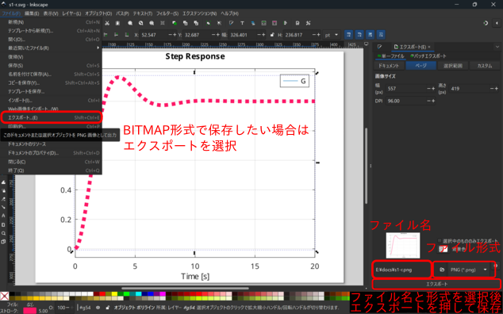

* 線種や色は編集可。その他は編集してはいけません。
