---
#content/post/以外に置くファイルのfrontmatter
#---はyamlの書式.+++はtoml
title: "Inkscape始めましょう" # Title of the blog post.
date: 2025-02-21T14:59:17+09:00 # Date of post creation.
description: "Inkscape" # Description used for search engine.
featured: true # sidebarのおすすめの投稿, sets if post is a featured post, making appear on the home page side bar.
draft: false #true # Sets whether to render this page. Draft of true will not be rendered.
toc: false # Controls if a table of contents should be generated for first-level links automatically.
# menu: main # when uncomment, display on manu bar
#usePageBundles: false # Set to true to group assets like images in the same folder as thigs post.
usePageBundles: true # Set to true to group assets like images in the same folder as this post.
#featureImage: "/images/path/file.jpg" # Sets featured image on blog post.
#featureImageAlt: 'Description of image' # Alternative text for featured image.
#featureImageCap: 'This is the featured image.' # Caption (optional).
#thumbnailはstatic/images/*.pngを
#thumbnail: "/images/path/thumbnail.png" # Sets thumbnail image appearing inside card on homepage.
#shareImage: "/images/path/share.png" # Designate a separate image for social media sharing.
codeMaxLines: 10 # Override global value for how many lines within a code block before auto-collapsing.
codeLineNumbers: false # Override global value for showing of line numbers within code block.
figurePositionShow: true # Override global value for showing the figure label.
# hugo.tomlのtaxonomiesで分類あり
categories:
  - tool
tags:
  - inkscape
#  - Tag_name2
#series :
#  - tools
#aliases : 
#  - migrate-from-jekyl
# Create redirects from old URLs to new URLs with aliases:

# comment: false # Disable comment if false.

---

# ちょっとだけInkscape tips

よく使う最低限のTipsです。

<!--more-->

## 1.Inkscape起動直後の画面です。

右下の「新規ドキュメント」のボタンを押します。

参考として過去のファイルを呼び出すこともできます。

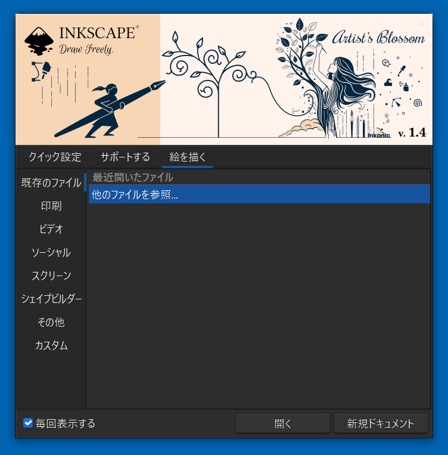

## 2.作業画面です。

- 中央の白い範囲が描画する画面。
- 左端のアイコンが図形のメニュー画面。
- 上部のメニュータブ画面は、いろいろな操作。
- 右側は図形の詳細を指定する画面。

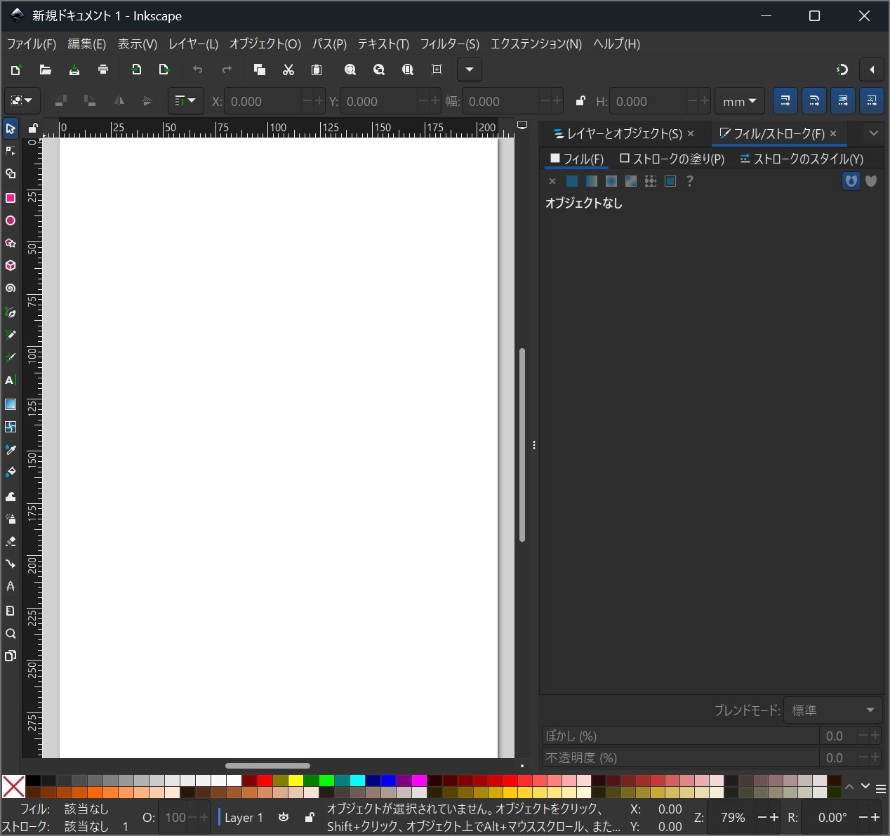
### メニューボタンの説明

よく使うボタンは以下のとおりです。

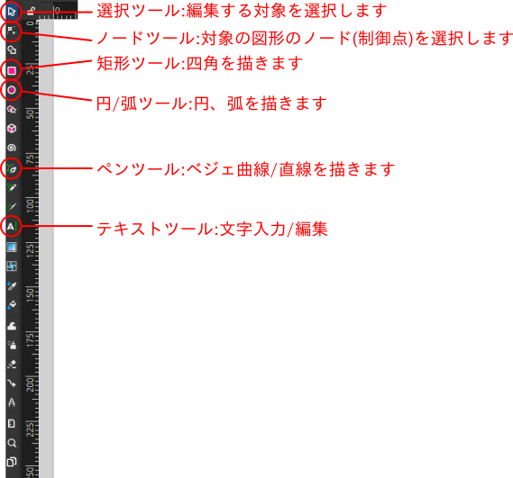

## 3. 直線を引く。矢印をつける

1. 左側のアイコンから、
ペンツール(ベジェ曲線/直線を描く)のアイコンをクリック。

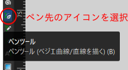

2. 始点でクリック。途中でクリック。最終点でダブルクリック。

Ctrlキーを押しながらマウスを動かすと、角度が15度ごとに制限された直線が引けます。

3. 直線を引くつもりでしたが、変なものが現れました。
慌てないでください。

inkscapeで作成する図形は、「図形の周囲(境界),縁」と「図形の内部」に分かれ
ています。

現在は、両方が描かれた状態になっているのでヘンに見えます。

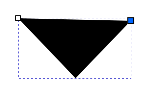

### この図形を編集します。

1. 色を変える。

このメニューで縁,線:ストロークと内部:フィルの色を変えることができます。

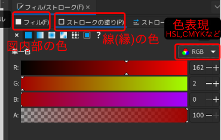

ストロークとは図形の周囲の縁を示す線、
フィルとは縁で囲まれた内部のことです。

フィルまたはストロークの塗り、のタブをクリックした後、ColorWheelを操作
します。なお、色表現は、HSL,RGB,CMYKなどがあります。

または、「**shiftキーを押しながら**」好きな色のパレットをクリックすると、ストローク
(線,縁)の色が設定されます。

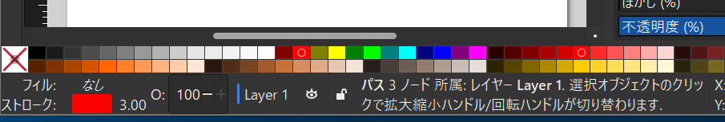

ちなみに、shiftキー押し下げなしで
パレットをクリックすると(オブジェクト選択後)、フィル(周辺、境界内部)の色指定ができます。

先程は、フィル/ストロークともに黒色だったため、縁の直線が見えませんでした。

その後の色微調整はColor-Wheelからできます。ストローク(線,縁)とフィル(内部)が現れました。

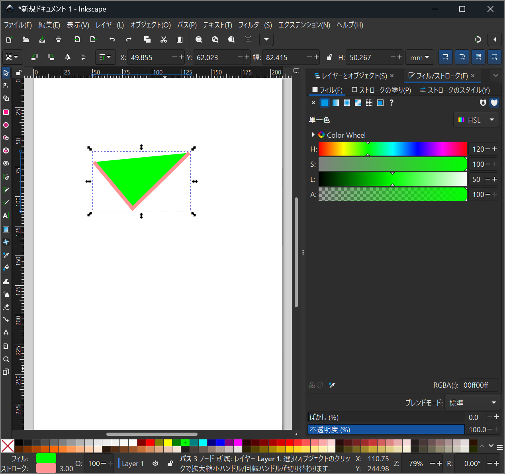

2. 線だけにするには、フィル(内部の塗り)を消去します。

a. 右側の「フィル」のタブをクリック\
b. 左端のx印をクリック。\
これで、内部の色塗りが消えました。

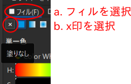
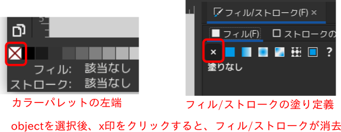

フィルの色指定を「なし」、にしたので、ストローク(線)だけの表示になりました。

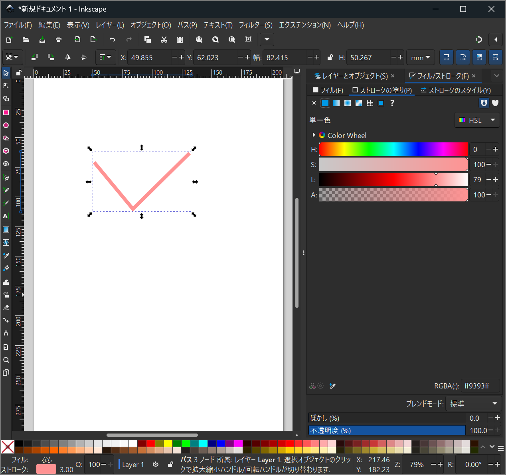

3. ストロークの線の太さを変えます。

a. 「ストロークのスタイル」のタブをクリック\
b. 「幅」の中に、任意の数値を設定します。\
単位系もmmのほかにpx,ptなどいろいろあります。

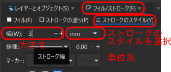

4. 線の種類も変更できます。

線種の右側の下向き三角印をクリックします。
点線、破線、一点鎖線などに変更できます。

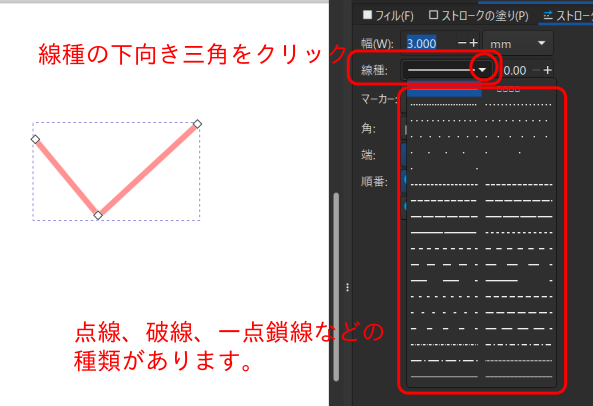

一点鎖線にしました。「パターン4 2 1 2」を変えれば、線の長さと間隔を変更できます。

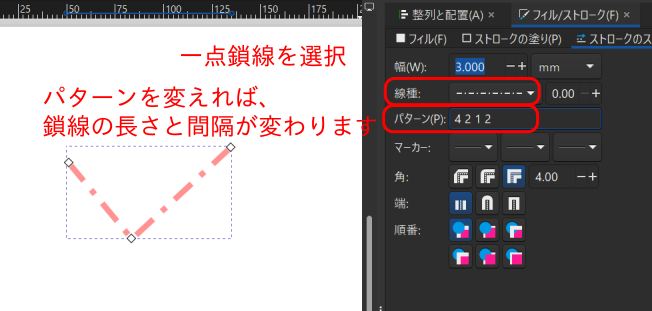

###  線の端を矢印などにすることもできます。

「フィル/ストローク」「ストロークのスタイル」のタブから「マーカー」の
メニューを引き出します。
左端、中央、右端の設定ができます。

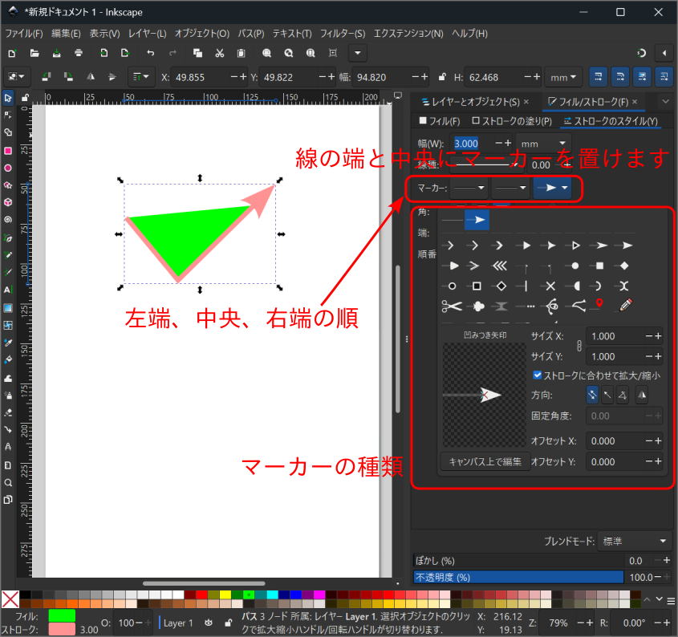

### **ノード(制御点)を編集したら、始点終点を自由に移動できます。**

1. ノードツールアイコンを使い、ノード(制御点)を表示します。

- ノードツールアイコンを選択後、図形をクリック。
または、図形をダブルクリック

- 白い四角がノード(制御点)で現れます。
- 編集したいノードを左クリックで選択

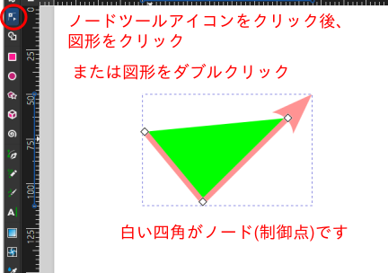

選択ツールアイコンでのクリックでは、図形そのものの拡大縮小(後述)になるので、
使い分けを意識してください。

2. 左クリックしたまま、移動。任意の点で離す。

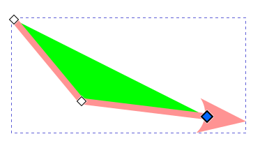

終点が移動しました。

## 4. 曲線を描く

折れた直線など、連続した直線を描くときは、曲線または多角形を選びましょ
う。

曲線も自由に描けます。ベジェ曲線と手書きの自由曲線があります。

1. ベジェ曲線の場合です。
まず、直線を描きます。

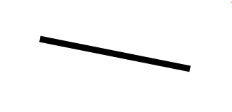

2.ノードツールアイコンを押して、ノード(制御点)を表示します。

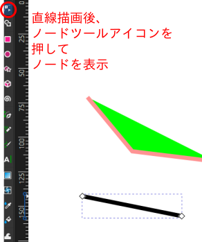

3.SHIFTキー押したままノードを左クリックし、マウスを動かすと、任意のカーブになります。

マウスを動かした方向に現れる青い線が、接線方向を示します。

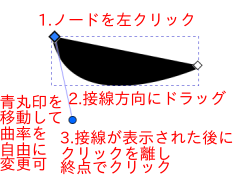

4. フィルを「塗りなし」にすると線だけ現れます。

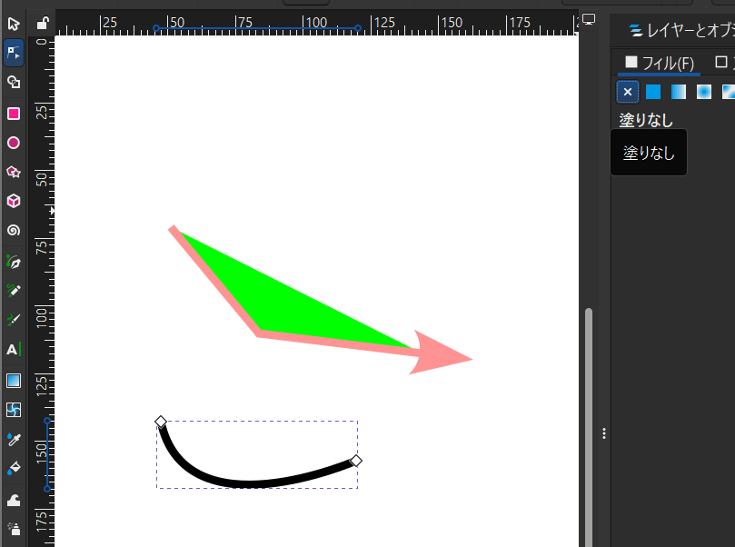

1.の段階で、フィルなし、ストロークだけにしておくと作業しやすいかもしれません。

5. 最初から曲線を描く方法として、

- 始点でマウスを左クリック
- クリックしたまま、ゆっくりとマウスを動かす。これが接線方向になります。
- 動かした方向に接線が現れます
- 左クリックを離して、任意の終点でダブルクリック

曲線が現れます。

6. 接線の先端の丸印はノードなので編集できます。
これを動かすと曲率が変わります。

## 5.円を描く

1. 円のアイコンをクリック
2. 始点で左クリックしたまま、マウスを移動させ、終点で離します。

Ctrl を押しながら移動すると、移動角度が制約されるので、
正円が描きやすくなります。

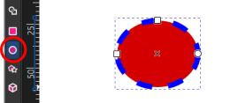

### 図形は、**「内部の塗りつぶし」と「周囲を取り囲む線」で区別**して設定できます。

-   「フィル」は線で囲まれた内部の色を指定できます。
-   ストロークの塗りは、線の周囲(縁)の色を指定できます。
-   ストロークのスタイルは、線の幅、線種(実線/点線/一点鎖線など)、
    線のマーカー(矢印など)を指定できます。

3. 白四角の点が大きさが変わるノード、白丸印が変形できるノードです。

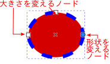

4. 円弧、扇型などを描きたいときは、以下の手順とします。

- (1)ノードツールアイコンを押して、編集する図形を選択すると、ノードが表示されます。
- (2)**白丸印**のノードを移動します。
- (3)円のアイコンを押すと、右上の方にシェイプ切り替えアイコンが現れます。

希望のアイコンを選択します。

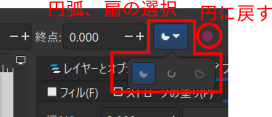

扇になりました。

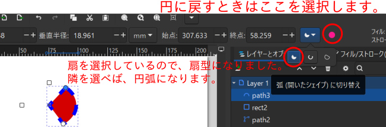

## 6. 四角を描く。

円の作図と同様です。

- 四角のアイコンをクリックします。
- 始点を左クリックします。 
- ドラッグしたまま、終点方向へ引き出し、終点でクリックを離す。
このとき、Ctrlを押しながらすると、正方形が描きやすくなります。

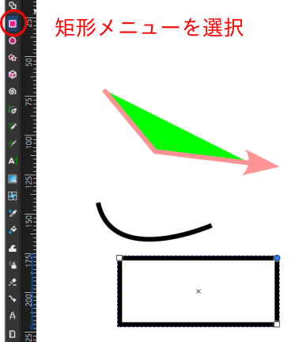

白四角が大きさが変わるノード、白丸印が形状が変わるノードです。

白丸印を移動すると、角が丸い四角になります。

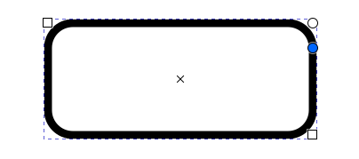

直線の時と同様に、Shift-Ctrl-Fを押すと編集メニューが現れますので、
図形のプロパティをいろいろ変えられます。

または編集したい図形をクリックで選択してください。

「フィル」「ストロークの塗り」「ストロークのスタイル」タブ
で選択します。

-   「フィル」は四角の内部の色を指定できます。
-   ストロークの塗りは、 四角を取り囲んでいる 線(縁)の色を指定できます。
-   ストロークのスタイルは、上述の四角を取り囲んでいる、線の幅、線種(実線/点線/一点鎖線など)、
    線のマーカー(矢印など)を指定できます。

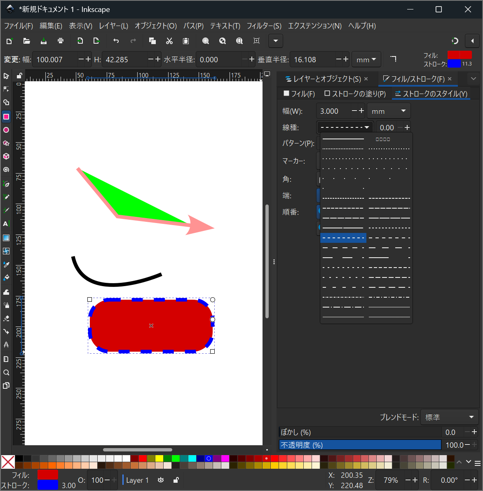

## 7. 多角形も円と同様です

- 星型/多角形ツールを選択
- 角数と凸凹形状を選択します。

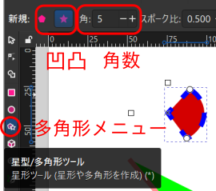

三角形も同様です

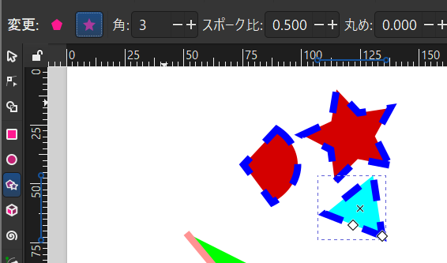

## 8. 文字を書く

1. テキストツールを選択します。

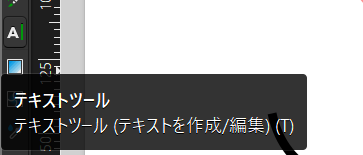

2. 文字のフォント、形式、大きさを選択します。

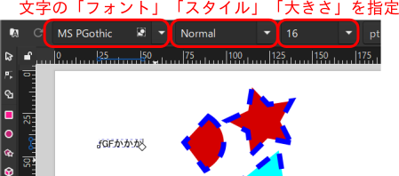

3. 任意の位置をクリックした後、文字を入力します。

## 9. 図形を変形する

図形そのものを拡大縮小する方法と、図形中のノードを移動する方法がありま
す。

### 編集する図形を選択して、拡大縮小する

- 選択ツールアイコンを押します。

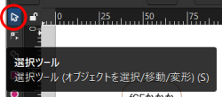

- 図形を選択すると、拡大縮小できる方向に矢印が現れます。

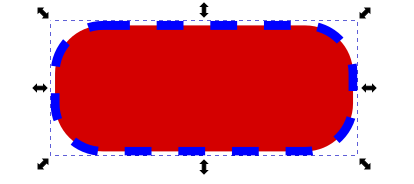

- 希望の方向の矢印をマウス左クリックで掴んで、移動し、離します。

線の太さも同時に変わります。

### ノードを選択、動かして、拡大縮小する。

**線の太さを変えたくない**ときは、この方法を用います。

- ノードツールアイコンを押します

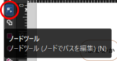

- 現れたノードのうち、白四角を選択して、移動します。

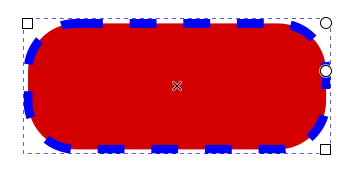

複数のノードの同時移動もできます。
折れた直線の移動はこの方法を用います。

1.  移動する複数のノードを選択します。shiftを押しながら左クリックします。

2. 青い点が選択されたノードです。2つあります。

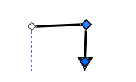

3. 左クリックでドラッグすると、ノードが移動します。

矢印の折れている部分だけが移動しました。

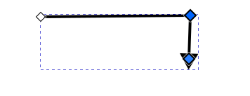

### 図形を回転する

1. 図形を2回左クリックする。(ゆっくり2回。ダブルクリックよりゆっくり。)

変形できる方向を示す矢印が現れます。

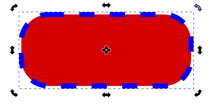

2. 操作したい矢印の上にマウスカーソルを移動してクリック、示している方向にドラッグすると、回転、変形します。

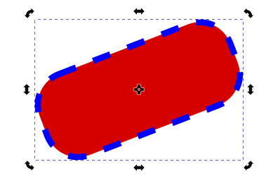

3. 回転中心も移動できます。マウスで掴んで移動させます。

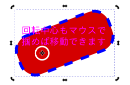

## 10. 図形の重なり方を調整する

ここでは、楕円の上に三角形が重なっているのを、逆の重なりにします。
**文字と図形の重なりの調整にも使えますので、ぜひ覚えてください。**

1. 三角形を後ろに配置(星印を前に)します。

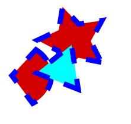

2. 重なりを変更したい図形を左クリックして選択する。
三角形を選択します。

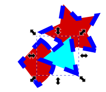

3. オブジェクトメニューから、「再背面へ」を選択します。

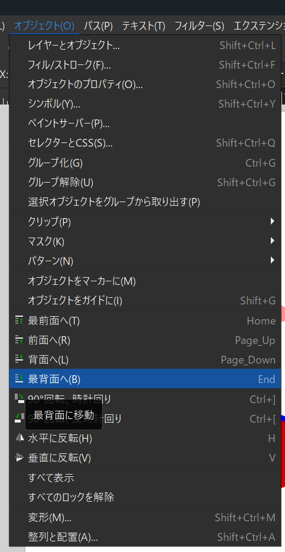

4. 後ろに行きました。

重なり方の前後関係が変わりました。

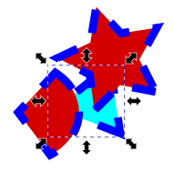

## 11. 図形の位置を揃える

1. 操作する図形を選択します。

選択ツールアイコンを押した後、shiftキーを押しながら図形を選択すると複数選
択できます。

範囲で選択してもできます。

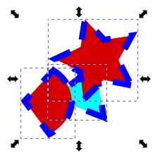

2. オブジェクトのメニューから、「整列と配置」を選択します。
 shift+Ctrl+A
 
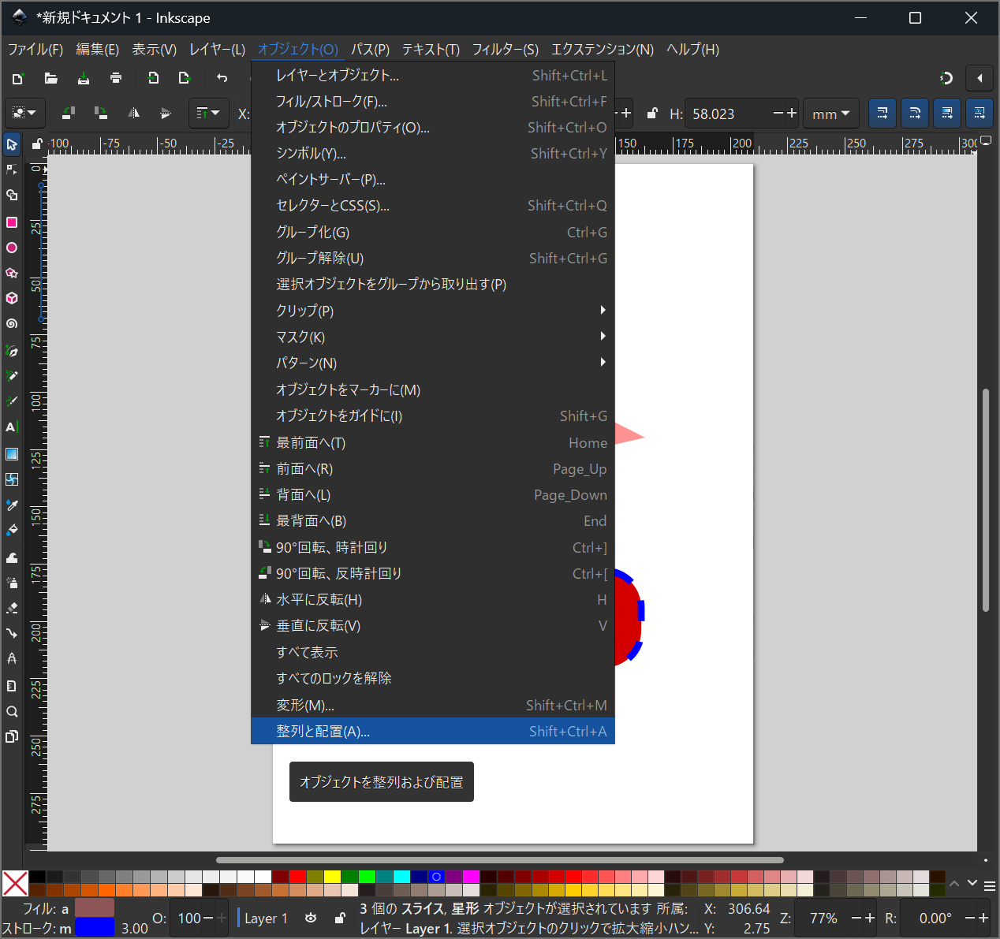

3. 揃え方を選択します。

a. 垂直方向を揃える場合は、このアイコンから選択します。

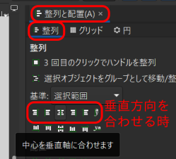

b. 水平方向を揃える場合は、このアイコンから選択します。

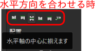

c. 間隔を揃える場合は、このアイコンから選択します。

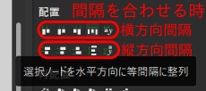

4. 等間隔、水平揃えの結果例です。このように並びました。

5. 文字を図形の中央にするときも、この方法を用います。

**このオブジェクトを揃えると見栄えが良くなる**ので
ゼヒ覚えてください。

## 12. 保存して終了

名前をつけて保存して終了します。

1. ファイルのメニューから「名前を付けて保存」を選択します。

2. 名前を付けて保存します。

- ファイル名は、英語文字を用いたほうがトラブルが少ないのでおすすめです。

- ファイルの種類は色々あります。

Inkscape SVGのままでokです。

svgとは、scalable vector graphicsの意味で、ベクトル形式の画像なので、
拡大縮小しても品質が劣化しにくい形式です。

svg以外では、pdf、eps、ps形式で保存することもできます。

**保存場所を覚えておきましょう。
また、保存ファイル名は英数(半角)文字だけとし、日本語(全角)文字は使わな
いほうが、平和な場合が多いです。**

## 13. EXPORT:別形式で保存

図の形式には、
ベクトル形式以外にビットマップ形式があり、こちらが必要な場合は、
svgで保存後、exportします。

**一旦は必ずsvg形式で保存してください。他の形式ではInkscapeでは編集できません!!**

1. エクスポートを選択

2. 右下に、エクスポートファイル名と形式が現れています。

 PNG形式になっています。ビットマップ形式と同等の形式です。

これで良ければ、右下のエクスポートボタンを押します。

3. PNG形式以外では、jpg形式も選択可能です。

4. オブジェクト以外のページ余白もエクスポート対象に含まれています。

このまま、エクスポートしたものをワードなどに貼り付けると、空白が多く、見栄えはあまり良くありません。

余白を含めたくないときは、「オブジェクトを選択」して、「選択中のもののみエクスポート」にチェックを入れます。

## 14. TeX形式の数式、ギリシャ文字を使う

きれいな数式を描きたいときは、
textextというエクステンションを使用します。
インストールについては、適当なサイトを探してください。

## 15. svgを直接編集する

svgはHTML5形式のテキストファイルなので、エディタで直接編集できます。

- 「編集」「XMLエディタ」から
- Emacsを使う場合は、svgファイルを読み込んだ後、
M-x image-mode-as-text
とすれば、ソースコードが表示されるので、簡単に編集できます。

## その他Tips

- 複数のオブジェクト(図形や文字)をグループとして選択したり、解除したりして、編集の効率を上げます。

例えば、図形の中に文字を入れて一体として移動したいとき、シフトキーを押しながら、図形と文字を選択して、メニューからオブジェクト-グループ化を選択し
ます(またはCtrl-G)。\
個別に編集したいときは、グループ解除、または、編集したい図形だけをダブルクリックして選択します。

- もちろんレイヤーも触れますが、特に触らなくても最初は支障ありません。

**習うより慣れろです。 ソフトウエアのせいでパソコンが壊れることは、ま
ずありません。 ソフトウエアを使い倒して、いろいろな方法を見つけてくだ
さい。**
