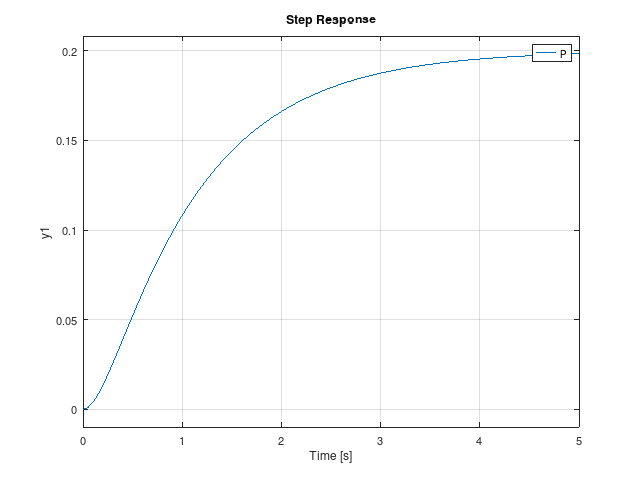

---
#content/post/に置くファイルの雛形!
#---はyamlの書式.+++はtoml
title: "markdownの始め方" # Title of the blog post.
date: 2025-02-21T15:01:20+09:00 # Date of post creation.
description: "markdownの書き方" # Description used for search engine.
featured: false $true # sidebarのおすすめの投稿, sets if post is a featured post, making appear on the home page side bar.
draft: false #true # Sets whether to render this page. Draft of true will not be rendered.
toc: false # Controls if a table of contents should be generated for first-level links automatically.
# menu: main # when uncomment, display on manu bar
usePageBundles: false # Set to true to group assets like images in the same folder as this post.
#featureImage: "/images/path/file.jpg" # Sets featured image on blog post.
#featureImageAlt: 'Description of image' # Alternative text for featured image.
#featureImageCap: 'This is the featured image.' # Caption (optional).
#thumbnailはstatic/images/*.pngを
#thumbnail: "/images/path/thumbnail.png" # Sets thumbnail image appearing inside card on homepage.
#shareImage: "/images/path/share.png" # Designate a separate image for social media sharing.
codeMaxLines: 10 # Override global value for how many lines within a code block before auto-collapsing.
codeLineNumbers: false # Override global value for showing of line numbers within code block.
figurePositionShow: true # Override global value for showing the figure label.
# hugo.tomlのtaxonomiesで分類あり
categories:
  - document write
tags:
  - markdown
#series :
#  - Enjoy Linux
#aliases : 
#  - migrate-from-jekyl
# Create redirects from old URLs to new URLs with aliases:

# comment: false # Disable comment if false.

---


もともとはプレーンテキストをhtmlに変換(Export/convert)するための書き方

いろいろな変換ソフトが乱立したために、markupの記述方法(mark)が乱立して
いる。
最小限共通と思えるmarkは以下に紹介!?

<!--more-->

# かんたんな文法

セクションヘッドは#(井桁,number)で、#の数でレベルを指定します。


## 1. テキストフォーマット(文字装飾)

-     *アスタリスク* or _アンダーバー_ 1つで囲むと斜体


	*アスタリスク* or _アンダーバー_ 1つで囲むと斜体

-     **アスタリスク** or __アンダーバー__ 2つで囲むと太字(強調)


	**アスタリスク** or __アンダーバー__ 2つで囲むと太字(強調)


-      ~~チルダ2つで囲めば打ち消し~~

	~~チルダ2つで囲めば打ち消し~~

-      <u>uタグで囲めば下線</u>

	<u>uタグで囲めば下線</u>

-     <mark>markタグで囲めばハイライト</mark>

	<mark>markタグで囲めばハイライト</mark>


- 色指定したいときは、htmlタグ
````
      <font color='red'>赤</font>
      <span style="color:blue">青</span>
	  <span style="background-color:blue"> 
	  <font color="white">バックラウンド青,白抜き文字</font></span>
````

<font color='red'>赤</font>
<span style="color:blue">青</span>

<span style="background-color:blue"> 
<font color="white">バックラウンド青,白抜き文字</font></span>

spanはインライン要素としてグループ化できるタグ

背景色はstyle タグ

- 引用はできないのが標準??

     不等号+半角スペース,"などいろいろ試したけど効かん!???
```
>>> ddd
>>> dddd
>>>> jhjh
" llll
" llll
" fff
```

## 2. リスト形式


### 2.1 番号なしリスト
アスタリスクorハイフンorプラス1つ+半角スペース

- 1
- 2
- 3

* ああすと
  * ee
* dなん

- リスト1
  * リスト2
    + リスト3

TABで階層つける。

### 2.2 番号ありリスト
数字orアルファベット+ドット+半角スペース


1. hoge
1. guga
   1. hh
   1. kaj

a. abv
a. ffg

i. iii
i. greece


1. list
   2. lii  
      3. ll

ギリシャ数字はHTMLタグを書くしかないのかな?

<ol start="1" type="i">
 <li> hoge

 <li> guga
</ol>


<ol start="1" type="i">
 <li> hoge

 <li> guga
</ol>

カッコ付きなどは、cssで頑張りましょう。


## 3. ブロック環境


### 3.1 そのまま出力,preタグ

- バッククォート3つでそのまま。

```
# 1
# 2
```


- 半角スペース4つでもpre

		hoge
		kkkk
		eeee


- TAB1つでもpre	

		* kkk
			* llll
				* jkjk

	
	
### ソースファイルもかける場合がある


	``` ruby:d.rb
    ddd
	```

### バッククォートで文字列を挟んでもpre

アンダーバー`jeee.hoge_hh`


### 3.2 数式


\$で囲めばインライン$T_E$
ててて$T_e=\int_0^\infty$


\$\$で囲めば1行数式
$$T_e=\int_0^\infty$$


### 3.3 折りたたみ
```
<details>
<summary>タイトル</summary>

おりたためる
本文は1行空行して、2行目から記述
矢印クリックして折りたたみのトリガー
</details>
```
<details>
<summary>タイトル</summary>

おりたためる
本文は1行空行して、2行目から記述
矢印クリックして折りたたみのトリガー
</details>

### 3.4 変換出力しない(コメント)
HTMLのタグ
```
<!--
ここは出力されない 
改行記号がなくとも
大丈夫??
-->
```
<!--
ここは出力されない 
改行記号がなくとも
大丈夫??
-->


## 4. 画像やファイル挿入、リンク

### 4.1 図を挿入

図

```

```

大きさ指定はhtmlタグ
```

```


### 4.2 link

```
[yahooへリンク](https://yahoo.co.jp)
```

[yahooへリンク](https://yahoo.co.jp)


## 5. 表

- 縦棒で区切る
- :で揃え位置指定できる
- 2行目にハイフン指定必要
- ハイフンの数は1つ以上。数で幅を制御できない?
- 罫線(枠線)表示はない。
- 1行目が自動で太字になる

```
|:---|:---:|---:|
```

| トロ | マグロ | ハマチ | 
| :--- | :-----: | ----: |
| 鶏     | 豚     | 牛 |
|       |       | |
|a|b|c|
---|---|---

行揃えがない場合

| トロ | マグロ | ハマチ | 
|-|-----------|-|
| 鶏     | 豚     | 牛 |
|a|b|c|


## 6. 罫線

3つ以上のハイフン、アンダーバー、アスタリスクで罫線

-----

____

****


## 7. ヘッダ部

書いても変換されない。

CSSやmarpなどいろいろな設定ができる。


## 8. Export

- htmlに出力するだけでもpandoc必要(Emacs)
- pdfに出力する: pandoc/lualatexを使う方法

```
pandoc markdown.md -o markdown.pdf -V documentclass=ltjarticle --pdf-engine=lualatex
pandoc markdown.md -o markdown.pdf -V documentclass=jlreq --pdf-engine=lualatex

```

ただしヘッダ指定したほうが、紙幅などきれいかも(紙幅せまめ)


- slideにする

```
pandoc hoge.md -f markdown -t beamer -o hogeP.pdf  --pdf-engine=lualatex -V documentclass=jlreq
pandoc markdown.md -f markdown -t beamer -o markdown.tex
pandoc markdown.md -f markdown -t beamer -o markdown.tex --latex-engine=lualatex
```

1番目はうまくいかず(Undefined control sequence. \setbeamertemplate

2,3番目。latex-engine指定の効果は未検証


